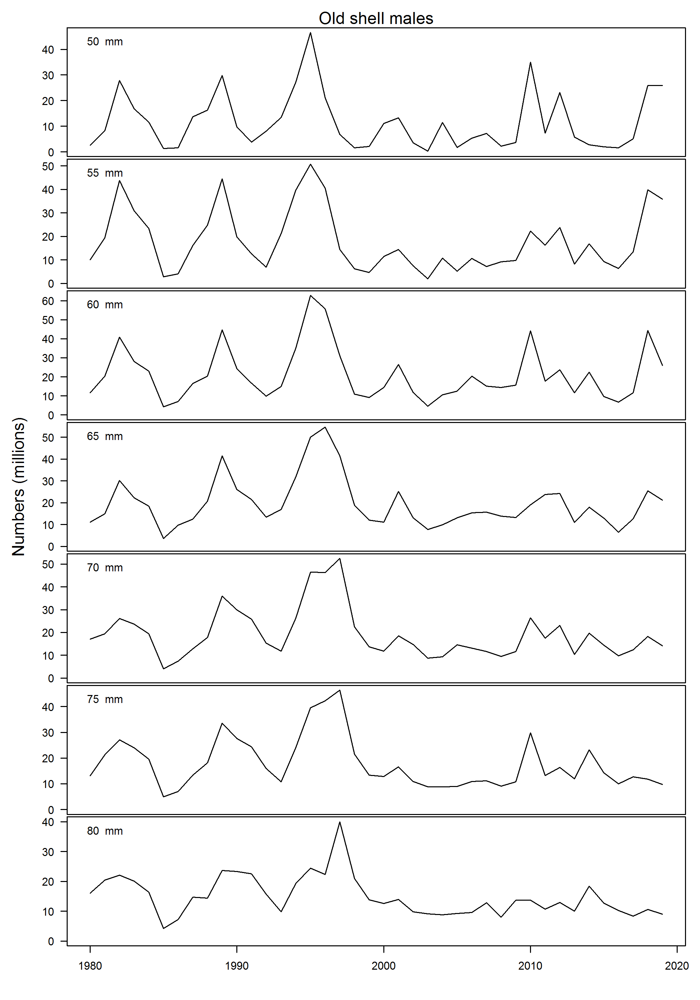
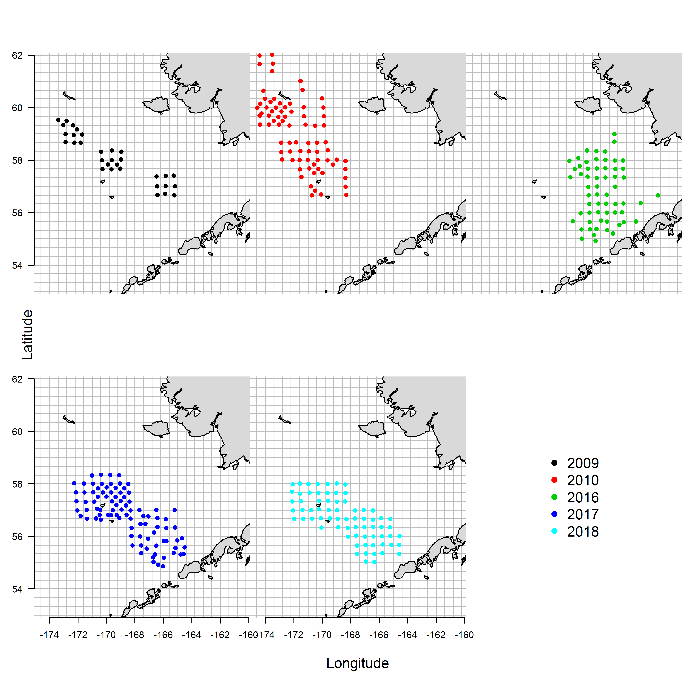
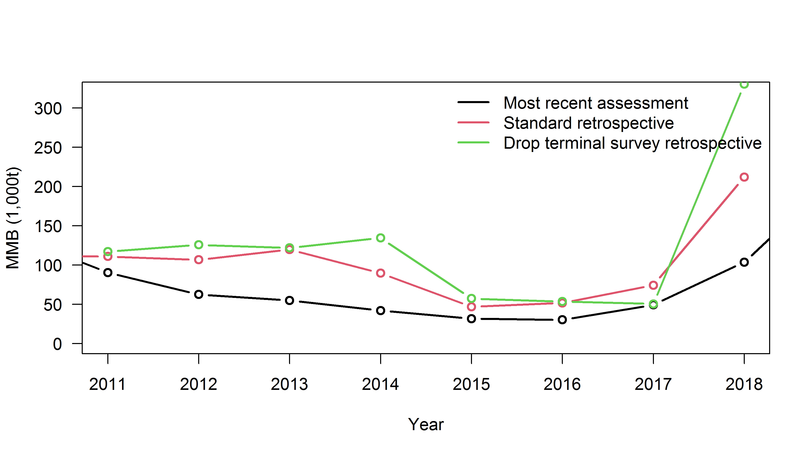

```{r, include=FALSE}

knitr::opts_chunk$set(echo=FALSE,message=FALSE,warning=FALSE)

library(plyr)
library(dplyr)
library(knitr)
library(ggplot2)
library(PBSmodelling)
library(pander)
library(coda)
library(maps)
library(lattice)
library(PBSmapping)
library(mapdata)    #some additional hires data
library(maptools)   #useful tools such as reading shapefiles
library(mapproj)
library(plotrix)

#install.packages("szuwalski/gmr")
library(gmr)
library(ggridges)
library(reshape2)
library(miceadds)

source("scripts/plot.bubble.residuals.addn.R")

```

\newpage

```{r,echo=F,message=FALSE,warning=F,include=FALSE}

survey_fig_N<-7
ABC_buffer  <-0.5
chosen_model<-"opilio"
chosen_ind<-1
ChosenInd<-2

#===PULL gmacs DATA AND outputs

mod_names <- c("20.1g","20.2g","20.3g")
.MODELDIR = c("./20_gmacs/","./20_gmacs_1_q/","./20_gmacs_1_cv2/")

mod_names <- c("20.2","20.3")
.MODELDIR = c("./20_gmacs_3/","./20_gmacs_3_q/") 

# mod_names <- c("GMACS_20","GMACS_20_q","GMACS_20_cv")
# .MODELDIR = c("./20_gmacs/","./20_gmacs_1_q/","./20_gmacs_1_cv2/")


.THEME    = theme_bw(base_size = 12, base_family = "") +
  theme(strip.text.x = element_text(margin= margin(1,0,1,0)),
        panel.grid.major = element_blank(), 
        panel.grid.minor = element_blank(),
        panel.border = element_blank(),
        panel.background = element_blank(),
        strip.background = element_rect(color="white",fill="white"))

.OVERLAY  = TRUE
.SEX      = c("Aggregate","Male","Female")
.FLEET    = c("Pot","Trawl bycatch","NMFS Trawl 1982", "NMFS Trawl 1989")
.TYPE     = c("Retained","Discarded","Total")
.SHELL    = c("New","Old")
.MATURITY = c("Aggregate","Mature","Immature")
.SEAS     = c("1","2","3")

fn       <- paste0(.MODELDIR, "gmacs")
M        <- lapply(fn, read_admb) #need .prj file to run gmacs and need .rep file here
names(M) <- mod_names


#===============
# directory in which all of the scenario folder reside and names of the scenario folders
Scenarios   <-c("19_sq_model_new_trawl","20_sq_model_new_trawl")
ScenarioNames<-c("19.1","20.1",mod_names)

#==make a list of the scenario names
##==save all of the output from the scenarios
snowad.rep<-rep(list(list()),length(Scenarios))
CatchYrN<-rep(list(list()),length(Scenarios))
SurvYrN<-rep(list(list()),length(Scenarios))
DiscYrFN<-rep(list(list()),length(Scenarios))
DiscYrMN<-rep(list(list()),length(Scenarios))
TrawlYrN<-rep(list(list()),length(Scenarios))
ObsCatchNumbers<-rep(list(list()),length(Scenarios))
ObsCatchPounds<-rep(list(list()),length(Scenarios))
RetCatchYrs<-rep(list(list()),length(Scenarios))
TotCatchYrs<-rep(list(list()),length(Scenarios))
ObsDiscF<-rep(list(list()),length(Scenarios))
ObsDiscM<-rep(list(list()),length(Scenarios))
TrawlBycatch<-rep(list(list()),length(Scenarios))
SurveyNumbers<-rep(list(list()),length(Scenarios))
SurveyYrs<-rep(list(list()),length(Scenarios))
LengthBins<-rep(list(list()),length(Scenarios))
GrowthNfem<-rep(list(list()),length(Scenarios))
GrowthNm<-rep(list(list()),length(Scenarios))
GrowthData<-rep(list(list()),length(Scenarios))

REPfileEnd<-rep(list(list()),length(Scenarios))
MgmtQuants<-rep(list(list()),length(Scenarios))

# names(snowad.rep[[ChosenInd]])
# snowad.rep[[ChosenInd]]$"Predicted probability of maturing female" 
# snowad.rep[[ChosenInd]]$"Predicted probability of maturing male" 

for(x in 1:length(Scenarios))
{
  snowad.rep[[x]]  <-readList(paste(Scenarios[x],"/R_input.txt",sep=""))

DATfile <-readLines(paste(Scenarios[x],"/2016sc.DAT",sep=""))

# length of data types
tmp<-grep("number of years of retained fishery data",DATfile)
CatchYrN[[x]] <-as.numeric(DATfile[tmp+1])
tmp<-grep("number of years of survey data",DATfile)
SurvYrN[[x]] <-as.numeric(DATfile[tmp+1])
tmp<-grep("number of years of fishery discard",DATfile)
DiscYrFN[[x]] <-as.numeric(DATfile[tmp+1])
tmp<-grep("number of years of fishery male discard",DATfile)
DiscYrMN[[x]] <-as.numeric(DATfile[tmp+1])
tmp<-grep("number of years of trawl discard",DATfile)
TrawlYrN[[x]] <-as.numeric(DATfile[tmp+1])

# observed retained catch
tmp<-grep("retained catch in numbers",DATfile)
ObsCatchNumbers[[x]]<-as.numeric(DATfile[(tmp+1):(tmp+CatchYrN[[x]])])[1:CatchYrN[[x]]]
tmp<-grep("retained catch in pounds",DATfile)
ObsCatchPounds[[x]]<-as.numeric(DATfile[(tmp+1):(tmp+CatchYrN[[x]])])[1:CatchYrN[[x]]]
tmp<-grep("years for fishery data",DATfile)
RetCatchYrs[[x]]<-as.numeric(unlist(strsplit(DATfile[(tmp+1)],split=" ")))
RetCatchYrs[[x]]<-RetCatchYrs[[x]][!is.na(RetCatchYrs[[x]])]

tmp<-grep("years when have fishery discard length data",DATfile)
TotCatchYrs[[x]]<-as.numeric(unlist(strsplit(DATfile[(tmp+1)],split=" ")))
TotCatchYrs[[x]]<-TotCatchYrs[[x]][!is.na(TotCatchYrs[[x]])]

# observed discard
tmp<-grep("Discard Catch from observer",DATfile)
ObsDiscF[[x]]<-as.numeric(DATfile[(tmp+2):(tmp+1+CatchYrN[[x]])])[1:CatchYrN[[x]]]
tmp<-grep("discard catch males",DATfile)
ObsDiscM[[x]]<-as.numeric(DATfile[(tmp+1):(tmp+CatchYrN[[x]])])[1:CatchYrN[[x]]]

# observed trawl
tmp<-grep(" bycatch numbers by geartype",DATfile)
TrawlBycatch[[x]]<-as.numeric(DATfile[(tmp+2):(tmp+1+CatchYrN[[x]])])[1:CatchYrN[[x]]]

# survey numbers
tmp<-grep("survey numbers by year",DATfile)
SurveyNumbers[[x]]<-as.numeric(DATfile[(tmp+1):(tmp+SurvYrN[[x]])])
tmp<-grep("years for survey data",DATfile)
SurveyYrs[[x]]<-na.omit(as.numeric(unlist(strsplit(DATfile[(tmp+1)],split=" "))))

tmp<-grep("length bins",DATfile)[[5]]
LengthBins[[x]]<-as.numeric(unlist(strsplit(DATfile[(tmp+1)],split=" ")))
LengthBins[[x]]<-LengthBins[[x]][!is.na(LengthBins[[x]])]

tmp       <-grep("growth data female",DATfile)
GrowthNfem[[x]]<-as.numeric(DATfile[(tmp+1)])
tmp1      <-grep("growth data male",DATfile)
GrowthNm[[x]]  <-as.numeric(DATfile[(tmp1+1)])
GrowthData[[x]]<-matrix(NA,ncol=4,nrow=max(GrowthNm[[x]],GrowthNfem[[x]]))

GrowthData[[x]][1:GrowthNfem[[x]],1] <-na.omit(as.numeric(unlist(strsplit(DATfile[(tmp+2)],split="\t"))))
GrowthData[[x]][1:GrowthNfem[[x]],2] <-na.omit(as.numeric(unlist(strsplit(DATfile[(tmp+3)],split="\t"))))

GrowthData[[x]][1:GrowthNm[[x]],3]  <-na.omit(as.numeric(unlist(strsplit(DATfile[(tmp1+2)],split="\t"))))
GrowthData[[x]][1:GrowthNm[[x]],4] <-na.omit(as.numeric(unlist(strsplit(DATfile[(tmp1+3)],split="\t"))))

#==pulling MLEs for management quantities
for(x in 1:length(Scenarios))
{
  REPfileEnd[[x]]       <-readLines(paste(Scenarios[x],"/2016sc.REP",sep=""))
  MgmtQuants[[x]]       <-as.numeric(unlist(strsplit(as.character(REPfileEnd[[x]][1]),split=" ")))
  MgmtQuants[[x]]$Status<-as.numeric(MgmtQuants[[x]][5])/as.numeric(MgmtQuants[[x]][2])
  names(MgmtQuants[[x]])<-c("F","BMSY","Surv_MMB","Fish_MMB","Mate_MMB","F35","FOFL","OFL","Status")
  }
}


#==MLE stuff
#==set up storage
  mle_B35<-list()
  mle_F35<-list()
  mle_FOFL<-list()
  mle_OFL<-list()
  mle_MMB<-list()
  mle_projMMB<-list()
  mle_ABC<-list()
  mle_Status<-list()
  mle_Status2<-list()
  mle_allMMB<-list()

  #==CHECK THIS  
for(x in 1:length(Scenarios))
{  
 REPfile <-readLines(paste(Scenarios[x],"/2016sc.REP",sep=""))
 temp <-as.numeric(unlist(strsplit(REPfile[1],split=" ")))
 temp <-temp[!is.na(temp)]
 mle_B35[[x]] <-temp[2]
 mle_F35[[x]] <-temp[6]
 mle_FOFL[[x]]<-temp[7]
 mle_OFL[[x]] <-temp[8]
 mle_MMB[[x]] <-temp[5]    
 mle_ABC[[x]]<-mle_OFL[[x]]*ABC_buffer
 mle_Status[[x]]<-mle_MMB[[x]]/mle_B35[[x]]

 mle_projMMB[[x]]<-snowad.rep[[x]]$"Mature male biomass at mating"[SurvYrN[[x]]]
 mle_allMMB[[x]]<-snowad.rep[[x]]$"Mature male biomass at mating"
 mle_Status2[[x]]<-mle_projMMB[[x]]/ mle_B35[[x]]
   
}
  
 B35<-mle_B35
 F35<-mle_F35
 FOFL<-mle_FOFL
 OFL<-mle_OFL
 MMB<-mle_MMB    
 ABC<-mle_ABC
 Status<-mle_Status 
 projMMB<-mle_projMMB
 proj_Status<-mle_Status2
 
 # organize data_2020
repfile20<-scan("20_gmacs_3_proj_rec/mcoutSSB.REP")
hist_ssb20<-matrix(repfile20,ncol=length(seq(1982,2019)),byrow=T)
colnames(hist_ssb20)<-seq(1982,2019)

innames<-c("Draw","Replicate","Treatment",paste("F",seq(1,length(M[[1]]$log_fbar))),
           "B35",paste("proj_ssb_",seq(2020,2025)))
projfile20<-as.data.frame(matrix(scan("20_gmacs_3_proj_rec/mcoutPROJ.REP"),ncol=length(innames),byrow=TRUE))
colnames(projfile20)<-innames

ind<-grep('ssb',colnames(projfile20))
adj_proj20<-dplyr::filter(projfile20,Replicate==1& Treatment==3)
proj_ssb20<-cbind(hist_ssb20,adj_proj20[,ind])
colnames(proj_ssb20)<-seq(1982,2025)

proj_ssb_1<-proj_ssb20[1,]

 proj_ssb_19<-proj_ssb_1[colnames(proj_ssb_1)==2019]
 proj_ssb_20<-proj_ssb_1[colnames(proj_ssb_1)==2020] 

```

\newpage


1. Stock: Eastern Bering Sea snow crab, *Chionoecetes opilio*.

2. Catches: trends and current levels

Retained catches increased from relatively low levels in the early 1980s (e.g. retained catch of `r round(snowad.rep[[2]]$"Observed retained catch biomass"[RetCatchYrs[[2]]==1982],2)` kt during 1982) to historical highs in 1990s (retained catch during 1991, 1992, and 1998 were `r round(snowad.rep[[2]]$"Observed retained catch biomass"[RetCatchYrs[[2]]==1991],2)`, `r round(snowad.rep[[2]]$"Observed retained catch biomass"[RetCatchYrs[[2]]==1992],2)`, and `r round(snowad.rep[[2]]$"Observed retained catch biomass"[RetCatchYrs[[2]]==1998],2)` kt, respectively).  The stock was declared overfished in 1999 at which time retained catches dropped to levels similar to the early 1980s (e.g. retained catch during 2000 was `r round(snowad.rep[[2]]$"Observed retained catch biomass"[RetCatchYrs[[2]]==2000],2)` kt). Retained catches have slowly increased since 1999 as the stock rebuilt, although retained catch during `r SurveyYrs[[2]][SurvYrN[[2]]]` was relatively low (`r round(snowad.rep[[2]]$"Observed retained catch biomass"[SurvYrN[[2]]],2)` kt). 

Discard mortality is the next largest source of mortality after retained catch and approximately tracks the retained catch. The highest estimated discard mortality occurred during 1992 at `r round(snowad.rep[[2]]$"observed male discard mortality biomass"[RetCatchYrs[[2]]==1992],2)` kt which was `r 100*round(as.numeric(round(snowad.rep[[2]]$"observed male discard mortality biomass"[RetCatchYrs[[2]]==1992],2)) / as.numeric(round(snowad.rep[[2]]$"Observed retained catch biomass"[RetCatchYrs[[2]]==1992],2)),2)`% of the retained catch during that year.
The most recent estimated discard mortality was `r round(M[[ChosenInd]]$obs_catch[2,ncol(M[[ChosenInd]]$obs_catch)],2)` kt, which was `r 100*round(M[[ChosenInd]]$obs_catch[2,ncol(M[[ChosenInd]]$obs_catch)] / (M[[ChosenInd]]$obs_catch[1,ncol(M[[ChosenInd]]$obs_catch)]),2) `% of the retained catch (the highest fraction on record).

3. Stock Biomass: 

Observed mature male biomass (MMB) at the time of the survey increased from an average of `r round(mean(snowad.rep[[2]]$"Observed survey male spawning biomass"[1:10]),2)` kt in the early to mid-1980s to historical highs 1990s (observed MMB during 1990, 1991, and 1997 were `r round(snowad.rep[[2]]$"Observed survey male spawning biomass"[which(SurveyYrs[[2]]==1990)],2)`, `r round(snowad.rep[[2]]$"Observed survey male spawning biomass"[which(SurveyYrs[[2]]==1991)],2)`, and `r round(snowad.rep[[2]]$"Observed survey male spawning biomass"[which(SurveyYrs[[2]]==1997)],2)` kt, respectively). The stock was declared overfished in 1999 in response to the total mature biomass dropping below the 1999 minimum stock size threshold.  MMB in that year decreased to `r round(snowad.rep[[2]]$"Observed survey male spawning biomass"[which(SurveyYrs[[2]]==1999)],2)` kt. Observed MMB slowly increased after 1999, and the stock was declared rebuilt in 2011 when estimated MMB at mating was above B~*35%*~.  However, after 2011, the stock declined and the observed MMB at the time of survey dropped to an all time low in 2016 of `r round(snowad.rep[[2]]$"Observed survey male spawning biomass"[which(SurveyYrs[[2]]==2016)],2)` kt. Recently, MMB is increasing again as a large recruitment moves through the size classes and is currently estimated to be above B~*35%*~.

4. Recruitment

Estimated recruitment shifted from a period of high recruitment to a period of low recruitment in the mid-1990s (late 1980s when lagged to fertilization). Recently, a large year class recruited to the survey gear and is beginning to be seen in the  biomass vulnerable to the directed fishery.

\newpage

5. Management 


```{r,echo=F}
 # =UPDATE TO USE GMACS
 ManTable <-read.csv("plots/ManagementTable.csv")
 PlotTab<- data.frame(ManTable)
 colnames(PlotTab)<-c("Year","MSST","Biomass (MMB)","TAC","Retained catch","Total catch", "OFL","ABC")

 PlotTab[(nrow(PlotTab)-1),6]<-format(round(sum(M[[ChosenInd]]$obs_catch[,ncol(M[[ChosenInd]]$obs_catch)]),1),nsmall=1)
 PlotTab[(nrow(PlotTab)-1),4:5]<-format(round(M[[ChosenInd]]$obs_catch[1,ncol(M[[ChosenInd]]$obs_catch)],1),nsmall=1)

 #==I forget which estimates go in which year
 PlotTab[(nrow(PlotTab)-1),2]<-format(round(M[[ChosenInd]]$spr_bmsy/2,1),nsmall=1)
 PlotTab[(nrow(PlotTab)),3]<-format(round(proj_ssb_20,1),nsmall=1)
 PlotTab[nrow(PlotTab),7]<-format(round(M[[ChosenInd]]$spr_cofl,1),nsmall=1)
 PlotTab[nrow(PlotTab),8]<-format(round(M[[ChosenInd]]$spr_cofl*ABC_buffer,1),nsmall=1)
 PlotTab[nrow(PlotTab),6]<- " "
 PlotTab[is.na(PlotTab)]<-" "
 rownames(PlotTab)<- NULL
 pander(PlotTab,split.cells=10,caption="\\label{managementtable}Historical status and catch specifications for snow crab (1,000t).")

```


```{r,echo=F}

PlotTab3<-PlotTab
for(x in 1:nrow(PlotTab3))
  for(y in seq(2,8))
    PlotTab3[x,y]<-round(as.numeric(unlist(PlotTab[x,y]))*2.20462,2)
PlotTab3[is.na(PlotTab3)]<-" "
pander(PlotTab3,split.cells=10,caption="Historical status and catch specifications for snow crab (millions of lbs).")


```

6.  Basis for the OFL

The OFL for crab year `r M[[ChosenInd]]$mod_yr[length(M[[ChosenInd]]$mod_yr)]+1`  from the chosen model `r mod_names[ChosenInd]` was `r round(M[[ChosenInd]]$spr_cofl,2)` kt fishing at F~*OFL*~ = `r round(M[[ChosenInd]]$sd_fofl[1],2)`, which was `r 100*round(M[[ChosenInd]]$sd_fofl[1]/M[[ChosenInd]]$sd_fmsy[1],2)`% of the calculated F~35%~. The projected ratio of MMB at the time of mating in  `r M[[ChosenInd]]$mod_yr[length(M[[ChosenInd]]$mod_yr)]+1` (crab year) to B~35%~ is `r round(proj_ssb_20/M[[ChosenInd]]$spr_bmsy,2)` .


```{r,echo=F}

# year, Tier, BMSY, MMB, B/BMSY, FOFL, Years to define BMSY, natural mortality

# temp_OFL<-data.frame(Year = '2019/2020',
#            Tier = 3,
#            BMSY = round(PlotTab2$B35[ChosenInd],1),
#            MMB = round(projMMB[[ChosenInd]],1),
#            Status = round(proj_Status[[ChosenInd]],2),
#            FOFL = round(FOFL[[ChosenInd]],2),
#            Years = "1982-2018",
#            M = toString(c(round(snowad.rep[[ChosenInd]]$`natural mortality immature`[1],2),round(snowad.rep[[ChosenInd]]$`atural mortality mature`,2))))
# 
# pander(temp_OFL,split.cells=17,caption="Metrics used in designation of status and OFL (1,000 t). 'Years' indicates the year range over which recruitment is averaged for use in calculation of B35. 'M' is the natural mortality for immature crab, mature female crab, and mature male crab, respectively. ")


```


```{r,echo=F}

# year, Tier, BMSY, MMB, B/BMSY, FOFL, Years to define BMSY, natural mortality

# temp_OFL_lbs<-temp_OFL
# temp_OFL_lbs[3]<- temp_OFL_lbs[3]*2.20462
# temp_OFL_lbs[4]<- temp_OFL_lbs[4]*2.20462 
#   
# pander(temp_OFL_lbs,split.cells=17,caption="Metrics used in designation of status and OFL (millions of lb.). 'Years' indicate the year range over which recruitment is averaged for use in calculation of B35. 'Status' is the ratio between MMB and BMSY. 'M' is the natural mortality for immature crab, mature female crab, and mature male crab, respectively. ")


```


7.	Probability Density Function of the OFL

The probability density function of the OFL was characterized for all models by using maximum likelihood estimates of the OFL and associated standard errors. 

8.	Basis for ABC

The ABC  for the chosen model was `r round(M[[ChosenInd]]$spr_cofl*(ABC_buffer),2)` kt, calculated by subtracting a `r 100* (1-ABC_buffer)`% buffer from the OFL as recommended by the CPT.  The buffer was increased from 20% (used in 2019) to 25% to account for model uncertainty around the 2015 recruitment event and an additional 25% was added to account for uncertainty related to missing the terminal year of survey data. 


\newpage
# A.  Summary of Major Changes 

1. Management: None 

2. Input data: 

Data added to this assessment included:  `r max(M[[ChosenInd]]$mod_yrs)` directed fishery retained and discard catch, and length composition for retained and discard catch (calculated via the 'subtraction' method; see below), and groundfish discard length frequency and discard from `r max(M[[ChosenInd]]$mod_yrs)`. Importantly, no new survey data were available for 2020.

3. Assessment methodology: 

Management quantities were derived from maximum likelihood estimates of model parameters in a size-based, integrated assessment method.  Jittering was not performed because of the shift to GMACS, but will be implemented in the next cycle. Retrospective analyses were performed for selected model configurations.

4. Assessment results

The updated estimate of MMB (February 15, `r M[[ChosenInd]]$mod_yrs[length(M[[ChosenInd]]$mod_yrs)] +1 `) was `r round(proj_ssb_19,2)`kt which placed the stock at `r round(proj_ssb_19/ M[[ChosenInd]]$spr_bmsy,2)*100`% of B~*35%*~. Projected MMB on February 15, `r max(M[[ChosenInd]]$mod_yrs) +2` from this assessment's chosen model was `r round(proj_ssb_20,2)` kt after fishing at the OFL, which will place the stock at `r 100* round(proj_ssb_20 / M[[ChosenInd]]$spr_bmsy,2)`%  of B~*35%*~. Fits to all data sources were acceptable for the chosen model and most estimated population processes were credible (see discussion below).

\newpage
# B. Comments, responses and assessment summary
## SSC and CPT Comments + author responses
*SSC comment: The stock assessment author recommended bringing forward three model variants for consideration this fall: status quo, “free q” GMACS, and “prior q” GMACS models. The CPT agreed, and the SSC concurs. The GMACS models fit both NMFS and BSFRF survey data better than the status quo model. Both the stock assessment author and the CPT recommended postponing the use of VAST estimates for assessment until diagnostics could be more fully analyzed. The team offered other suggestions about the assessment, with which the SSC agrees.*  

Author response: These recommendations are included in the models considered, plus additional exercises necessary to address uncertainty resulting from cancelled NMFS summer surveys.

*CPT comments: Identify cause of the 'pigtails' in the retained catch size compositions*

Author response: I have not identified why the pigtails occur. Currently, the problem only exists in 1982-1984, so it should not influence management advice arising from the terminal year estimates of MMB. I plan to spend more time understanding this result in the fall.  

*CPT comments: Implement reference point calculations in GMACS for status determination and OFL calculation* 
 
Author response: Reference point calculations were modified in GMACS to accommodate terminally molting life histories with differing natural mortalities between immature and mature life stages. The resulting reference points are similar to the reference points calculated in the status quo assessment and a more thorough comparison is made in the supplementary document titled "A comparison of the status quo stock assessment for eastern Bering Sea snow crab to an assessment developed in GMACS." The conclusion in that document is that, in the opinion of the author, GMACS satisfactorily produces reference points and should be adopted for use in management.

## Summary of assessment scenarios for September 2020

Five models are presented here:

 * 19.1  -- Last year's accepted model fit to last year's data
 * 20.1  -- 19.1 fit to this year's data, with revised trawl data
 * 20.2 -- GMACS fit to the same data as 20.1
 * 20.3 -- 20.2 + extra weight on BSFRF data to force the estimated catchability coefficient to equal the implied catchability by the BSFRF data

Model 20.2 was the author preferred model based on model fits and the use of GMACS. Model 20.1 was not preferred because it did not fit the terminal years of survey MMB and the GMACS modeling platform is an improvement over the status quo model. Model 20.3 was not preferred because it did not converge and resulted in doubling of the stock size.
 
Given the potential uncertainty added by missing the survey data for this year, several additional analyses were performed. Retrospective analyses, an imputed survey data exercise, and a projection to the year 2025 under two different harvest scenarios were undertaken with the author preferred model. A sequential addition of catch data was performed to understand the impact of the new catch data. An exercise that varied the size of the smoothing penalties placed on estimated recruitment deviations is presented to explore the impact of the penalties on the size of the 2015 estimated recruitment and the resulting management quantities.

\newpage

# C. Introduction
## Distribution
Snow crab (*Chionoecetes opilio*) are distributed on the continental shelf of the Bering Sea, Chukchi Sea, and in the western Atlantic Ocean as far south as Maine.  In the Bering Sea, snow crab are distributed widely over the shelf and are common at depths less than ~200 meters (\autoref{malemap} & \autoref{femalemap}).  Smaller crabs tend to occupy more inshore northern regions (\autoref{male77map}) and mature crabs occupy deeper areas to the south of the juveniles (\autoref{male101map} & \autoref{femaleMmap}; Zheng et al. 2001). The eastern Bering Sea population within U.S. waters is managed as a single stock; however, the distribution of the population may extend into Russian waters to an unknown degree. 

## Life history characteristics
Studies relevant to key population and fishery processes are discussed below to provide background for the model description in appendix A.

## Natural Mortality

Relatively few targeted studies exist to determine natural mortality for snow crab in the Bering Sea. In one of these studies, Nevissi, et al. (1995) used radiometric techniques to estimate shell age from last molt (\autoref{nevissi}).  The total sample size was 21 male crabs (a combination of Tanner and snow crab) from a collection of 105 male crabs from various hauls in the 1992 National Marine Fishery Service (NMFS) Bering Sea survey. Representative samples for the 5 shell condition categories were collected from the available crab.  Shell condition 5 crab (SC5 = very, very old shell) had a maximum age of 6.85 years (s.d. 0.58, 95% CI approximately 5.69 to 8.01 years; carapace width of 110 mm).  The average age of 6 crabs with SC4 (very old shell) and SC5, was 4.95 years (range: 2.70 to 6.85 years).  Given the small sample size, this maximum age may not represent the 1.5% percentile of the population that is approximately equivalent to Hoenig's method (1983). Tag recovery evidence from eastern Canada revealed observed maximum ages in exploited populations of 17-19 years (Nevissi, et al. 1995, Sainte-Marie 2002).  A maximum time at large of 11 years for tag returns of terminally molted mature male snow crab in the North Atlantic has been recorded since tagging started about 1993 (Fonseca, et al. 2008).  Fonseca, et al. (2008) estimated a maximum age of 7.8 years post terminal molt using data on dactal wear. 

In recent years, the mean for the prior for natural mortality used in the eastern Bering Sea snow crab assessment was based on the assumption that longevity would be at least 20 years in a virgin population of snow crab, informed by the studies above.  Under negative exponential depletion, the 99th percentile corresponding to age 20 of an unexploited population corresponds to a natural mortality rate of 0.23.  Using Hoenig's (1983) method a natural mortality equal to 0.23 corresponds to a maximum age of 18 years. For the base model in this assessment cycle, the means of the prior on natural mortality for immature males and females, mature males, and mature females were also set to 0.23 yr^-1^. 

In contrast to the implied natural mortalities from the methodology used above,  Murphy et al. (2018) estimated time-varying natural mortality for eastern Bering Sea snow crab with a mean of 0.49 for females and 0.36 for males (based on the output of state-space models fit to NMFS survey data; \autoref{murphy}).  Further, natural mortality estimates produced from empirical analyses by Then et al. (2015) and Hamel (2015) using similar assumed maximum ages as the methodology above produce natural mortalities larger than 0.23 (\autoref{natM_empir}). Then et al. (2015) compared several major empirical estimation methods for M (including Hoenig's method) with an updated data set and found that maximum age was the best available predictor. A maximum age of 20 years corresponded to an M of ~0.315 in Then et al.'s analysis. Hamel (2015) developed priors in a similar manner to Then et al., but forced the regression of observed natural mortality onto maximum age through the intercept, which resulted in an M of ~0.27 for an assumed maximum age of 20 years. 

```{r,echo=FALSE,warning=FALSE,message=F}

# format all the above into a tabular format

dat<-data.frame( c(0.277,0.315,0.365),
            c(0.19,0.212,0.257),
            c(0.194, 0.223, 0.261),
            c(0.235, 0.271, 0.318))

rownames(dat)<-c(23,20,17)
colnames(dat)<-c("Then","Hoenig (1983)","Hoenig (2015)",'Hamel')

pander(t(dat),split.cells=20,caption="\\label{natM_empir} Empirical estimates of natural mortality for a range of methods over a range of assumed maximum ages (column header).")

```

In addition to the results of empirical estimates of M from updated methodologies and state-space modeling by Murphy et al. (2018), inspection of the survey data suggests that natural mortality for mature individuals is higher than assumed. A fraction of the mature population (which are assumed not to grow, given evidence for a terminal molt) are not selected in the fishery (e.g. sizes 50-80 mm; \autoref{natM_mature}). Consequently, all mortality observed is 'natural'. The collapse in recruitment in the 1990s can be used as an instrument to understand natural mortality for mature individuals. The last large recruitment enters these size classes in the mid- to late-1990s and numbers of crab in these size classes return to low levels in less than 5 years. It would be useful to perform radiometric aging on old shell crab that are not selected in the fishery to better understand natural mortality for mature crab.

Natural mortality is one of the major axes of uncertainty considered in the assessment scenarios presented in this assessment. The median value of the priors used in some scenarios were changed to values resulting from assuming a maximum age of 20 years and applying Then et al.'s or Hamel's methodology. A standard error of 0.054 was used for all priors and was estimated using the 95% CI of +-1.7 years on maximum age estimates from dactal wear and tag return analysis in Fonseca, et al. (2008). Another potential, but unexplored, option for developing a prior is to apply all of the methods to the range of possible maximum ages, develop a probability density function for maximum age given the observed data, then calculate a weighted average of the natural mortalities using the pdf for weights and use the standard error from that weighted average to define the breadth of the prior.


## Weight at length

Weight at length is calculated by a power function, the parameters for which were recalculated by the Shellfish Assessment Program in August 2016 and resulted in very small changes in weight at length for males, but rather large changes for females. New weight at length parameters were applied to all years of data, rather than just the most recent observations and were used starting in 2016 for calculation of the OFL. To provide context for the change, a juvenile female crab of carapace width 52.5 mm was previously estimated to weigh 65 g and is now 48 g; a mature female crab of carapace width 57.5 mm was estimated to previously weigh 102 g and is now 67.7 g; and a male of carapace width 92.5 mm was previously estimated to weigh 450 g and now weighs 451 g.

## Maturity 

Maturity of females collected during the NMFS summer survey was determined by the shape of the abdomen, by the presence of brooded eggs, or egg remnants. Maturity for males was determined by chela height measurements, which were available starting from the 1989 survey (Otto 1998). Mature male biomass referenced throughout this document refers to a morphometrically mature male. A maturity curve for males was estimated using the average fraction mature based on chela height data and applied to all years of survey data to estimate mature survey numbers.  The separation of mature and immature males by chela height may not be adequately refined given the current measurement to the nearest millimeter.  Chela height measured to the nearest tenth of a millimeter (by Canadian researchers on North Atlantic snow crab) shows a clear break in chela height at small and large widths and shows fewer mature animals at small widths than the Bering Sea data measured to the nearest millimeter.  Measurements taken in 2004-2005 on Bering Sea snow crab chela to the nearest tenth of a millimeter show a similar break in chela height to the Canadian data (Rugolo et al. 2005). The probability of maturing (which is different from the fraction mature at length) is a freely estimated (but smoothed) function of length for both sexes within the assessment model.  

## Molting probability

Bering Sea male snow crab appear to have a terminal molt to maturity based on hormone level data and findings from molt stage analysis via setagenesis (Tamone et al. 2005).  The models presented here assume a terminal molt for both males and females, which is supported by research on populations in the Bering Sea and the Atlantic Ocean (e.g., Dawe, et al. 1991).  

Male snow crabs that do not molt (old shell) may be important in reproduction.  Paul et al. (1995) found that old shell mature male Tanner crab out-competed new shell crab of the same size in breeding in a laboratory study.  Recently molted males did not breed even with no competition and may not breed until after ~100 days from molting (Paul et al. 1995).  Sainte-Marie et al. (2002) stated that only old shell males take part in mating for North Atlantic snow crab.  If molting precludes males from breeding for a three month period, then males that are new shell at the time of the survey (June to July), would have molted during the preceding spring (March to April), and would not have participated in mating.  The fishery targets new shell males, resulting in those animals that molted to maturity and to a size acceptable to the fishery of being removed from the population before the chance to mate.  However, new shell males will be a mixture of crab less than 1 year from terminal molt and 1+ years from terminal molt due to the inaccuracy of shell condition as a measure of shell age. Crabs in their first few years of life may molt more than once per year, however, the smallest crabs included in the model are approximately 4 years old and would be expected to molt annually. Information for the probability of molting comes from the split in numbers at length between immature and mature individuals by sexes.

## Mating ratio and reproductive success

Bering Sea snow crabs are managed using mature male biomass (MMB) as a proxy for reproductive potential. MMB is used as the currency for management because the fishery only retains large male crabs. Male snow crabs are sperm conservers, using less than 4% of their sperm at each mating and females also will mate with more than one male. The amount of stored sperm and clutch fullness varies with sex ratio (Sainte-Marie 2002).  If mating with only one male is inadequate to fertilize a full clutch, then females will need to mate with more than one male, necessitating a sex ratio closer to 1:1 in the mature population, than if one male is assumed to be able to adequately fertilize multiple females. Although mature male biomass is currently the currency of management, female biomass may also be an important indicator of reproductive potential of the stock.

Quantifying the reproductive potential of the female population from survey data can be difficult.  For example, full clutches of unfertilized eggs may be extruded and appear normal to visual examination, and may be retained for several weeks or months by snow crab. Resorption of eggs may occur if not all eggs are extruded resulting in less than a full clutch.  Female snow crab at the time of the survey may have a full clutch of eggs that are unfertilized, resulting in overestimation of reproductive potential. Barren females are a more obvious indication of low reproductive potential and increased in the early 1990s, decreased in the mid-1990s, then increased again in the late 1990s.  The highest levels of barren females coincides with the peaks in catch and exploitation rates that occurred in 1992 and 1993 fishery seasons and the 1998 and 1999 fishery seasons.  While the biomass of mature females was high in the early 1990s, it is possible the production may have been impacted by the spatial distribution of the catch and the resulting sex ratio in areas of highest reproductive potential. Biennial spawning is another confounding factor in determining the reproductive potential of snow crab. Laboratory analysis showed that female snow crab collected in waters colder than 1.5 degrees C from the Bering Sea spawn only every two years.  

Further complicating the process of quantifying reproductive capacity, clutch fullness and fraction of unmated females may not account for the fraction of females that may have unfertilized eggs, since these cannot be detected by eye at the time of the survey.  The fraction of barren females observed in the survey may not be an accurate measure of fertilization success because females may retain unfertilized eggs for months after extrusion.  To examine this hypothesis, NMFS personnel sampled mature females from the Bering Sea in winter and held them in tanks until their eggs hatched in March of the same year (Rugolo et al. 2005).  All females then extruded a new clutch of eggs in the absence of males.  All eggs were retained until the crabs were euthanized near the end of August.  Approximately 20% of the females had full clutches of unfertilized eggs.  The unfertilized eggs could not be distinguished from fertilized eggs by visual inspection at the time they were euthanized.  Indices of fertilized females based on the visual inspection method of assessing clutch fullness and percent unmated females may overestimate fertilized females and may not be an accurate index of reproductive success.    

## Growth

Historically, little information was available on growth for Bering Sea snow crab. However, many new data points have been added in recent years (\autoref{growthdata}). These studies include:

1.  Transit study (2003); 14 crab
2.	Cooperative seasonality study; 6 crab
3.	Dutch harbor holding study; 9 crab
4.	NMFS Kodiak holding study held less than 30 days;  6 crab
5.  NMFS Kodiak holding study 2016; 5 crab
6.  NMFS Kodiak holding study 2017; 70 crab.
7.  BSFRF/NMFS holding study 2018; 4 crab.

In the "Transit study", pre- and post-molt measurements of 14 male crabs that molted soon after being captured were collected.  The crabs were measured when shells were still soft because all died after molting, so measurements may be underestimates of post-molt width (L. Rugolo, pers. com.).  The holding studies include only data for crab held less than 30 days because growth of crabs held until the next spring's molting was much lower. Females molting to maturity were excluded from all data sets, since the molt increment is usually smaller.  Crab missing more than two limbs were excluded due to other studies showing lower growth.  Crab from the seasonal study were excluded that were measured less than 3 days after molting due to difficulty in measuring soft crab accurately (L. Rugolo, pers. comm.). In general, growth of snow crab in the Bering Sea appears to be greater than growth of some North Atlantic snow crab stocks (Sainte-Marie 1995).   

## Management history

## ADFG harvest strategy

Before the year 2000, the Guideline Harvest Level (GHL) for retained crab only was a 58% harvest rate of the number of male crab over 101 mm CW estimated from the survey.  The minimum legal size limit for snow crab is 78 mm, however, the snow crab market generally only accepts crab greater than 101 mm.  In 2000, due to the decline in abundance and the declaration of the stock as overfished, the harvest rate for calculation of the GHL was reduced to 20% of male crab over 101 mm.  After 2000, a rebuilding strategy was developed based on simulations by Zheng et al. (2002) using survey biomass estimates. The realized retained catch typically exceeded the GHL historically, resulting in exploitation rates for the retained catch on males >101mm ranging from about 10% to 80%.  
 
The Alaska Department of Fish and Game (ADFG) harvest strategy since 2000 sets harvest rate based on estimated mature biomass. The harvest rate scales with the status of the population relative to B~*MSY*~, which is calculated as the average total mature biomass at the time of the survey from 1983 to 1997 and MSST is one half B~*MSY*~.  The harvest rate begins at 0.10 when total mature biomass exceeds 50% MSST (230 million lbs) and increases linearly to 0.225 when biomass is equal to or greater than B~*MSY*~ (Zheng et al. 2002).   

\begin{equation}
 u =
 \begin{cases}
 Bycatch  & if \frac{TMB}{TMB_{MSY}} \leq 0.25 \\[3ex]
 \frac {0.225 ( \frac {TMB}{TMB_{MSY}} - \alpha)}{1-\alpha}  & if 0.25 < \frac {TMB}{TMB_{MSY}} < 1 \\[3ex]
 0.225 & if TMB >TMB_{MSY}
\end{cases}
\end{equation}

Where *TMB* is the total mature biomass and TMB~*BMSY*~ is the *TMB* associated with maximum sustainable yield. The maximum retained catch is set as the product of the exploitation rate, *u*, calculated from the above control rule and survey mature male biomass.  If the retained catch in numbers is greater than 58% of the estimated number of new shell crabs greater than 101 mm plus 25% of the old shell crab greater than 101 mm, the catch is capped at 58%.

## History of BMSY

Prior to adoption of Amendment 24, B~*MSY*~ was defined as the average total mature biomass (males and females) estimated from the survey for the years 1983 to 1997 (921.6 million lbs; NPFMC 1998) and MSST was defined as 50% of B~*MSY*~. Currently, the biological reference point for biomass is calculated using a spawning biomass per recruit proxy, B~*35%*~ (Clark, 1993). B~*35%*~ is the biomass at which spawning biomass per recruit is 35% of unfished levels and has been shown to provide close to maximum sustainable yield for a range of steepnesses (Clark, 1993).  Consequently, it is an often used target when a stock recruit relationship is unknown or unreliable.  The range of years of recruitment used to calculate biomass reference points is from 1982 to the present assessment year, minus 1. 

## Fishery history

Snow crab were harvested in the Bering Sea by the Japanese from the 1960s until 1980 when the Magnuson Act prohibited foreign fishing. After the closure to foreign fleets, retained catches increased from relatively low levels in the early 1980s (e.g. retained catch of `r round(snowad.rep[[2]]$"Observed retained catch biomass"[RetCatchYrs[[2]]==1982],2)` kt during 1982) to historical highs in the early and mid-1990s (retained catches during 1991, 1992, and 1998 were `r round(snowad.rep[[2]]$"Observed retained catch biomass"[RetCatchYrs[[2]]==1991],2)`, `r round(snowad.rep[[2]]$"Observed retained catch biomass"[RetCatchYrs[[2]]==1992],2)`, and `r round(snowad.rep[[2]]$"Observed retained catch biomass"[RetCatchYrs[[2]]==1998],2)` kt, respectively; \autoref{obscatch}).  The stock was declared overfished in 1999 at which time retained catches dropped to levels similar to the early 1980s (e.g. retained catch during 2000 was `r round(snowad.rep[[2]]$"Observed retained catch biomass"[RetCatchYrs[[2]]==2000],2)` kt). Retained catches have slowly increased since 1999 as the stock rebuilt, although retained catch during `r RetCatchYrs[[2]][CatchYrN[[2]]]` was low (`r round(snowad.rep[[2]]$"Observed retained catch biomass"[SurvYrN[[2]]],2)` kt). 

Discard mortality is the next largest source of mortality after retained catch and approximately tracks the retained catch. The highest estimated discard mortality occurred during 1992 at `r round(snowad.rep[[2]]$"observed male discard mortality biomass"[RetCatchYrs[[2]]==1992],2)` kt, which was `r 100*round(as.numeric(round(snowad.rep[[2]]$"observed male discard mortality biomass"[RetCatchYrs[[2]]==1992],2)) / as.numeric(round(snowad.rep[[2]]$"Observed retained catch biomass"[RetCatchYrs[[2]]==1992],2)),2)`% of the retained catch.
The most recent estimated discard biomass was `r round(M[[ChosenInd]]$obs_catch[2,ncol(M[[ChosenInd]]$obs_catch)],2)` kt, which was `r 100*round(M[[ChosenInd]]$obs_catch[2,ncol(M[[ChosenInd]]$obs_catch)]/(M[[ChosenInd]]$obs_catch[2,ncol(M[[ChosenInd]]$obs_catch)]+M[[ChosenInd]]$obs_catch[1,ncol(M[[ChosenInd]]$obs_catch)]),2)`% of the total catch.

Discard from the directed pot fishery has been estimated from observer data since 1992 and has ranged from 11-100% of the magnitude of retained catch by numbers . In recent years, discards have reached 50-100% of the magnitude of retained catch because of the large year class entering the population.  Female discard catch has been very low compared to male discard catch and has not been a significant source of mortality.  Discard of snow crab in groundfish fisheries has been highest in the yellowfin sole trawl fishery, and decreases down through the flathead sole trawl fishery, Pacific cod bottom trawl fishery, rock sole trawl fishery, and the Pacific cod hook-and-line and pot fisheries, respectively (\autoref{bycatch}).  Bycatch in fisheries other than the groundfish trawl fishery has historically been relatively low. Size frequency data and catch per pot have been collected by observers on snow crab fishery vessels since 1992.  Observer coverage has been 10% on catcher vessels larger than 125 ft (since 2001), and 100% coverage on catcher processors (since 1992). 

Several modifications to pot gear have been introduced to reduce bycatch mortality.  In the 1978/79 season, escape panels were require on pots used in the snow crab fishery to prevent ghost fishing.  Escape panels consist of an opening with one-half the perimeter of the tunnel eye laced with untreated cotton twine.  The size of the cotton laced panel was increased in 1991 to at least 18 inches in length.  No escape mechanisms for undersized crab were required until the 1997 season when at least one-third of one vertical surface of pots had to contain not less than 5 inches stretched mesh webbing or have no less than four circular rings of no less than 3 3/4 inches inside diameter.  In the 2001 season the escapement provisions for undersized crab was increased to at least eight escape rings of no less than 4 inches placed within one mesh measurement from the bottom of the pot, with four escape rings on each side of the two sides of a four-sided pot, or one-half of one side of the pot must have a side panel composed of not less than 5 1/4 inch stretched mesh webbing.  

# D. Data 

No new NMFS survey data were available this year due to cancellation of the surveys. Bycatch data (biomass and size composition) were updated for 1986-present after a change in the AKFIN database (\autoref{trawl_change}). This resulted primarily in a scaling down of the bycatch mortality, though the trend of the time series was largely maintained. Retained, total, and discarded catch (in numbers and biomass) and size composition data for each of these data sources were updated for the most recent year based on files provided by the State of Alaska. 

## Catch data

Catch data and size composition of retained crab from the directed snow crab pot fishery from survey year 1982 to 2019 were used in this analysis (\autoref{obscatch}).  Discard size composition data from 1992 to 2017 were estimated from observer data and then combined with retained catch size compositions to become the 'total catch' size composition data, which are fit in the assessment. In 2018, observer data collection changed and only total catch size composition data and retained size composition data are produced. This is a sensible step in data collection, but the current formulation of the snow crab model accepts discarded size composition data as an input. So, in 2018 the discarded size compositions were calculated by subtracting the retained size compositions from the total size compositions. This mismatch of input data types will be addressed in an upcoming data overhaul for the assessment.

The discard male catch was estimated for survey year `r SurveyYrs[[2]][1]` to 1991 in the model using the estimated fishery selectivities based on the observer data for the period of survey year 1992 to `r SurveyYrs[[2]][SurvYrN[[2]]-1]`.  The discard catch estimate was multiplied by the assumed mortality of discards from the pot fishery.  The assumed mortality of discarded crab was 30% for all model scenarios.  This estimate differs from the strategy used since 2001 to the present by ADFG to set the TAC, which assumes a discard mortality of 25% (Zheng, et al. 2002).  The discards prior to 1992 may be underestimated due to the lack of escape mechanisms for undersized crab in the pots before 1997. See \autoref{datayears} for a summary of catch data.

```{r,echo=FALSE,warning=FALSE,message=F}
Data<-c("Retained male crab pot fishery size frequency by shell condition",
         "Discarded Males and female crab pot fishery size frequencey",
         "Trawl fishery bycatch size frequencies by sex",
         "Survey size frequencies by sex and shell condition",
        "Retained catch estimates",
        "Discard catch estimates from crab pot fishery",
        "Trawl bycatch estimates",
        "Total survey biomass estimates and coefficients of variation",
        "2009 study area biomass estimates, CVs, and size frequencey for BSFRF and NMFS tows",
        "2010 study area biomass estimates, CVs, and size frequencey for BSFRF and NMFS tows"
         )
DataYears<-c(paste("1982 -  ",SurveyYrs[[2]][SurvYrN[[2]]],sep=""),
             paste("1992 - ",SurveyYrs[[2]][SurvYrN[[2]]],sep=""),
             paste("1991 - ",SurveyYrs[[2]][SurvYrN[[2]]],sep=""),
             paste("1982 - ",SurveyYrs[[2]][SurvYrN[[2]]],sep=""),
             paste("1982 - ",SurveyYrs[[2]][SurvYrN[[2]]],sep=""),
             paste("1992 - ",SurveyYrs[[2]][SurvYrN[[2]]],sep=""),
             paste("1993 - ",SurveyYrs[[2]][SurvYrN[[2]]],sep=""),
             paste("1982 - ",SurveyYrs[[2]][SurvYrN[[2]]],sep=""),
             "2009",
             "2010")

PlotTab<- data.frame(Data,DataYears)
colnames(PlotTab)<- c("Data component","Years")
rownames(PlotTab)<- NULL
pander(PlotTab,split.cells=c(65,20),justify=c("left","center"),caption="\\label{datayears}Data included in the assessment. Dates indicate survey year.")

```

## Survey biomass and size composition data
Estimates from the annual eastern Bering Sea (EBS) bottom trawl survey conducted by NMFS serve as the primary index of abundance in this assessment (see Lang et al., 2018).  In 1982 the survey net was changed resulting in a potential change in catchability and additional survey stations were added in 1989.  Consequently, survey selectivity has been historically modeled in two 'eras' in the assessment (1982-1988, 1989-present). All survey data in this assessment used measured net widths instead of the fixed 50 ft net width based on Chilton et al.'s (2009) survey estimates. Carapace width and shell conditions were measured and reported for snow crab caught in the survey. 

Mature biomass for males and females at the time of the survey were the primary indices of population size fit to in the assessments presented. In the status quo assessment, total survey numbers were input to the model via the .DAT file, after which MMB and FMB at the time of the survey were calculated based on the size composition data, which were delineated by shell condition, maturity state, and sex. In the GMACS models, MMB and FMB were input directly via the .DAT file and the size composition data were input by sex and maturity state (e.g. \autoref{n_at_len_m} & \autoref{n_at_len_imm}), cutting out the steps necessary within the code to calculate the data to which the model is ultimately fit.

Distinguishing between mature and immature crab for the size composition was accomplished by demarcating any female that had eggs reported in the survey as 'mature'. Mature male size composition data were calculated by multiplying the total numbers at length for new shell male crab by a vector of observed proportion of mature males at length. The observed proportion of mature males at length was calculated by chelae height and therefore refers only to 'morphometrically' mature males. All old shell crab of both sexes were assumed to be mature.  New shell crab were demarcated as any crab with shell condition index <= 2. The biomass of new and old shell mature individuals was calculated by multiplying the vector of numbers at length by weight at length. These vectors were then summed by sex to provide the input for the status quo assessment model (\autoref{obsbio}).  

The NMFS summer surveys were cancelled in 2020 due to the coronavirus pandemic. 

## Spatial distribution of survey abundance and catch
Spatial gradients exist in the survey data by maturity and size for both sexes.  For example, larger males have been more prevalent on the southwest portion of the shelf (\autoref{male101map}) while smaller males have been more prevalent on the northwest portion of the shelf (\autoref{malemap}).  Females have exhibited a similar pattern (compare \autoref{femalemap} to \autoref{femaleMmap}).  In addition to changing spatially over the shelf and by size class, distributions of crab by size and maturity have also changed temporally. The centroids of abundance in the summer survey have moved over time (\autoref{centroidFmat} & \autoref{centroidM101}). Centroids of mature female abundance early in the history of the survey were farther south, but moved north during the 1990s. Since the late 1990s and early 2000s, the centroids moved south again, but not to the extent seen in the early 1980s. This phenomenon was mirrored in centroids of abundance for large males (\autoref{centroidM101}). 

Centroids of the catch have generally been south of 58.5 N, even when ice cover did not restrict the fishery moving farther north.  This is possibly due to proximity to port and practical constraints of meeting delivery schedules. In general, the majority of catch was taken west and north of the Pribilof Islands, but this rule has had exceptions.  

The observed distribution of large males during the summer survey and the fishery catch have historically been different, and the origin of this difference is unknown. It is possible that crab move between the fishery and the survey, but it is also possible that fishers do not target all portions of the distribution of large male crab equally. The underlying explanation of this phenomenon could hold implications for relative exploitation rates spatially and it has been suggested that high exploitation rates in the southern portion of the snow crab range may have resulted in a northward shift in snow crab distribution (Orensanz, 2004). Snow crab larvae likely drift north and east after hatching in spring.  Snow crab appear to move south and west as they age (Parada et al., 2010); however, little tagging data exists to fully characterize the ontogenetic or annual migration patterns of this stock (Murphy et al. 2010).    

## Experimental study of survey selectivity  

The Bering Sea Fisheries Research Foundation (BSFRF) has conducted supplementary surveys in the Bering Sea in which snow crab were caught during 2009, 2010, 2016, 2017, and 2018.  The location and extent of these surveys varied over the years as the survey goals changed. In 2009, the survey consisted of 108 tows around 27 survey stations and the goal was to improve understanding snow crab densities and the selectivity of NMFS survey gear (\autoref{bsfrfmap}). In 2010, the survey area was larger and still focused on snow crab. The mature biomass and size composition data gleaned from each of these experiments (and their complimentary NMFS survey observations; \autoref{bsfrfdata} & \autoref{bsfrfdataM}) are incorporated into the model by fitting them as an extra survey that is linked to the NMFS survey through a shared selectivity (see appendix A and B for a description of the way in which the surveys are related in the assessment models--the approach is similar for both).  Abundances estimated by the industry surveys were generally higher than the NMFS estimates, which suggests that the catchability of the NMFS survey gear is less than 1. 

In 2016, 2017, and 2018, snow crab were not the focus of the BSFRF surveys, yet were still caught in the BSFRF gear.  Comparing the ratio of the number of crab caught at length in the BSFRF gear (which is assumed to have a catchability/selectivity of 1 over all size classes) to the number of crab caught at length within the same area in the NMFS survey gear (which is assumed to have a catchability/selectivity <= to 1 for at least some of the size classes) can provide an empirical estimate of catchability/selectivity (\autoref{bsfrf_sel}). Empirical estimates of catchability/selectivity vary by year and size class across the different BSFRF data sets (\autoref{bsfrf_sel_all}). The number of snow crab used to develop estimates of numbers at length probably contribute to these differences among years (\autoref{bsfrf_sampN}), but there are likely other factors that influence catchability/selectivity at size of the NMFS survey gear (e.g. Somerton et al. 2013 show substrate type can influence selectivity). Further understanding the implications of these experiments is a research priority for snow crab.

# E. Analytic approach

## History of modeling approaches for the stock

Historically, survey estimates of large males (>101 mm) were the basis for calculating the Guideline Harvest Level (GHL) for retained catch.  A harvest strategy was developed using a simulation model that pre-dated the current stock assessment model (Zheng et al. 2002).  This model has been used to set the GHL (renamed total allowable catch, 'TAC', since 2009) by ADFG since the 2000/2001 fishery. Currently, NMFS uses an integrated size-structured assessment to calculate the overfishing level (OFL), which constrains the ADFG harvest strategy.

## Model description

The integrated size-structured model used by NMFS (and presented here) was developed following Fournier and Archibald's (1982) methods, with many similarities to Methot (1990).  The model was implemented using automatic differentiation software developed as a set of libraries under C++ (ADModel Builder).  ADModel Builder can estimate a large number of parameters in a non-linear model using automatic differentiation software extended from Greiwank and Corliss (1991) and developed into C++ class libraries.  

The snow crab population dynamics model tracked the number of crab of sex *s*, shell condition *v*, maturity state *m*, during year *y* at length *l*, N~*s,v,m,y,l*~. A terminal molt was modeled in which crab move from an immature to a mature state, after which no further molting occurred. The mid-points of the size bins tracked in the model spanned from 27.5 to 132.5mm carapace width, with 5 mm size classes. For the base assessment (`r ScenarioNames[2]`), 364 parameters were estimated.  Parameters estimated within the assessment included those associated with the population processes recruitment, growth, natural mortality (historically subject to a fairly informative prior), fishing mortality, selectivity (fishery and survey), catchability, and maturity.  Weight at length, discard mortality, bycatch mortality, and parameters associated with the variance in growth and proportion of recruitment allocated to size bin were estimated outside of the model or specified. See appendix A for a complete description of the population dynamics.  

In the past, each assessment author for crab stocks in the Bering Sea developed an assessment model to provide management advice, and this has lead to some heterogeneity among assessment methodologies. Recently the General Model for Assessing Crustacean Stocks (GMACS) was developed to promote consistency and comparability among assessments. Several crab assessments have been developed in GMACS and subsequently approved for use in management by the Crab Plan Team. GMACS was developed with king crab-like life histories in mind, but has recently been modified to accommodate terminally molting life histories. The structure of the population dynamics model in GMACS is now very similar to the status quo assessment model and can reproduce the dynamics of the male component of the status quo model precisely with the correct configuration (see May 2020 CPT opilio document).

A 'jittering' approach has been historically used to find the estimated parameter vector that produced the smallest negative log likelihood for the assessment model (Turnock, 2016). Jittering was not implemented here because the functionality in GMACS is still in development.  

Three models are presented here for consideration: the status quo model, a GMACS implementation in which the BSFRF data are given the same weight as in the status quo assessment, and a GMACS implementation in which the BSFRF data are given a much higher weight to force catchability in the model to align with the implied catchability from the BSFRF experiments. 

Retrospective analyses were performed in which the terminal year of data was removed sequentially from the model fitting for the author preferred model. Then estimated management quantities (like MMB) were compared between the most recent model and successive 'peels' of the data to identify retrospective patterns. A retrospective pattern is a consistent directional change in assessment estimates of management quantities (e.g. MMB or the OFL) in a given year when additional years of data are added to an assessment. Mohn's rho (which computes the average difference between the reference case and the peels) was calculated for each retrospective analysis (i.e. including and excluding the terminal year survey data) to quantify the retrospective patterns. A second retrospective analysis was performed in which the terminal year of survey data was removed from the assessment to explore the impact of a missed survey in 2020. 

The estimated recruitment in 2015 produced from the author's preferred model nearly doubled when adding the 2019/20 catch data, and this was unexpected. The size of this recruitment strongly impacts the management quantities and the OFL, so additional models runs in which the catch data were added sequentially and the magnitude of the recruitment penalty was varied were performed to explore the behavior of the model with respect to this estimated recruitment.   

## Model selection and evaluation
Models were evaluated based on their fit to the data, the credibility of the estimated population processes, stability of the model, the magnitude of retrospective patterns, and the strength of the influence of the assumptions of the model on the outcomes of the assessment. Input data, functional forms of population processes, initial values, projections specification, and maximum likelihood estimates of parameters can be seen for the author preferred model in the appendices containing the .DAT, .CTL, .PROJ, and .PAR files.

Comparison between the output of the status quo model and GMACS is difficult because the likelihoods and weighting schemes are different. The mean absolute relative errors (relative error being the observed data minus the predicted value, all divided by the observed data) were calculated for the survey indices and catch data. Mean absolute errors were calculated for the size composition data. Both these metrics provide a quantitative measure of goodness of fit, but are not ideal because they do not consider the uncertainty in the data.  Model comparison will be less of a problem when the only GMACS models are considered.

## Results

Model 20.2 is the only model that incorporated the most recent catch data, provided passable fits to the recent survey MMB, and converged. Given the total allowable catches are often based on survey derived quantities and no survey was performed this year, projected values of survey MMB could be important to management of the fishery. Model 20.2 fit the survey data the best (\autoref{MARE} & \autoref{MAE}), but it also displayed a retrospective pattern (\autoref{retro_mmb}), which has been a persistent issue with the snow crab assessment. Retrospective patterns suggest that a process is varying over time that is not allowed to vary within the model (e.g. catchability) or the data are incomplete (e.g. not all catch is reported). This particular pattern appears to be driven by an anomalously high observation of survey MMB in 2014. Below, the fits to data and estimated population processes for all considered models are described. 

## Fits to data
### Survey biomass data
The GMACS models generally fit the survey MMB and FMB better than the status quo model (\autoref{mmbfits}). The status quo model (20.1) did not fit the last two years of available MMB well, in spite of relatively good fits to the data from models without the new data (i.e. 19.1). 

### Growth data
All GMACS models provided roughly the same fit to the male growth data, which is a line with a slightly larger slope than the line fit by the status quo models (\autoref{growthfits}).  All GMACS models fit a linear relationship between premolt length and growth increment for females, whereas status quo models retained the kinked growth curve.

### Catch data
Retained catch data were fit by all models well, but the status quo models fit the data slightly better than GMACS (\autoref{catchfits}). Female discard data were fit more closely by GMACS, which is a reflection of the transition to CVs that force greater precision than the weights used in the status quo assessment. Male discard data during the period for which data exist (early 1990s to the present) were well fit by every model (\autoref{catchfits}). 

### Size composition data
Total and retained catch size composition were similarly fit by both GMACS and the status quo model. However, GMACS predicted larger numbers of animals in the largest size bins for the first few model years (\autoref{catchcomps}). This phenomenon disappeared in later years with fits to the data that were indiscernible among models. Total catch and bycatch size composition data were both similarly fit by the models, with total catch size composition being fit more closely than the bycatch data (\autoref{totalcomps} & \autoref{trawlcomps}). 

Fits to size composition data for the BSFRF survey selectivity experiments produced some notable runs of positive and negative residuals for males (\autoref{bsfrffits}). GMACS fit the data in 2010 (which are most important for informing catchability) better than the status quo assessment, but which model best fit the 2009 data was less clear. 

Notable differences in fits to NMFS survey size composition data existed (\autoref{survcomp_fits_m_imm}, \autoref{survcomp_fits_f_imm}, \autoref{survcomp_fits_m_mat} & \autoref{survcomp_fits_f_mat}). GMACS fit the immature female size composition data better in many years (e.g. 1984, 1986, 1996, 1997, 2007); GMACS fit the immature males more similarly to the status quo model than the immature females. Fits to mature male size composition data were also similar between models and the few differences seemed to favor GMACS (e.g. 1984, 1990, 2017-18). Differences between models for fits to mature female size composition data were the smallest for survey size composition data. The shift in how growth and natural mortality from the status quo model to GMACS likely contributed to the changes in fits to the size composition data.

A potentially important lack of fit is apparent in the mature males NMFS size composition data in 2019. All models predicted fewer mature males >~70mm carapace size than observed (\autoref{m_mat_resid}). There is a conflict in the two terminal years of the survey which may warrant caution in extrapolating the fitted trend to the year of survey data required for management advice. This issue was not apparent for mature females (\autoref{f_mat_resid}).


## Estimated population processes and derived quantities

Estimated population processes and derived quantities varied among models. Projected MMB for 2020 ranged from 165 to 517 kt (\autoref{predmmb}). Model 20.3 produced the largest estimates of MMB, resulting from forcing the catchability coefficient to reflect the implied q from the BSFRF studies. For the author preferred model, estimated fishing mortality has exceeded F~*35%*~ in the recent past (\autoref{Kobe}). Estimated MMB has been less than B~*35%*~ from 2011 to 2018, and estimates suggest that the population may have recently been beneath MSST (\autoref{Kobe}). However, the most recent estimated MMB exceeds B~*35%*~ for the author preferred model `r mod_names[[ChosenInd]]`.

Both status quo and GMACS models estimated lower catchability in survey era 1 (1982-1988) relative to era 2 (1989-present). The shapes of the NMFS selectivity curves were similar among all models; the largest changes were seen in the catchability coefficient (\autoref{predselect}). GMACS model 20.2 estimated a higher catchability coefficient than the status quo model during selectivity era 2; model 20.3 estimated catchability at the value implied by the BSFRF data. These differences in catchabilities contributed to the differences in scale of estimated MMB between the models. 

Predicted availability curves for the BSFRF experimental surveys were similar across assessments in years with similar configurations (\autoref{predBSFRF}). The status quo assessment historically used a logistic curve for the availability for females in 2009, but this is likely overly restrictive. All implementations of GMACS estimated a vector of availabilities for both years and sexes of BSFRF data, which more closely reflect the empirical availabilities.

The shape of the estimated curve representing the probability of maturing for both sexes were similar within sex, but the magnitude of the probabilities varied, most strongly for females (\autoref{predmat}). The GMACS-estimated probability of maturing at smaller sizes was consistently higher for females and this is related to the change from a kinked growth curve to a linear growth model. The 'hump' at 32.5 mm carapace width for females is likely related to the specified curve that determines what fraction of incoming recruitment is placed in which length bin, which has a peak at the same spot as the probability of maturing.  Model 20.3 (in which survey q was low) estimated a higher probability of maturing for intermediately sized male crab than other models.

Estimated fishing mortality scaled with estimated population size across models (\autoref{predfmort}). GMACS models generally estimated fishing mortality lower than the status quo models during survey era 1. This difference is a result of differences in estimated MMB in the early years of the fishery. Estimated fishery and discard selectivity were dissimilar between model type (i.e. GMACS vs. status quo), which is related to how selectivity and fishing mortality are treated in the code (discussed in the May 2020 snow crab document). GMACS estimates of female discard mortality were lower than the status quo, but, when balanced with changes in estimated selectivity, the estimated catches were similar to the status quo (\autoref{catchfits}).

Patterns in estimated recruitment by sex were similar for both models, but GMACS estimates were more variable than the status quo estimates (\autoref{recruits}).  Further, the estimated 2015 recruitment was larger in GMACS than the status quo model and the size of this recruitment is a strong driver of the terminal year MMB and OFL. Part of the variation in estimated recruitment appears to be related to differences in the relative weight of smoothing penalties placed on estimated recruitment deviations (\autoref{rec_pen_comp}). These differences in recruitment are translated to the MMB and OFL (\autoref{mmb_pen_comp} & \autoref{compare_table}). The penalties in both the status quo and GMACS model were first difference penalties with a weight of 1, but, given the differences in likelihood and model structure, the relative strength of the smoothness penalties appear to be stronger in the status quo model. The estimated recruitment in GMACS sharply increases from the estimates with only the 2019 assessment year data when the discard data are added and then again with the addition of the trawl data to the final estimate in 20.2 (not shown).

In general, a period of high recruitment was estimated in which 2 or 3 large male cohorts passed through the population during the 1980s and into the early 1990s. Following that, a period of low recruitment persisted from the early 1990s to the mid-2010s.  All models indicated a large (relative to the past) recruitment to the survey gear occurred around 2015 for males. Peaks in female recruitment were roughly coincident across models, but the magnitudes could be mismatched. Recruitment entering the model was placed primarily in the first three size bins, and the parameters determining the process were fixed in both models.   

Estimated natural mortality from GMACS model for immature crab was higher than the status quo models, in spite of identical priors (\autoref{nat_m}). Estimated immature natural mortality was generally higher than mature natural mortality in GMACS, which was not seen in the status quo model. The relationship between estimates of immature and mature natural mortality produced using GMACS is more consistent with a 'U-shaped' natural mortality curve with respect to size/age that is posited to be a better reflection of exposure to predation at smaller sizes and increased senescence at older ages.

# F. Calculation of the OFL
## Methodology for OFL 
The OFL was calculated using proxies for biomass and fishing mortality reference points and a sloped control rule. Proxies for biomass and fishing mortality reference points were calculated using spawner-per-recruit methods (e.g. Clark, 1991). After fitting the assessment model to the data and estimating population parameters, the model was projected forward 100 years using the estimated parameters under no exploitation to determine 'unfished' mature male biomass-per-recruit.  Projections were repeated in which the bisection method was used to identify a fishing mortality that reduced the mature male biomass-per-recruit to 35% of the unfished level (i.e. F~35%~ and B~35%~). Calculations of F~*35%*~ were made under the assumption that bycatch fishing mortality was equal to the estimated average value. 

Calculated values of F~35%~ and B~35%~ were used in conjunction with a Tier 3 control rule to adjust the proportion of F~35%~ that is applied based on the status of the population relative to B~35%~ (Amendment 24, NMFS).

\begin{equation}
 F_{OFL} =
 \begin{cases}
 Bycatch  & if \frac{MMB}{MMB_{35}} \leq 0.25 \\[3ex]
 \frac {F_{35} ( \frac {MMB}{MMB_{35}} - \alpha)}{1-\alpha}  & if 0.25 < \frac {MMB}{MMB_{35}} < 1 \\[3ex]
 F_{35} & if MMB > MMB_{35}
\end{cases}
\end{equation}

Where MMB is the projected mature male biomass in the current survey year after fishing at the F~*OFL*~, MMB~*35%*~ is the mature male biomass at the time of mating resulting from fishing at F~*35%*~, F~*35%*~ is the fishing mortality that reduces the mature male biomass per recruit to 35% of unfished levels, and $\alpha$ determines the slope of the descending limb of the harvest control rule (set to 0.1 here).  

## Calculated OFLs and interpretation
OFLs calculated from maximum likelihood estimates of parameters from the suite of presented models ranged from 95.4 to 448.38 (\autoref{stepchange}). Differences in OFLs were a result of differences in estimated MMB (see above), calculated B~*35%*~ (which ranged from 113.66 to 183.95  kt; \autoref{stepchange}), F~*35%*~ (which ranged from 1.6 to 2.61 yr^-1^; \autoref{stepchange}), and F~*OFL*~ (which ranged from 1.6 to 2.61 yr^-1^; \autoref{stepchange}). Changes in estimated catchability, natural mortality, and the probability of maturing determine the reference points calculated within a given assessment.

## Projections under harvest strategies

# G. Calculation of the ABC

The acceptable biological catch (ABC) was set by subtracting a `r 100*(1-ABC_buffer)`% buffer from the OFL to account for scientific uncertainty, as recommended by the CPT.  The 2019 buffer was 20%, recommended by the CPT and SSC. For this year's buffer, 5% of the increase was attributed to model uncertainty related to changes in recruitment estimates and 25% of the additional buffer was attributed to retrospective analyses with and without the terminal year of survey data showing large increases in the OFL when the terminal year of survey data was excluded.  

## Uncertainty in the ABC
Several aspects of this year's assessment contributed to the consideration of an additional buffer.  First, the retrospective analyses performed showed that the retrospective patterns were worse when the terminal year of survey biomass was not included in the model. A Mohn's rho of 0.66 vs. 1.04 in MMB was produced by the author preferred model, including and excluding terminal survey data, respectively (\autoref{retro_mmb}) & \autoref{retro_mmb_term}). These retrospective patterns would have often translated to higher OFLs (i.e. overharvesting of the stock) when the terminal year of survey data was unavailable (\autoref{retro_ofl}). Part of the differences in MMB and OFL arise from changes in estimated survey q (\autoref{retro_q_m}). 

Second, runs using an imputed survey for 2020 based on the prediction of the survey data and error associated with the 25th and 75th quantiles of the residuals produced a large range of OFL (154 to 203 kt). This coupled with conflict in the 2018 and 2019 survey data is troubling. The survey numbers in 2019 decreased much more rapidly than would be expected based on estimates of natural mortality. If the decline is 'real' and not an artifact of sampling, the larger magnitude of the predicted survey MMB with respect to the observed survey MMB in 2019 could result in a larger OFL than appropriate.  All models had a difficult time fitting the observed composition of mature males in these years and, without a survey in 2020 to corroborate the survey numbers and size composition from either 2018 or 2019, additional uncertainty will exist in projections that is difficult to incorporate into assessment output directly.

Finally, the large differences in the estimated recruitment in 2015 with the addition of the 2019/2020 catch data is concerning because it is not clear why the estimates should increase as much as they did.  Estimates of the 2015 recruitment from the GMACS model were already somewhat larger than those from the status quo before adding the 2019/20 data. However, once the 2019/20 discard and bycatch data were in the model, the GMACS estimate of the 2015 recruitment nearly doubled.

Projections were performed for the author preferred model to the year 2025, harvesting at F*~35%~* and at a fishing mortality defined by the most recent five year average of the estimated directed fishing mortality. Recruitment in these projections were a random draws from estimates of historical recruitments.  The projections suggest that, given the estimated 2019 size composition and estimates of growth, maturity, natural mortality, and stock size, MMB will peak either this year or next at levels similar to the maximum historically estimated MMB before declining precipitously (\autoref{projection}). Projections beyond 4 years become uncertain because the stochasticity introduced by randomly drawn recruitment enters the model. These projections should be considered exploratory and not an absolute reflection of the future of the stock.


\newpage
## Author recommendations

Model `r mod_names[[ChosenInd]]` is the author preferred model, based on fits to the data (particularly the survey MMB), the credibility of the estimated populations processes (growth and natural mortality, importantly), and the strength of the influence of assumptions of the model on the outcomes of the assessment (e.g. assumptions about BSFRF availability and growth functional forms). The CPT elected to increase the buffer to 50% for this year, given model uncertainties and the impacts of a missing terminal year of survey data.

Although the author preferred model fit the data as well or better than the status quo model in most instances, there were exceptions. The overestimation of the retained size length composition data in the initial model years by GMACS should be further examined, but it ultimately does not appear to influence the model appreciably in recent years. The GMACS estimates of population processes were at least as credible as the status quo model, given what we know about snow crab biology and the fishery (perhaps more so for processes like growth). The resulting changes in reference points and other quantities used in management were readily explained by the observed changes in estimates of parameters determining population processes. Given the improvements in GMACS model structure and following the need to standardize assessment methodologies across platforms, the author recommends adoption of the GMACS platform for the use of assessment and management of snow crab. 

```{r,echo=FALSE,warning=FALSE,message=F}  
# Consequently, the recommended OFL for `r SurveyYrs[[ChosenInd]][SurvYrN[[ChosenInd]]]` was `r round(median(OFL[[ChosenInd]]),2)` kt fishing at F~*OFL*~ = `r round(median(FOFL[[ChosenInd]]),2)` (`r round(median(FOFL[[ChosenInd]])/median(F35[[ChosenInd]]),2)*100` % of the calculated F~*35%*~, `r round(median(F35[[ChosenInd]]),2)`). The projected ratio of MMB at the time of mating to B~*35%*~ is `r round(median(Status[[ChosenInd]]),2)`.   The associated ABC was `r round(ABC2[[ChosenInd]],2)` (calculated via the 10% buffer suggested by the SSC). 
```
# H. Data gaps and research priorities
## Methodology
Refining the code base and transparency of the newly minted assessment for snow crab in GMACS is the next priority. 

## Data sources
The supplementary analyses included in this document confirm that yearly survey data are very important to the assessment and management of snow crab in the eastern Bering Sea. The author is pleased to hear from collaborators at ADFG that an automated system for producing the catch data used in assessment is being developed. This will improve confidence in the input data, which should bolster confidence in the assessment output.

## Modeling

Although GMACS appears to be a satisfactory platform with which to assess eastern Bering Sea snow crab, more work exists to address data inputs, model structure, and assumptions about population processes. Future work will include reexamining catchability and the functional form of selectivity of the NMFS survey gear. The estimated change in catchability between survey eras is rather large and it is not clear if the changes in survey gear and area surveyed are sufficient to explain these changes. Based on the BSFRF survey selectivities, it is possible that survey selectivity is not logistic, as assumed, and perhaps a more flexible functional form would incorporate the BSFRF data more effectively into the model. Time varying catchability is also a strong potential culprit behind some years of poorly fit survey data (e.g. 2014). 

The concept of a kinked growth curve should not be entirely abandoned because the biological reasoning holds merit. However, the current growth data and growth function does not capture the hypothesized process well. A potentially more realistic growth model may fit two growth curves: one for immature crab and one for maturing crab. However, this would require the growth increment data to be split between 'immature' and 'maturing' growth increments, which are not currently available. 

It is not clear in practice which parameters can be reliably estimated with the currently available data and assessment model. Different weightings of likelihood components can have drastic impacts on the management advice provided from an assessment. A close look at the way CVs, sample sizes, and other weighting factors are calculated and their influence on assessment results could provide better understanding of how well the model is balanced. Simulations may be useful to understand both the estimability of the parameters in the current model with the current data and the impact of the weights assigned to different data sources. Standardization of the weighting schemes would also improve readability of the code (for example, some size composition data have both 'weights' and 'sample sizes'). 

## Scientific uncertainty
Natural mortality exerts a large influence over estimated management quantities and population processes, but is poorly known. Tagging studies targeted at estimating natural mortality could be useful to the assessment and could also shed light on the migration patterns, which could help us understand the impact of the fishery (e.g. centroids of large male abundance in the survey and catch do not match--is this because the crab are moving or because the fishery operates in a specific place regardless of the centroid of large male abundance? The answer to this question could influence priors on catchability.)  Lacking tagging studies, studies aimed at aging old shell crab protected from the fishery by selectivity could provide better estimates of maximum age for use in empirical estimates of M.

Similarly, establishing measures of reproductive capacity that include females, the spatial overlap of mature individuals, the role water temperature plays in biennial spawning, and the effectiveness of mating by size for males may allow for relationships between recruitment and mature biomass to be found (e.g. Murphy et al. 2017). In general, exploring the spatial dynamics of the population may allow for patterns and influences of the fishery and environment on the productivity of the stock to be more easily identified. 

Previous analyses suggested that retrospective patterns may be a problem for the snow crab assessment (Szuwalski and Turnock, 2016; Szuwalski, 2017), which was supported by this analysis. Retrospective patterns can result from unaccounted for time-varying processes in the population dynamics of the model (Hurtado et al., 2015). The retrospective patterns in MMB for snow crab appears to be at least partially a result of large estimates of survey MMB in 2014 and 2018. The large estimated survey MMB may have been caused by a change in catchability during those years and focused research on time-variation in important population processes for snow crab should be pursued to confront retrospective biases. Efforts to address catchability and the spatial dynamics of the snow crab fishery are currently underway.

# I. Ecosystem Considerations

Historically, recruitment for snow crab could be divided into two periods via regime shift algorithms (e.g. Rodionov, 2004). Szuwalski and Punt (2013) reported that the shift in recruitment corresponded with a change in the winter Pacific Decadal Oscillation (Szuwalski and Punt, 2013), but also with a period of intense fishing mortality. The recent observed large recruitments may suggest a new 'regime' has begun (though it could also be a one-off large recruitment event). 

Checking the new estimates of recruitment against the winter PDO showed that the relationship has broken down with the addition of new data (which is a common phenomenon; Myers 1998). However, the PDO is  correlated with the Arctic Oscillation (AO) and the AO is very significantly correlated with estimated snow crab recruitment (\autoref{rec_env}; though one data point has high leverage in this relationship). Negative values of the AO are associated with high pressure in the polar region and greater movement of polar air into lower latitudes. This relationship may be another clue in the search for mechanistic explanations for changes in snow crab recruitment.

Regime-based management strategies have been evaluated for snow crab, but found that only small improvements in long-term yield are derived from changing the target reference points based on a change point algorithm and those changes come at a higher risk of overfishing (Szuwalski and Punt, 2012). Given the uncertainty around whether or not the environment or the fishery precipitated changes in recruitment, the precautionary principle guides managers to assume it is the fishery (Restrepo et al., 1998). Spatial analyses of recruitment, mature biomass, environmental drivers, and the impact of the fishery may provide insight to the population dynamics of snow crab, but modeling techniques capable of fully-spatial stock assessment are only recently feasible. The most recent large recruitment events will likely divide the recruitment time series into three periods and present an intriguing opportunity for further study of the relationship between environmental variables and recruitment success.


\newpage

# Appendix A: Status quo assessment model population dynamics

   
Numbers of sex *s* of shell condition *v* and maturity state *m* at length *l* in the initial year of the assessment, N~*s,v,m,y=1,l*~, were calculated from an estimated vector of numbers at length *l* by sex *s* and maturity state *m* for males, $\lambda_{s,m,l}$ and numbers at length *l* by sex *s* and shell condition *v* for females (i.e. 2 vectors for each sex were estimated). Estimated vectors of initial numbers at length by maturity for females were calculated by splitting the estimated vectors at length by the observed proportion mature in the first year of the survey.  
 
\begin{equation} N_{s,v,m,y=1,l} = 
  \begin{cases}
  \Omega_{s,l}^{obs} \lambda_{s,1,l} & \text{if v = new; m = mat, s = fem} \\[2ex]
  1-\Omega_{s,l}^{obs} \lambda_{s,1,l} & \text{if v = new; m = imat, s = fem} \\[2ex]
  \lambda_{s,2,l} & \text{if v = old; m = mat, s = fem} \\[2ex]
  0 & \text{if v = old; m = imat} 
  \end{cases}
  \end{equation}

Initial numbers at length for males were all assumed to be new shell. 

\begin{equation} N_{s,v,m,y=1,l} = 
  \begin{cases}
   \lambda_{s,1,l} & \text{if v = new; m = mat, s = male} \\[2ex]
   \lambda_{s,2,l} & \text{if v = new; m = imat, s = male} \\[2ex]
  0 & \text{if v = old; m = mat, s = male} \\[2ex]
  0 & \text{if v = old; m = imat, s = male} 
  \end{cases}
  \end{equation}

The dynamics after the initial year were described by:

  \begin{equation} N_{s,v,m,y+1,l} = 
  \begin{cases}
  \Omega_{s,l}  \kappa_{s,l'} Q_{s,imat,y,l'} X_{s,l',l} & \text{if v = new; m = mat} \\[2ex] 
  1-\Omega_{s,l} \kappa_{s,l'} Q_{s,imat,y,l'} X_{s,l',l} + Rec^\epsilon_y Pr_{l} & \text{if v = new; m = imat} \\[2ex]
  Q_{s,mat,y,l'} & \text{if v = old; m = mat} \\[2ex]
  (1-\kappa_{s,l'}) Q_{s,imat,y,l'} & \text{if v = old; m = imat} 
  \end{cases}
  \end{equation}

Where $\Omega_{s,l}$ was the probability of maturing at length *l* for sex *s* (a freely estimated vector for both males and females constrained by penalties on smoothness), $\kappa_{s,l'}$ was the probability of molting for an immature crab of sex *s* at length *l'* (set to 1 for all immature crab),  and X~*s,l,l'*~ was the size transition matrix describing the probability of transitioning from size *l'* to size *l* for sex *s*. Q~*s,m,y,l'*~ was the number of crab of sex *s*, maturity state *m*, and length *l'* surviving natural and fishing mortality during year *y*:

 \begin{equation}
  Q_{s,m,y,l} = \sum_v N_{s,v,m,y,l}e^{Z_{s,v,m,y,l}} 
 \end{equation}
 
 Where N~*s,v,m,y,l*~ represented the numbers, *N*, of sex *s* during year *y* of shell condition *v* and maturity state *m* at length *l*. Z~*s,v,m,y,l*~ represented the total mortality experienced by the population and consisted of the sum of instantaneous rates of natural mortality by sex and maturity state, M~*s,m*~, and fishing mortality, F~*s,f,y,l*~ from each fishery. Each fishing mortality was subject to selectivity by length *l*, which varied between sexes *s* and fisheries *f* (and by year *y* if specified) . M~*s,m*~ was specified in the model and a multiplier $\gamma_{natM,m}$ was estimated subject to constraints (see this formulation effectively specified a mean and standard deviation for a prior distribution for M).
 
 \begin{equation} Z_{s,v,m,y,l} = \gamma_{natM,m} M_{s,m} + \sum_f S_{s,f,y,l} F_{s,f,y,l} \end{equation}
 
Selectivities in the directed and bycatch fisheries were estimated logistic functions of size.  Different selectivity parameters were estimated for females and males in the directed fisheries (S~*fem,dir,l*~ and S~*male,dir,l*~, respectively), a single selectivity for both sexes was estimated for bycatch in the groundfish trawl fishery (S~*trawl,l*~), and a retention selectivity was estimated for the directed fishery for males (R~*dir,l*~; all females were discarded).
 
  \begin{align}
  S_{male,dir,l} = & \frac {1}{1+e^{-S_{slope,m,d}(L_{l}-S_{50,m,d}}}) \\
  S_{fem,dir,l} = & \frac {1}{1+e^{-S_{slope,f,d}(L_{l}-S_{50,f,d}}}) \\
  S_{trawl,l} = & \frac {1}{1+e^{-S_{slope,t}(L_{l}-S_{50,t}}}) \\
  R_{dir,l} = & \frac {1}{1+e^{-S_{slope,m,d}(L_{l}-S_{50,m,d}}})
  \end{align}

Where S~*slope,s,f*~ was the slope of the logistic curve for sex *s* in fishery *f* and S~*50,s,f*~ was the length at 50% selection for sex *s* in fishery *f*.  Catches for all fisheries were modeled as pulse fisheries in which all catch was removed instantaneously (i.e. no natural mortality occurred during the fishery). Catch in fishery *f* during year *y* was calculated as the fraction of the total fishing mortality, F~*s,f,y,l*~, applied to a given sex *s* in a fishery *f* times the biomass removed by all fisheries for that sex.

 \begin{align}
 C_{male,dir,y}  = & \sum_{l} \sum_{v} \sum_{m} w_{male,l} \frac {R_l F_{male,dir,y,l}}{F_{male,dir,y,l} + F_{trawl,y,l}} N_{male,v,m,y,l} e^{-\delta_y M_{s,m}} (1-e^{-(F_{male,dir,y,l}+F_{trawl,y,l})}) \\
 C_{male,tot,y}  = & \sum_{l} \sum_{v} \sum_{m} w_{male,l} \frac {F_{male,dir,y,l}}{F_{male,dir,y,l} + F_{trawl,y,l}} N_{male,v,m,y,l} e^{-\delta_y M_{s,m}} (1-e^{-(F_{male,dir,y,l}+F_{trawl,y,l})}) \\
 C_{fem,dir,y}   = & \sum_{l} \sum_{v} \sum_{m} w_{fem,l} \frac {F_{fem,dir,y,l}}{F_{fem,dir,y,l} + F_{trawl,y,l}} N_{fem,v,m,y,l} e^{-\delta_y M_{s,m}} (1-e^{-(F_{fem,dir,y,l}+F_{trawl,y,l})})  \\
 C_{m+f,trawl,y}  = & \sum_{s} \sum_{l} \sum_{v} \sum_{m} w_{s,l} N_{s,v,m,y,l} e^{-\delta_y M_{s,m}} (1-e^{-(F_{trawl,y,l})})
 \end{align}
 
Where $\delta_y$ was the mid point of the fishery (all fisheries were assumed to occur concurrently and the midpoint was based on the directed fishery, which accounts for the vast majority of the fishing mortality) and w~*s,l*~ was the weight at length *l* for sex *s*. Trawl data and discard data were entered into the model with an assumed mortality of 80% and 30%, respectively.  Fully-selected fishing mortality parameters for fishery *f* were estimated as a logged average over a given time period ($F^{log}_{avg}$) with yearly deviations around that mean ($F^{log}_{dev,y}$).

\begin{equation}
 F_{f,y} = e^{(F^{log}_{avg,f}+F^{log}_{dev,f,y})}
\end{equation}

Selectivity for the survey was estimated for 2 eras in the base model: 1982-1988 and 1989-present. Selectivity was assumed to be logistic and separate parameters representing the length at which selection probability equal 50% and 95% (s~*50,s,e*~ and s~*95,s,e*~, respectively) were estimated for males and females in the third era (1989-present). Separate catchability coefficients (q~*s,e*~) were estimated for males and females in all eras.

  \begin{equation}
  S_{surv,s,l,e} =  \frac {q_{s,e}}{1+e^{-log(19)\frac{L_{l}-s_{50,s,e}}{s_{95,s,e}-s_{50,s,e}}}}) \\
  \end{equation}

Survey selectivity was informed by experimental surveys during the years 2009 and 2010. A portion of the NMFS summer survey tows were accompanied by an industry vessel using nephrops trawls with an assumed selectivity of 1 for all size classes. To represent the proportion of the population covered by the experiment, a vector was freely estimated for males, $S^{free}_{y}$ (subject to a scaling parameter), and a logistic curve was estimated for females. 

\begin{equation} S_{ind,s,l,y} =
 \begin{cases}
  \frac {q_{ind,s,y}}{1+e^{-log(19)\frac{L_{l}-s_{50,s,y}}{s_{95,s,y}-s_{50,s,y}}}}) & \text{if s = female} \\[2ex]
   q_{ind,s,y}S^{free}_{y} & \text{if s = male}
  \end{cases}
 \end{equation}

Based on this logic, after identifying the fraction of the crab at length covered by the experimental surveys, the length frequencies of the NMFS data collected simultaneously with the experimental trawls can be calculated by multiplying the numbers at length 'available' to the experimental trawls by the overall survey selectivity, S~*surv,s,l,y*~. The predicted numbers at length for the NMFS and industry data from the selectivity experiment were calculated by multiplying the respective selectivities by the survey numbers at length.

  \begin{equation}
  S_{nmfs,s,l,y} =  S_{ind,s,l,y}  S_{surv,s,l,y} 
  \end{equation}

Mature male and female biomass (MMB and FMB, respectively) were fitted in the objective function and were the product of mature numbers at length during year *y* and the weight at length, w~*s,l*~:

  \begin{align}
  MMB_{y} = & \sum_{l,v} w_{male,l} N_{male,v,mat,y,l} \\
  FMB_{y} = & \sum_{l,v} w_{fem,l} N_{fem,v,mat,y,l} \\
  w_{s,l} = & \alpha_{wt,s}L_{l}^{\beta_{wt,s}}
  \end{align}

Mature biomass can be calculated for different time through out the year, in which case the numbers at length are decremented by the estimated natural mortality. Parameters $\alpha_{wt,s}$ and $\beta_{wt,s}$ were estimated outside of the assessment model and specified in the control file.

Molting and growth occur before the survey.  Immature crab were assumed to molt every year with an estimated probability of molting to maturity based on length *l* (in all the scenarios presented here, the probability of molting was 1 for all immature animals). For crab that do molt, the growth increment within the size-transition matrix, X~*s,l,l'*~, was based on a piece-wise linear relationship between predicted pre- and post-molt length, ($\hat{L}^{pred}_{s,l}$ and $\hat{L}^{post}_{s,l}$, respectively) and the variability around that relationship was characterized by a discretized and renormalized gamma function, Y~*s,l,l'*~.

 \begin{equation} X_{s,l,l'} = \frac{Y_{s,l,l'}}{ \sum_{l'} Y_{s,l,l'}}\end{equation}

 \begin{equation} Y_{s,l,l'} = (\Delta_{l,l'})^{\frac {\hat{L_{s,l}}-(\bar{L}_{l}-2.5)}{ \beta_{s}}} \end{equation}

 \begin{equation}
  \hat{L}^{post,1}_{s,l} = \alpha_{s} + \beta_{s,1}L_{l}
 \end{equation}
 \begin{equation}
  \hat{L}^{post,2}_{s,l} = \alpha_{s} + \delta_{s}(\beta_{s,1}-\beta_{s,2}) + \beta_{s,2}L_{l}
 \end{equation}

\begin{equation}
 \hat{L}^{post}_{s,l} = \hat{L}^{post,1}_{s,l} (1 - \Phi (\frac {L_{l} - \delta_{a,x}}{stgr})) + \hat{L}^{post,2}_{s,l} (\Phi (\frac {L_{l} - \delta_{a,x}}{stgr}))
\end{equation}

\begin{equation} \Delta_{l,l'} = \bar{L}_{l'} + 2.5 - L_{l} \end{equation}


 $\hat{L}^{post,1}_{s,l}$ and $\hat{L}^{post,2}_{s,l}$ were predicted post-molt lengths from each piece of the piece-wise relationship, and $\Phi$() was a cumulative normal distribution in which $\delta_{a,x}$ was an estimated change point.  The model in which linear growth was estimated removed equations 26 and 27 from the model.
 
 An average recruitment for the assessment period (1982-present) and yearly deviations around this average were estimated within the assessment for models in which only a single vector of recruitment deviations was estimated.  The sex ratio of recruitment was assumed to be 50/50 male to female.  Each year's estimated recruitment was allocated to length bins based on a discretized and renormalized gamma function with parameters specified in the control file.
 
 \begin{equation} Rec_{y} = e^{(Rec_{avg} + Rec_{dev,y})} \end{equation}
 \begin{equation} Pr_l = \frac {(\Delta_{1,l})^{\alpha_{rec}/ \beta_{rec}}e^{-\Delta_{1,l'}/ \beta_{rec}}}{\sum_{l'} (\Delta_{1,l'})^{\alpha_{rec}/ \beta_{rec}}e^{(-\Delta_{1,l'}/\beta_{rec})}} \end{equation}
 
For models in which separate vectors of recruitment deviations were estimated for males and females, a separate average recruitment was also estimated (in log space).  Each vector of deviations was also subject to a smoothing penalty, but were not linked directly in any way (e.g. priors on the ratio of estimated male to female average recruitment).

Three general types of likelihood components were used to fit to the available data. Multinomial likelihoods were used for size composition data, log-normal likelihoods were used for indices of abundance data, and normal likelihoods were used for catch data, growth data, priors, and penalties. Multinomial likelihoods were implemented in the form:

\begin{equation} L_{x} = \lambda_{x} \sum_{y} N^{eff}_{x,y} \sum_{l} p^{obs}_{x,y,l} ln( \hat {p}_{x,y,l}/p^{obs}_{x,y,l})
\end{equation}

L~*x*~ was the likelihood associated with data component x, where $\lambda_{x}$ represented an optional additional weighting factor for the likelihood, $N^{eff}_{x,y}$ was the effective sample sizes for the likelihood, $p^{obs}_{x,y,l}$ was the observed proportion in size bin *l* during year *y* for data component *x*, and $\hat {p}_{x,y,l}$ was the predicted proportion in size bin *l* during year *y* for data component *x*.  

Log normal likelihoods were implemented in the form:

\begin{equation} L_{x} = \lambda_{x} \sum_{y} \frac {(ln(\hat{I}_{x,y}) - ln(I_{x,y}))^2}{2(ln(CV_{x,y}^2 + 1))}
\end{equation}

$L_{x}$ was the contribution to the objective function of data component *x*, $\lambda_{x}$ was any additional weighting applied to the component, $\hat{I}_{x,y}$ was the predicted value of quantity *I* from data component *x* during year *y*, I~*x,y*~ was the observed value of quantity *I* from data component *x* during year *y* and CV~*x,y*~ was the coefficient of variation for data component *x* during year *y*.   

Normal likelihoods were implemented in the form:

\begin{equation} L_{x} = \lambda_{x} \sum_{y}  (\hat{I}_{x,y} - I_{x,y})^2
\end{equation}

$L_{x}$ was the contribution to the objective function of data component *x*, $\lambda_{x}$ was represents the weight applied to the data component (and can be translated to a standard deviation), $\hat{I}_{x,y}$ was the predicted value of quantity *I* from data component *x* during year *y*, I~*x,y*~ was the observed value of quantity *I* from data component *x* during year *y*. 

Smoothing penalties were also placed on some estimated vectors of parameters in the form of normal likelihoods on the second differences of the vector. 


# Appendix B: GMACS basic population dynamics 

The basic dynamics of GMACS account for growth, mortality, maturity state, and shell condition (although most of the equations omit these indices for simplicity):
\begin{align}
N_{hji} &= \left( \left( \textbf{I}-\textbf{P}_{hji-1} \right) + \textbf{X}_{hji-1} \textbf{P}_{hji-1} \right) \textbf{S}_{hji-1} N_{hji-1} + \widetilde{R}_{hji}   
\end{align}

where $N_{hji}$ is the number of animals by size-class of sex
$h$ at the start of season $j$ of year $i$, $\textbf{P}_{hji}$  is a matrix
with diagonals given by vector of molting probabilities for animals of sex h
at the start of season $j$ of year $i$, $\textbf{S}_{hji}$ is a matrix with
diagonals given by the vector of probabilities of surviving for animals of sex
$h$ during time-step $j$ of year $i$ (which may be of zero duration):     

\begin{align}
S_{hjil} &= exp\left(-Z_{hjil} \right) \\ 
S_{hjil} &= 1-\frac{Z_{hjil}}{\widetilde{Z}_{hjil}  } \left(1- exp\left(-Z_{hjil} \right) \right) 
\end{align}

$\textbf{X}_{hji}$ is the size-transition matrix (probability of growing
from one size-class to each of the other size-classes or remaining in the same size class) for animals of sex $h$
during season $j$ of year $i$, $\widetilde{R}_{hji}$ is the recruitment (by size-class) to gear $g$
during season $j$ of year $i$ (which will be zero except for one season – the
recruitment season), $Z_{hjil}$ is the total mortality for animals of sex $h$ in size-
class $l$ during season $j$ of year $i$, and $\tilde{Z}_{hjil}$ is the probability of encountering
the gear for animals of sex $h$ in size-class $l$ during season $j$ of year $i$.
Equation 34 applies when mortality is continuous across a time-step and
equation 35 applies when a time-step is instantaneous.  Equation 33 can be
modified to track old and new shell crab (under the assumption that both old
and new shell crab molt), i.e.:

\begin{align}
N^{new}_{hji} &= \textbf{X}_{hji-1}\textbf{P}_{hji-1}  \textbf{S}_{hji-1} \left(  N^{new}_{hji-1} + N^{old}_{hji-1} \right) +  \widetilde{R}_{hji}   \\
N^{old}_{hji} &= \left( \textbf{I}-\textbf{P}_{hji-1}\right)  \textbf{S}_{hji-1}\textbf{P}_{hji-1}  \left(  N^{new}_{hji-1} + N^{old}_{hji-1} \right) 
\end{align}

Equation 33 can be also be modified to track mature and immature shell crab (under the assumption that immature crab always molt and mature crab never molt and $\textbf{P}_{hji}$ now represents the probability of molting to maturity), i.e.:

\begin{align}
 N^{mat}_{hji} = \textbf{X}_{hji-1}\textbf{S}_{hji-1}\textbf{P}_{hji-1}N^{imm}_{hji-1} + \textbf{S}_{hji-1}N^{mat}_{hji-1}
 N^{imm}_{hji} = \textbf{X}_{hji-1}\textbf{S}_{hji-1}(\textbf{I}-\textbf{P}_{hji-1})N^{imm}_{hji-1} + \textbf{S}_{hji-1}N^{mat}_{hji-1}
 \end{align}

There are several ways to specify the initial conditions for the model (i.e.,
the numbers-at- size at the start of the first year, $i_{1}$).

 *  An equilibrium size-structure based on constant recruitment and either no fishing for any of the fleets or (estimated or fixed) fishing mortality by fleet. The average recruitment is an estimated parameter of the model.
 
 *  An individual parameter for each size- class, i.e.: $N_{hi_{1}1} = exp(\delta_{hi_{1}l})$
 *  An overall total recruitment multiplied by offsets for each size-class, i.e.:         

\begin{align}
 N_{hi_{1}1} = \frac {R_{init}exp(\delta_{hi_{1}l})} {\sum_{h'} \sum_{l'} {exp(\delta_{hi_{1}l'})}}
\end{align}  
  
Recruitment occurs once during each year. Recruitment by sex and size-class is
the product of total recruitment, the split of the total recruitment to sex
and the assignment of sex-specific recruitment to size-classes, i.e.:

\begin{align}
 \widetilde{R}_{hjil} =  \bar{R} e^{\epsilon_{i}}
  \begin{cases}
    (1 + e^{\theta_{i}})^{-1} p_{hl} & \text{if h = males} \\[2ex]
    \theta_{i} (1 + e^{\theta_{i}})^{-1} p_{hl} & \text{if h = females} \\
    \end{cases}
    \end{align}
    
where $\bar{R}$  is median recruitment, $\theta_{i}$ determines the sex ratio of recruitment during year $i$, and $p_{hl}$ is the proportion of the recruitment (by sex) that recruits to size-class $l$:

\begin{align}
 p_{hil} = \int_{L_{low}}^{L_{high}} \frac {\frac{le^{-l/\beta_{h}}}{\beta_{h}}^{(\alpha^{h}/\beta^{h})-1}}{\Gamma(\alpha_{h}/\beta{h})} dl
\end{align}

where $\alpha_{h}$ and $\beta_{h}$ are the parameters that define a gamma function for the distribution of recruits to size-class $l$. Equation 41 can be restricted to a subset of size-classes, in which case the results from Equation 41 are normalized to sum to 1 over the selected size-classes.

Total mortality is the sum of fishing mortality and natural mortality, i.e.:

\begin{align}
 Z_{hijl} = \rho_{ij}M_{hi}\tilde{M}_{l} + \sum_{f} S_{fhijl}(\lambda_{fhijl} + \Omega_{fhijl}(1-\lambda_{fhijl}))F_{fhijl}
\end{align}

where $\rho_{ij}$ is the proportion of natural mortality that occurs during season $j$ for
year $i$, $M_{hi}$ is the rate of natural mortality for year $i$ for animals of sex $h$
(applies to animals for which $\tilde{M}_{l} = 1$), $\tilde{M}_{l}$ is the relative natural mortality for
size-class $l$, $S_{fhijl}$ is the (capture) selectivity for animals of sex $h$ in size-
class $l$ by fleet $f$ during season $j$ of year $i$, $\lambda_{fhijl}$ is the probability of
retention for animals of sex $h$ in size-class $l$ by fleet $f$ during season $j$ of
year $i$, $\Omega_{fhijl}$ is the mortality rate for discards of sex $h$ in size-class $l$ by fleet
$f$ during season $j$ of year $i$, and $F_{fhijl}$ is the fully-selected fishing mortality for
animals of sex $h$ by fleet $f$ during season $j$ of year $i$.

The probability of capture (occurs instantaneously) is given by:
          
\begin{align}
 \widetilde{Z}_{hijl} = \sum_{f} S_{fhijl}F_{fhij}
\end{align}
 
Note that Equation 43 is computed under the premise that fishing is instantaneous and hence that there is no natural mortality during season $j$ of year $i$.
The logarithms of the fully-selected fishing mortalities by season are modelled as:
\begin{align}
 ln(F_{fhij}) = ln(F_{fh}) + \epsilon_{fhij}  & \text{  if h = males} \\[2ex]
 ln(F_{fhij}) = ln(F_{fh}) + \theta_{f} + \epsilon_{fhij}  & \text{  if h = females} 
\end{align}

where $F_{fh}$ is the reference fully-selected fishing mortality rate for fleet $f$, $\theta_{f}$ is the offset between female and male fully-selected fishing mortality for fleet $f$, and $\epsilon_{fhij}$ are the annual deviation of fully-selected fishing mortality for fleet $f$ (by sex).
Natural mortality can depend on time according to several functional forms:

 * Natural mortality changes over time as a random walk, i.e.:
 
 \begin{align}
 M_{hi} = 
  \begin{cases}
    M_{hi_{1}} & \text{if i = $i_{1}$ } \\[2ex]
    M_{hi-1}e^{\psi_{hi}} & \text{otherwise} \\
    \end{cases}
    \end{align}

where $M_{hi_{1}}$ is the rate of natural mortality for sex $h$ for the first year of the model, and $\psi_{hi}$ is the annual change in natural mortality.

  * Natural mortality changes over time as a spline function. This option follows Equation 46, except that the number of knots at which $\psi_{hi}$ is estimated is specified.     
  * Blocked changes. This option follows Equation 46, except that $\psi_{hi}$ changes between ‘blocks’ of years, during which $\psi_{hi}$ is constant.     
  * Blocked natural mortality (individual parameters). This option estimates natural mortality as parameters by block, i.e.:     

\begin{align}
          M_{hi} = e^{\psi_{hi}}
\end{align}
where $\psi_{hi}$ changes in blocks of years.

 * Blocked offsets (relative to reference). This option captures the intent of the previous option, except that the parameters are relative to natural mortality in the first year, i.e.:
 
\begin{align}
          M_{hi} = M_{hi_{1}}e^{\psi_{hi}}
\end{align}      

It is possible to ‘mirror’ the values for the $\psi_{hi}$ parameters (between sexs and between blocks), which allows male and female natural mortality to be the same, and for natural mortality to be the same for discontinuous blocks (based on Equations 47 and 48). The deviations in natural mortality can also be penalized to avoid unrealistic changes in natural mortality to fit ‘quirks’ in the data.


The model keeps track of (and can be fitted to) landings, discards, total
catch by fleet, whose computation depends on whether the fisheries in season t
are continuous or instantaneous.

 \begin{align}
 C_{fhijl}^{Land} = 
  \begin{cases}
   \frac{\lambda_{fhijl}S_{fhijl}F_{fhijl}}{Z_{hijl}}N_{fhijl}(1-e^{-\hat{Z}_{hijl}}) & \text{if continuous } \\[2ex]
     \frac{\lambda_{fhijl}S_{fhijl}F_{fhijl}}{Z_{hijl}}N_{fhijl}(1-e^{-Z_{hijl}}) & \text{if instantaneous} \\
    \end{cases}
    \end{align}
 
 \begin{align}
 C_{fhijl}^{Disc} = 
  \begin{cases}
   \frac{(1-\lambda_{fhijl})S_{fhijl}F_{fhijl}}{Z_{hijl}}N_{fhijl}(1-e^{-\hat{Z}_{hijl}}) & \text{if continuous } \\[2ex]
     \frac{(1-\lambda_{fhijl})S_{fhijl}F_{fhijl}}{Z_{hijl}}N_{fhijl}(1-e^{-Z_{hijl}}) & \text{if instantaneous} \\
    \end{cases}
    \end{align}
 
 \begin{align}
 C_{fhijl}^{Tot} = 
  \begin{cases}
   \frac{S_{fhijl}F_{fhijl}}{Z_{hijl}}N_{fhijl}(1-e^{-\hat{Z}_{hijl}}) & \text{if continuous } \\[2ex]
     \frac{S_{fhijl}F_{fhijl}}{Z_{hijl}}N_{fhijl}(1-e^{-Z_{hijl}}) & \text{if instantaneous} \\
    \end{cases}
    \end{align}


Landings, discards, and total catches by fleet can be aggregated over sex (e.g., when fitting to removals reported as sex-combined). Equations 49-51 are extended naturally for the case in which the population is represented by shell condition and/or maturity status (given the assumption that fishing mortality, retention and discard mortality depend on sex and time, but not on shell condition nor maturity status). 
Landings, discards, and total catches by fleet can be reported in numbers (Equations 49-51) or in terms of weight. For example, the landings, discards, and total catches by fleet, season, year, and sex for the total (over size-class) removals are computed as:

\begin{align}
 C^{Land}_{fhij} = \sum_{l}  C^{Land}_{fhijl}w_{hil} \\
 C^{Disc}_{fhij} = \sum_{l}  C^{Disc}_{fhijl}w_{hil} \\
 C^{Total}_{fhij} = \sum_{l}  C^{Total}_{fhijl}w_{hil} \\
\end{align}

where  $C^{Land}_{fhij}$, $C^{Disc}_{fhij}$, and  $C^{Total}_{fhij}$ are respectively the landings, discards, and total catches in weight by fleet, season, year, and sex for the total (over size-class) removals, and $w_{hil}$ is the weight of an animal of sex h in size-class l during year i.

Many options exist related to selectivity (the probability of encountering the gear) and retention (the probability of being landed given being captured). The options for selectivity are:

 * Individual parameters for each size-class (in log-space); normalized to a maximum of 1 over all size-classes (if indicated).
 * Individual parameters for a subset of the size-classes (in log-space). Selectivity must be specified for a contiguous range of size-classes starting with the first size-class. Selectivity for any size-classes outside of the specified range is set to that for last size-class for which selectivity is treated as estimable. 
 * Logistic selectivity. Two variants are available depending of the parametrization:
 
  \begin{align}
   S_{l} = \frac {1} {1 + exp(\frac{ln19(\bar{L}_l - S_{50})}{S_{95}-S_{50}})} \\[2ex]
   S_{l} = \frac {1} {1 + exp(\frac{(\bar{L}_l - S_{50})}{\sigma_{S}})} 
  \end{align}

where  $S_{50}$ is the size corresponding to 50% selectivity, $S_{95}$ is the size corresponding to 95% selectivity, $\sigma_{S}$ is the “standard deviation” of the selectivity curve, and $\bar{L}_l$ is the midpoint of size-class l.

* All size-classes are equally selected.
* Selectivity is zero for all size-classes.

It is possible to assume that selectivity for one fleet is the product of two of the selectivity patterns. This option is used to model cases in which one survey is located within the footprint of another survey. 
The options to model retention are the same as those for selectivity, except that it is possible to estimate an asymptotic parameter, which allows discard of animals that would be “fully retained” according to the standard options for (capture) selectivity.
Selectivity and retention can be defined for blocks of contiguous years. The blocks need not be the same for selectivity and retention, and can also differ between fleets and sexs. 

Growth is a key component of any size-structured model. It is modelled in
terms of molt probability and the size-transition matrix (the probability of
growing from each size-class to each of the other size-classes, constrained to
be zero for sizes less than the current size). Note that the size-transition
matrix has entries on its diagonal, which represent animals that molt but do
not change size-classes

There are four options for modelling the probability of molting as a function of size:

 * Pre-specified probability
 * Individual parameters for each size-class (in log-space)
 * Constant probability
 * Logistic probability, i.e.:

 \begin{align}
  P_{l,l} = \frac {1}{1-(1+exp(\frac{\bar{L}_{l}-P_{50}}{\sigma_{P}}))}
 \end{align}
 
where $P_{50}$ is the size at which the probability of molting is 0.5 and $\sigma_{P}$ is the “standard deviation” of the molt probability function.
Molt probability is specified by sex and can change in blocks.

The proportion of animals in size-class $l$ that grow to be in size-class $l'$ ($X_{l,l'}$)
can either be pre-specified by the user or determined using a parametric form:

 * The size-increment is gamma-distributed:
 
 \begin{align}
  X_{l,l'} = \int_{L_{low}}^{L_{high}} \frac{((l-\bar{L}_{l})/\tilde{\beta})^{I_{l}/\tilde{\beta}-1}e^{-(l-\bar{L}_{l})/\tilde{\beta}}}{\Gamma(I_{l}/\tilde{\beta})} dl
 \end{align}

* The size after increment is gamma-distributed, i.e.:
 
 \begin{align}
  X_{l,l'} = \int_{L_{low}}^{L_{high}} \frac{(l/\tilde{\beta})^{(\bar{L}_{l}+I_{l})/\tilde{\beta}-1} e^{-(l/\tilde{\beta})}}{\Gamma((\bar{L}_{l}+I_{l})/\tilde{\beta})} dl
 \end{align}

* The size-increment is normally-distributed, i.e.:
 
 \begin{align}
  X_{l,l'} = \int_{L_{low}}^{L_{high}} \frac{e^{-(l-\bar{L}_{l}-I_{l})^{2}/(2\tilde{\beta}^{2})}}{\sqrt{2\pi}\tilde{\beta}} dl
 \end{align}
 
 * There is individual variation in the growth parameters $L_{\infty}$ and $k$ (equivalent to the parameters of a linear growth increment equation given the assumption of von Bertlanffy growth), i.e.:

 \begin{align}
   X_{l,l'} = \int_{L_{low}}^{L_{high}} \! \int_{L_{low}}^{L_{high}} \! \int_{0}^{\infty} \! \int_{0}^{\infty} 
   \frac{1}{L_{hi,l}-L_{low_{l}}}\frac{e^{-(ln(L_{\infty})-\bar{L_{\infty}})^{2}/(2\sigma^{2}_{L_{\infty}})}}{\sqrt{2\pi}\sigma^{2}_{L_{\infty}}}
   \frac{e^{-(ln(k)-\bar{k})^{2}/(2\sigma^{2}_{k})}} {\sqrt{2\pi}\sigma^{2}_{L_{k}}} dL_{L_{\infty}} dk dl_{l'} dl_{l}
 \end{align}
				
* There is individual variation in the growth parameter $L_{\infty}$:

 \begin{align}
   X_{l,l'} = \int_{L_{low}}^{L_{high}} \! \int_{L_{low}}^{L_{high}} \! \int_{0}^{\infty} 
   \frac{1}{L_{hi,l}-L_{low_{l}}} 
   \frac{e^{-(ln(L_{\infty})-\bar{L_{\infty}})^{2}/(2\sigma^{2}_{L_{\infty}})}}{\sqrt{2\pi}\sigma^{2}_{L_{\infty}}} dL_{L_{\infty}} dl_{l'} dl_{l}
 \end{align}
 
 * There is individual variation in the growth parameters k:
 
 \begin{align}
   X_{l,l'} = \int_{L_{low}}^{L_{high}} \! \int_{L_{low}}^{L_{high}} \! \int_{0}^{\infty} 
   \frac{1}{L_{hi,l}-L_{low_{l}}}
   \frac{e^{-(ln(k)-\bar{k})^{2}/(2\sigma^{2}_{k})}}{\sqrt{2\pi}\sigma^{2}_{k}} dk dl_{l'} dl_{l}
 \end{align}

The size-transition matrix is specified by sex and can change in blocks.


 \newpage

```{r,echo=FALSE,warning=FALSE,message=F}
#==================================
TakeDir     <-"C:/snow_2020/"
DATfile <-readLines(paste(TakeDir,Scenarios[2],"/2016sc.DAT",sep=""))
tmp       <-grep("growth data female",DATfile)
GrowthNfem<-as.numeric(DATfile[(tmp+1)])
tmp1      <-grep("growth data male",DATfile)
GrowthNm  <-as.numeric(DATfile[(tmp1+1)])
GrowthData_flat<-matrix(NA,ncol=4,nrow=max(GrowthNm,GrowthNfem))

GrowthData_flat[1:GrowthNfem,1]  <-as.numeric(unlist(strsplit(DATfile[(tmp+2)],split="\t")))[1:GrowthNfem]
GrowthData_flat[1:GrowthNfem,2] <-as.numeric(unlist(strsplit(DATfile[(tmp+3)],split="\t")))[1:GrowthNfem]

GrowthData_flat[1:GrowthNm,3]  <-as.numeric(unlist(strsplit(DATfile[(tmp1+2)],split="\t")))[1:GrowthNm]
GrowthData_flat[1:GrowthNm,4] <-as.numeric(unlist(strsplit(DATfile[(tmp1+3)],split="\t")))[1:GrowthNm]

PlotTab<-data.frame(GrowthData_flat)
PlotTab[is.na(PlotTab)]<-" "
colnames(PlotTab)<-c("Female premolt length (mm)","Female postmolt length (mm)",
                     "Male premolt length (mm)","Male postmolt length (mm)")
pander(PlotTab,split.cells=13,caption="\\label{growthdata}Observed growth increment data by sex")

```

\newpage

```{r,echo=FALSE,warning=FALSE,message=F}

# format all the above into a tabular format
tmpMat<-matrix(ncol=5,nrow=SurvYrN[[2]])
tmpMat[,1]<-SurveyYrs[[2]]
tmpMat[match(RetCatchYrs[[2]],SurveyYrs[[2]]),2]<-snowad.rep[[2]]$"Observed retained catch biomass"
tmpMat[match(RetCatchYrs[[2]],SurveyYrs[[2]]),3]<-snowad.rep[[2]]$"observed female discard mortality biomass"
tmpMat[match(RetCatchYrs[[2]],SurveyYrs[[2]]),4]<-snowad.rep[[2]]$"observed male discard mortality biomass"
tmpMat[match(RetCatchYrs[[2]],SurveyYrs[[2]]),5]<-snowad.rep[[2]]$"observed trawl catch biomass"[1:(SurvYrN[[2]])]


PlotTab<- data.frame(round(tmpMat,2))
colnames(PlotTab)<- c("Survey year","Retained catch (kt)",
                      "Discarded females (kt)","Discarded males (kt)","Trawl bycatch (kt)")

## break apart catch and survey numbers
## add cvs for survey

rownames(PlotTab)<- NULL
pander(PlotTab,split.cells=10,caption="\\label{obscatch}Observed retained catches, discarded catch, and bycatch. Discards and bycatch have assumed mortalities applied.")
#TRY PANDER

```

\newpage

```{r,echo=FALSE,warning=FALSE,message=F}

# format all the above into a tabular format
tmpMat<-matrix(ncol=7,nrow=SurvYrN[[2]])
tmpMat[,1]<-SurveyYrs[[2]]
tmpMat[,2]<-snowad.rep[[2]]$"Observed survey female spawning biomass"[1:SurvYrN[[2]]]
tmpMat[,4]<-snowad.rep[[2]]$"Observed survey male spawning biomass"[1:SurvYrN[[2]]]
tmpMat[,3]<-snowad.rep[[2]]$"survey CV"[1,]
tmpMat[,5]<-snowad.rep[[2]]$"survey CV"[2,]
tmpMat[,6]<-snowad.rep[[2]]$"Observed biomass males greater than 101mm"[1:SurvYrN[[2]]]
tmpMat[,7]<-snowad.rep[[2]]$"Observed number males greater than 101mm"[1:SurvYrN[[2]]]/1000

tmpMat[which(!is.na(match(tmpMat[,1],SurveyYrs[[chosen_ind]]))),6]<-snowad.rep[[chosen_ind]]$"Observed biomass males greater than 101mm"[1:SurvYrN[[chosen_ind]]]
tmpMat[which(!is.na(match(tmpMat[,1],SurveyYrs[[chosen_ind]]))),7]<-snowad.rep[[chosen_ind]]$"Observed number males greater than 101mm"[1:SurvYrN[[chosen_ind]]]/1000
PlotTab<- data.frame(round(tmpMat,2))
colnames(PlotTab)<- c("Survey year","Female mature biomass","Female CV",
                      "Mature male biomass","Male CV","Males >101mm (kt)","Males >101mm (million)")
## break apart catch and survey numbers
## add cvs for survey

rownames(PlotTab)<- NULL
pander(PlotTab,split.cells=8,caption="\\label{obsbio}Observed mature male and female biomass (1000 t) at the time of the survey and coefficients of variation.")

```

\newpage

```{r,echo=FALSE,warning=FALSE,message=F}


PlotTab<- data.frame(Model=ScenarioNames,
                     MMB=rep(0,length(ScenarioNames)),
                     B35=rep(0,length(ScenarioNames)),
                     F35=rep(0,length(ScenarioNames)),
                     FOFL=rep(0,length(ScenarioNames)),
                     OFL=rep(0,length(ScenarioNames)),
                     M=rep(0,length(ScenarioNames)),
                     avg_rec=rep(0,length(ScenarioNames)),
                     Status=rep(0,length(ScenarioNames)))
                     
for(x in 1:length(snowad.rep))
{
   PlotTab$MMB[x]<-MMB[[x]]
   PlotTab$B35[x]<-B35[[x]]
   PlotTab$F35[x]<-F35[[x]]
   PlotTab$FOFL[x]<-FOFL[[x]]
   PlotTab$OFL[x]<-OFL[[x]]
   PlotTab$Status[x]<-Status[[x]]
   PlotTab$M[x]<-round(snowad.rep[[x]]$"atural mortality mature"[2],2)
   PlotTab$avg_rec[x]<-round(mean(snowad.rep[[x]]$"estimated number of recruits male"/10000),2)
}

for(x in 1:length(M))
{
   PlotTab$MMB[x+length(snowad.rep)]<-M[[x]]$ssb[length(M[[x]]$ssb)]
   PlotTab$B35[x+length(snowad.rep)]<-M[[x]]$spr_bmsy
   PlotTab$F35[x+length(snowad.rep)]<-M[[x]]$sd_fmsy
   PlotTab$FOFL[x+length(snowad.rep)]<-M[[x]]$sd_fofl[1]
   PlotTab$OFL[x+length(snowad.rep)]<-M[[x]]$spr_cofl
   PlotTab$Status[x+length(snowad.rep)]<- PlotTab$MMB[x]/PlotTab$B35[x]
   PlotTab$M[x+length(snowad.rep)]<-round(M[[x]]$M[1,1],2)
   PlotTab$avg_rec[x+length(snowad.rep)]<-round(mean(M[[x]]$recruits[1,]/10000),2)
}


#grepl("20",as.character(PlotTab$Model))

rownames(PlotTab)<- NULL
PlotTab[,c(2:6)]<-round(PlotTab[,c(2:6)],2)
kable(PlotTab[,c(1:8)],split.cells=c(25,rep(7,5)),justify=c("left",rep("center",5)),caption="\\label{stepchange}Changes in management quantities for each scenario considered. Reported management quantities are derived from maximum likelihood estimates. Reported natural mortality is for mature males and average recruitment is for males.")


```

\newpage

```{r,echo=FALSE,warning=FALSE,message=F}

# format all the above into a tabular format
library(dplyr)
# survey year, predict FMB at survey, pred MMB at survey, survey male bio > 101mm,
# survey male abund > 101mm, population FMB, population MMB,
# population survey male bio >101mm, population survey male abundanc >101mm

fn       <- paste0("./20_gmacs_3/", "gmacs")
G        <- lapply(fn, read_admb) #need .prj file to run gmacs and need .rep file here

tmpMat<-matrix(ncol=9,nrow=length(G[[1]]$mod_yrs)+1)
tmpMat[,1]<-c(G[[1]]$mod_yrs,max(G[[1]]$mod_yrs)+1)
tot_m<-apply(M[[ChosenInd]]$N_males,1,sum)
tot_f<-apply(M[[ChosenInd]]$N_females,1,sum)

surv_sel_m<-matrix(ncol=22,nrow=nrow(G[[1]]$N_males))
surv_sel_f<-matrix(ncol=22,nrow=nrow(G[[1]]$N_males))

surv_sel_m[1:7,]<-matrix(as.numeric(unlist(filter(data.frame(G[[1]]$slx_capture),V2==1 & V3==3)[1:7,4:25])),ncol=22)*G[[1]]$survey_q[2]
surv_sel_m[8:nrow(surv_sel_m),]<-matrix(as.numeric(unlist(filter(data.frame(G[[1]]$slx_capture), V2==1 & V3==4)[8:nrow(surv_sel_m),4:25])),ncol=22)*G[[1]]$survey_q[4]

surv_sel_f[1:7,]<-matrix(as.numeric(unlist(filter(data.frame(G[[1]]$slx_capture),V2==2 & V3==3)[1:7,4:25])),ncol=22)*G[[1]]$survey_q[1]
surv_sel_f[8:nrow(surv_sel_m),]<-matrix(as.numeric(unlist(filter(data.frame(G[[1]]$slx_capture), V2==2 & V3==4)[8:nrow(surv_sel_m),4:25])),ncol=22)*G[[1]]$survey_q[3]

surv_sel_f[nrow(surv_sel_f),]<-surv_sel_f[nrow(surv_sel_f)-1,]
surv_sel_m[nrow(surv_sel_m),]<-surv_sel_m[nrow(surv_sel_m)-1,]


tmp<-G[[1]]$N_females_mature*surv_sel_f
tmp<-tmp*G[[1]]$mean_wt[40:nrow(G[[1]]$mean_wt),]
tmpMat[,2]<-apply(tmp,1,sum)

tmp<-G[[1]]$N_males_mature*surv_sel_m
tmp<-tmp*G[[1]]$mean_wt[1:39,]
tmpMat[,3]<-apply(tmp,1,sum)

len_bin<-seq(27.5,132.5,5)
tmp<-G[[1]]$N_males*surv_sel_m
tmp[,1:15]<-0
tmp[,16]<-0.5*tmp[,16] # takes half of the 102.5 length class
tmp2<-tmp*G[[1]]$mean_wt[1:39,]
tmpMat[,4]<-apply(tmp2,1,sum)
tmpMat[,5]<-apply(tmp,1,sum)/1000

tmp<-G[[1]]$N_females_mature*G[[1]]$mean_wt[40:nrow(G[[1]]$mean_wt),]
tmpMat[,6]<-apply(tmp,1,sum)

tmp<-G[[1]]$N_males_mature*G[[1]]$mean_wt[1:39,]
tmpMat[,7]<-apply(tmp,1,sum)

len_bin<-seq(27.5,132.5,5)
tmp<-G[[1]]$N_males
tmp[,1:15]<-0
tmp[,16]<-0.5*tmp[,16] # takes half of the 102.5 length class
tmp2<-tmp*G[[1]]$mean_wt[1:39,]
tmpMat[,8]<-apply(tmp2,1,sum)
tmpMat[,9]<-apply(tmp,1,sum)/1000

PlotTab<- data.frame(round(tmpMat,2))
colnames(PlotTab)<- c("Survey year","FMB","MMB","Male >101 biomass","Male >101 (millions)","FMB","MMB","Male >101 biomass","Male >101 (millions)")

# 
# 
# # snowad.rep[[ChosenInd]]$ "Predicted survey numbers female"                                                                
# # snowad.rep[[ChosenInd]]$ "Predicted survey numbers male"                                                                  
# tot_nums<-snowad.rep[[ChosenInd]]$ "Predicted population numbers female"  + snowad.rep[[ChosenInd]]$ "Predicted population numbers male" 
# tot_nums<-tot_nums[,-1]
# pop_num<-apply(tot_nums,1,sum)
# 
# # png("tots_vs_101.png",height=4.5,width=8,res=1200,units='in')
# # par(mar=c(4,4,1,5))
# # plot(pop_num/1000000~SurveyYrs[[ChosenInd]],type="l",las=1,xlab="Year",ylab="Total numbers (millions)")
# # par(new=TRUE)
# # plot(Male101abund/100000~SurveyYrs[[ChosenInd]],lty=2,yaxt='n',xlab='',ylab='',type='l')
# # axis(side=4,las=1)
# # mtext(side=4,"Abundance males >101mm 
# #       (100,000s)",line=2.5)
# # legend("bottomleft",bty='n',lty=c(1,2),legend=c("Total","Males >101mm"))
# # dev.off()
# # 
# # write.csv(pop_num,"total_pop_num.csv")
# # 
rownames(PlotTab)<- NULL
pander(PlotTab,split.cells=10,split.table=Inf,caption="\\label{predsurvbio}Maximum likelihood estimates of predicted mature male (MMB), mature female (FMB), and males >101mm biomass (1000 t) and numbers (in millions) at the time of the survey from the chosen model. Columns 2-5 are subject to survey selectivity; columns 6-9 are the population values (i.e. the numbers at length are not modified by multiplying them by a selectivity curve--they are estimates of the underlying population). ")

```


\newpage


```{r,echo=FALSE,warning=FALSE,message=F}

totpop<-apply(snowad.rep[[ChosenInd]]$"Predicted population numbers female",1,sum) +   
apply(snowad.rep[[ChosenInd]]$"Predicted population numbers male",1,sum) 

# totpop/1000

survpop<-snowad.rep[[ChosenInd]]$"Predicted survey numbers female" +   
snowad.rep[[ChosenInd]]$"Predicted survey numbers male"

# survpop/1000

tmpMat<-matrix(ncol=2,nrow=(SurvYrN[[ChosenInd]] +1))
tmpMat[,1]<-c(SurveyYrs[[ChosenInd]],2020)
tmpMat[,2]<-totpop/1000000

colnames(tmpMat)<- c("Survey year","Total numbers")
#write.csv(tmpMat,"tot_num.csv")
rownames(tmpMat)<- NULL
pander(tmpMat,split.cells=10,split.table=Inf,caption="\\label{predtotnum} Maximum likelihood estimates of predicted total numbers (billions), not subject to survey selectivity at the time of the survey. These are maximum likelihood estimates.")

```

\newpage

\newpage

```{r,echo=FALSE,warning=FALSE,message=F}

# format all the above into a tabular format
tmpMat<-matrix(ncol=4,nrow=length(M[[ChosenInd]]$mod_yrs))
tmpMat[,1]<-M[[ChosenInd]]$mod_yrs
tmpMat[,2]<-M[[ChosenInd]]$ssb
tmpMat[,3]<-M[[ChosenInd]]$recruits[1,]/1000000
tmpMat[,4]<-M[[ChosenInd]]$ft[1:length(M[[ChosenInd]]$mod_yrs),2]

PlotTab<- data.frame(round(tmpMat,2))
colnames(PlotTab)<- c("Survey year","Mature male biomass","Male recruits","Fishing mortality")

rownames(PlotTab)<- NULL
pander(PlotTab,split.cells=10,caption="\\label{predsurvbio} Maximum likelihood estimates of predicted mature male biomass at mating, male recruitment (millions) from the chosen model, and estimated fully-selected total fishing mortaltiy. ")

```

\newpage


```{r,echo=FALSE,warning=FALSE,message=F}

tot_m<-apply(M[[ChosenInd]]$N_males,1,sum)
tot_f<-apply(M[[ChosenInd]]$N_females,1,sum)

# survpop/1000

tmpMat<-matrix(ncol=4,nrow=length(M[[ChosenInd]]$mod_yrs)+1)
tmpMat[,1]<-c(M[[ChosenInd]]$mod_yrs,max(M[[ChosenInd]]$mod_yrs)+1)
tmpMat[,4]<-(tot_m+tot_f)/1000000
tmpMat[,2]<-(tot_f)/1000000
tmpMat[,3]<-(tot_m)/1000000

colnames(tmpMat)<- c("Survey year","Total females","Total males","Total numbers")

rownames(tmpMat)<- NULL
pander(tmpMat,split.cells=10,split.table=Inf,caption="\\label{predtotnum} Maximum likelihood estimates of predicted total numbers (billions), not subject to survey selectivity at the time of the survey." )

```

\newpage


```{r,echo=FALSE,warning=FALSE,message=F}


tmp<-matrix(ncol=3,nrow=5)
colnames(tmp)<- c("Process","GMACS","Status quo")
tmp[1,1]<-"Recruitment"
tmp[1,2]<-"Yearly recruitment estimate + parameter to divide recruitment between sexes"
tmp[1,3]<-"Separate estimated recruitment deviations and average recruitment for both sexes"

tmp[2,1]<-"Fishing mortality"
tmp[2,2]<-"Total mortality and female discards treated consistently (see May CPT document)"
tmp[2,3]<-"Total mortality and female discards treated inconsistently (see May CPT document)"

tmp[3,1]<-"Growth"
tmp[3,2]<-"Linear growth for both males and females"
tmp[3,3]<-"Linear growth for males; kinked growth for females"

tmp[4,1]<-"BSFRF"
tmp[4,2]<-"Freely estimated availability curves for all sex/year combinations"
tmp[4,3]<-"Logistic availability curves for some sex/year combinations"

tmp[5,1]<-"Natural mortality"
tmp[5,2]<-"Estimated M for mature males, mature females, immature males, immature females (n=4)"
tmp[5,3]<-"Estimated M for mature males, mature females, immature males and females (n=3)"


rownames(tmp)<- NULL
pander(tmp,split.table=Inf,caption="\\label{GMACS_diff} Differences between GMACS and the status quo model." )

```

\newpage


```{r malemap, echo=FALSE,warning=FALSE,message=F,fig.width=8.5,fig.height=10,fig.cap="\\label{malemap}Observed relative density of all males at the time of the 2019 NMFS summer survey"}


 include_graphics("plots/all_male_density.png")
  
```

\newpage

```{r,echo=FALSE,warning=FALSE,message=F,fig.width=8.5,fig.height=10,fig.cap="\\label{femalemap}Observed relative density of all females at the time of the 2019 NMFS summer survey"}


  include_graphics("plots/all_female_density.png")

```

\newpage

```{r,echo=FALSE,warning=FALSE,message=F,fig.width=8.5,fig.height=10,fig.cap="\\label{male77map}Observed relative density of males >77mm carapace width at the time of the 2019 NMFS summer survey"}


  include_graphics("plots/all_male77_density.png")

```

\newpage

```{r,echo=FALSE,warning=FALSE,message=F,fig.width=8.5,fig.height=10,fig.cap="\\label{male101map}Observed relative density of males >101mm carapace width at the time of the 2019 NMFS summer survey"}


  include_graphics("plots/all_male101_density.png")

```

\newpage

```{r,echo=FALSE,warning=FALSE,message=F,fig.width=8.5,fig.height=10,fig.cap="\\label{femaleMmap}Observed relative density of mature females at the time of the 2019 NMFS summer survey"}

  include_graphics("plots/all_mat_female_density.png")

```

\newpage


```{r,echo=FALSE,warning=FALSE,message=F,out.width="90%",fig.cap="\\label{nevissi} Radiometric estimates of shell age in male snow and tanner crabs collected during the NMFS survey of 1992. Reproduced from Ernst et al. 2005's presentation of Nevissi et al. 1995."}


```

\newpage

```{r,echo=FALSE,warning=FALSE,message=F,fig.width=7,fig.height=9,fig.cap="\\label{murphy}Murphy et al.'s (2018) estimates of natural mortality (and time-variation in M) from a state-space modeling framework."}


```


\newpage


```{r,echo=FALSE,warning=FALSE,message=F,fig.width=7,fig.height=9,fig.cap="\\label{natM_mature} Observed numbers at length of old shell mature males by size class. The presented size bins are not vulnerable to the fishery, so all mortality is 'natural'. The decline in numbers in a size class after the recruitment collapse in the early 1990s demonstrates expected natural mortality for mature male individuals."}




```

\newpage


```{r bycatch, echo=FALSE,warning=FALSE,message=F,out.width="100%",fig.cap="\\label{bycatch}Bycatches in other fishing fleets."}


```

\newpage


\newpage

```{r,echo=FALSE,warning=FALSE,message=F,out.width="100%",fig.cap="\\label{n_at_len_m}Observed size composition of mature males from th NMFS summer survey."}


  

```

\newpage

```{r,echo=FALSE,warning=FALSE,message=F,out.width="100%",fig.cap="\\label{n_at_len_imm}Observed size composition of immature males from th NMFS summer survey."}

  

```


\newpage


```{r,echo=FALSE,warning=FALSE,message=F,out.width="100%",fig.cap="\\label{centroidFmat} Centroid of mature females observed in the survey over time. Dark blue indicates years early in the time series; green are the most recent years in the time series."}


 include_graphics("plots/female_centroids.png")

```

\newpage

```{r,echo=FALSE,warning=FALSE,message=F,out.width="100%",fig.cap="\\label{centroidM101}Centroid of large males observed in the survey over time.  Dark blue indicates years early in the time series; green are the most recent years in the time series."}


 include_graphics("plots/male_centroids.png")

```

\newpage

```{r,echo=FALSE,warning=FALSE,message=F,fig.width=8,fig.height=9,fig.cap="\\label{bsfrfmap}Location of BSFRF survey selectivity experiments."}



```

\newpage

```{r,echo=FALSE,warning=FALSE,message=F,fig.width=8.5,fig.height=10,fig.cap="\\label{bsfrfdata}Raw female numbers from BSFRF survey selectivity experiments (2009 & 2010). Note a change in scale on the y-axis from 2009 to 2010"}

tmp<-grep("BSFRF females immat",DATfile)[1]
FemImm2009<-as.numeric(unlist(strsplit(DATfile[tmp+2],"\t")))
FemMat2009<-as.numeric(unlist(strsplit(DATfile[tmp+4],"\t")))
MalImm2009<-as.numeric(unlist(strsplit(DATfile[tmp+6],"\t")))
MalMat2009<-as.numeric(unlist(strsplit(DATfile[tmp+8],"\t")))

FemImm2009nmfs<-as.numeric(unlist(strsplit(DATfile[tmp+11],"\t")))
FemMat2009nmfs<-as.numeric(unlist(strsplit(DATfile[tmp+13],"\t")))
MalImm2009nmfs<-as.numeric(unlist(strsplit(DATfile[tmp+15],"\t")))
MalMat2009nmfs<-as.numeric(unlist(strsplit(DATfile[tmp+17],"\t")))

tmp<-grep("BSFRF females immat",DATfile)[2]
FemImm2010<-as.numeric(unlist(strsplit(DATfile[tmp+2],"\t")))
FemMat2010<-as.numeric(unlist(strsplit(DATfile[tmp+4],"\t")))
MalImm2010<-as.numeric(unlist(strsplit(DATfile[tmp+6],"\t")))
MalMat2010<-as.numeric(unlist(strsplit(DATfile[tmp+8],"\t")))

FemImm2010nmfs<-as.numeric(unlist(strsplit(DATfile[tmp+11],"\t")))
FemMat2010nmfs<-as.numeric(unlist(strsplit(DATfile[tmp+13],"\t")))
MalImm2010nmfs<-as.numeric(unlist(strsplit(DATfile[tmp+15],"\t")))
MalMat2010nmfs<-as.numeric(unlist(strsplit(DATfile[tmp+17],"\t")))

par(mfrow=c(2,1),mar=c(0.1,.1,.1,.1),oma=c(4,5,3,4))
inplot<-rbind(FemImm2009,FemMat2009,FemImm2009nmfs,FemMat2009nmfs)[,1:22]
colnames(inplot)<-LengthBins[[2]]
barplot(inplot[,1:12],beside=TRUE,col=c("pink","red","white","black"),las=1,xaxt='n')
legend("topleft",bty='n',legend=2009)
legend('topright',bty='n',col=c("pink","red","white","black"),
       legend=c("Immature (ind)","Mature (ind)","Immature (nmfs)","Mature (nmfs)"),
       pch=15)

inplot<-rbind(FemImm2010,FemMat2010,FemImm2010nmfs,FemMat2010nmfs)[,1:22]
colnames(inplot)[1:22]<-LengthBins[[2]][1:22]
barplot(inplot[,1:12],beside=TRUE,col=c("pink","red","white","black"),las=1)
legend("topleft",bty='n',legend=2010)

mtext(outer=T,side=2,line=2.75,"Numbers")
mtext(outer=T,side=1,"Length",line=2)

```

\newpage

```{r,echo=FALSE,warning=FALSE,message=F,fig.width=8.5,fig.height=10,fig.cap="\\label{bsfrfdataM}Raw male numbers from BSFRF survey selectivity experiments (2009 & 2010). Note a change in scale from 2009 to 2010 on the y-axis."}

par(mfrow=c(2,1),mar=c(0.1,.1,.1,.1),oma=c(4,5,3,4))
inplot<-rbind(MalImm2009,MalMat2009,MalImm2009nmfs,MalMat2009nmfs)[,1:22]
colnames(inplot)<-LengthBins[[2]]
barplot(inplot,beside=TRUE,col=c("lightblue","blue","white","black"),las=1,xaxt='n')
legend("topleft",bty='n',legend=2009)
legend('topright',bty='n',col=c("lightblue","blue","white","black"),
       legend=c("Immature (ind)","Mature (ind)","Immature (nmfs)","Mature (nmfs)"),
       pch=15)

inplot<-rbind(MalImm2010,MalMat2010,MalImm2010nmfs,MalMat2010nmfs)[,1:22]
colnames(inplot)<-LengthBins[[2]]
barplot(inplot,beside=TRUE,col=c("lightblue","blue","white","black"),las=1)

legend("topleft",bty='n',legend=2010)

mtext(outer=T,side=2,line=2.75,"Numbers")
mtext(outer=T,side=1,"Length",line=2)

```

\newpage

```{r,echo=FALSE,warning=FALSE,message=F,out.width="100%",fig.cap="\\label{bsfrf_sel}Observed numbers at length extrapolated from length composition data and estimates of total numbers within the survey selectivity experimental areas by year (left). Inferred selectivity (i.e. the ratio of crab at length in the NMFS gear to crab at length in the BSFRF gear."}


```

\newpage

```{r,echo=FALSE,warning=FALSE,message=F,fig.width=8,fig.height=9,fig.cap="\\label{bsfrf_sel_all}Inferred selectivity for all available years of BSFRF data."}


```

\newpage

```{r,echo=FALSE,warning=FALSE,message=F,fig.width=8,fig.height=9,fig.cap="\\label{bsfrf_sampN}Number of crab from which estimates of biomass and length composition data were inferred within the survey selectivity experimental area."}


```


\newpage

```{r,echo=FALSE,warning=FALSE,message=F, out.width="100%", fig.cap="\\label{MARE} Mean absolute relative error by data type (row) and model (column). A MARE of zero is perfect prediction. Dark colors indicate poorer fits ."}


```

\newpage

```{r,echo=FALSE,warning=FALSE,message=F, out.width="100%", fig.cap="\\label{MAE} Mean absolute error by data type (row) and model (column). A MAE of zero is perfect prediction. Dark colors indicate poorer fits ."}


```


\newpage

```{r,echo=FALSE,warning=FALSE,message=F, out.width="100%", fig.cap="\\label{retro_mmb} Retrospective analysis of mature male biomass (MMB) for the author's preferred model. Top model represents retrospective analysis including the terminal year of survey data; bottom represents analysis excluding terminal year of survey data"}


```

\newpage

```{r,echo=FALSE,warning=FALSE,message=F,fig.width=8.5,fig.height=7,fig.cap="\\label{mmbfits}Model fits to the observed mature biomass at survey"}

##=======FITS TO THE DATA SOURCES=========================
#==mature male biomass==============
par(mar=c(.1,.1,.3,.1),oma=c(4,4,1,1))
layout(matrix(c(1,1,1,2,3,3,3,4),nrow=2,byrow=T))
par(mfrow=c(2,1),mar=c(.1,.1,.3,.1),oma=c(4,4,1,4))

plot(as.numeric(unlist(snowad.rep[[1]]$"Observed survey male spawning biomass"))[1:SurvYrN[[1]]]~na.omit(SurveyYrs[[1]]),
     pch=20,ylab="Mature Male Biomass (1000 t)",
     xlab="Year",las=1,ylim=c(0,700),
     xaxt='n')

for(j in 1:length(SurveyYrs[[2]]))
{
 segments(x0=SurveyYrs[[2]][j],x1=na.omit(SurveyYrs[[2]])[j],
		y0=as.numeric(unlist(snowad.rep[[2]]$"Observed survey male spawning biomass"))[j]  /   exp(1.96*sqrt(log(1+snowad.rep[[2]]$"survey CV"[2,]^2)))[j],
		y1=as.numeric(unlist(snowad.rep[[2]]$"Observed survey male spawning biomass"))[j] * exp(1.96*sqrt(log(1+snowad.rep[[2]]$"survey CV"[2,]^2)))[j])
}

for(x in 1:length(M))
 lines(M[[x]]$pre_cpue[M[[x]]$dSurveyData[,5]==1 & M[[x]]$dSurveyData[,4]<5] ~
         M[[x]]$dSurveyData[M[[x]]$dSurveyData[,5]==1 & M[[x]]$dSurveyData[,4]<5,2],
       lty=x+length(snowad.rep))

for(x in 1:length(snowad.rep))
lines(as.numeric(unlist(snowad.rep[[x]]$"Predicted Male survey mature Biomass"))[1:SurvYrN[[x]]]~na.omit(SurveyYrs[[x]]),type="l",lty=x,lwd=1,col=c("blue"))

legend("topleft",bty='n',"Males")
legend("topright",bty='n',lty=seq(1,length(ScenarioNames)),legend=ScenarioNames,col=c("blue","blue",rep(1,length(ScenarioNames))))

#==mature female biomass==============
plot(as.numeric(unlist(snowad.rep[[2]]$"Observed survey female spawning biomass"))[1:SurvYrN[[2]]]~na.omit(SurveyYrs[[2]]),pch=20,ylab="Mature Female Biomass (1000 t)",xlab="Year",las=1,ylim=c(0,450));


for(j in 1:length(SurveyYrs[[2]]))
{
 segments(x0=SurveyYrs[[2]][j],x1=na.omit(SurveyYrs[[2]])[j],
		y0=as.numeric(unlist(snowad.rep[[2]]$"Observed survey female spawning biomass"))[j]  /   exp(1.96*sqrt(log(1+snowad.rep[[2]]$"survey CV"[1,]^2)))[j],
		y1=as.numeric(unlist(snowad.rep[[2]]$"Observed survey female spawning biomass"))[j] * exp(1.96*sqrt(log(1+snowad.rep[[2]]$"survey CV"[1,]^2)))[j])
}

for(x in 1:length(M))
 lines(M[[x]]$pre_cpue[M[[x]]$dSurveyData[,5]==2 & M[[x]]$dSurveyData[,4]<5]~
         M[[x]]$dSurveyData[M[[x]]$dSurveyData[,5]==2 & M[[x]]$dSurveyData[,4]<5,2], lty=x+length(snowad.rep))
axis(side=1,las=1)

for(x in 1:length(snowad.rep))
  lines(as.numeric(unlist(snowad.rep[[x]]$"Predicted Female survey mature Biomass"))[1:SurvYrN[[x]]]~na.omit(SurveyYrs[[x]]),type="l",lty=x,lwd=1,col='blue')

legend("topleft",bty='n',"Females")


```

\newpage


```{r,echo=FALSE,warning=FALSE,message=F,fig.width=7,fig.height=7,fig.cap="\\label{bsfrf_bio}Model predictions of mature biomass data from summer survey experiments (2009 & 2010). Top row are the observed values."}

# temp<-data.frame(cbind(M[[1]]$dSurveyData,M[[1]]$pre_cpue))
# colnames(temp)<-c("Survey","Year","Season","Fleet","Sex","Mature","Obs","CV","NA","Free_q")
# 
# tmp<-filter(temp,Fleet>4)
# #tmp$q_1<-M[[1]]$survey_q[tmp$Survey]
# #tmp$pred_q<-tmp$Pred*tmp$q
# #tmp$sd<-tmp$Obs/tmp$CV
# tmp$Fleet[tmp$Fleet==5 | tmp$Fleet==7]<-"BSFRF"
# tmp$Fleet[tmp$Fleet==6 | tmp$Fleet==8]<-"NMFS"
# tmp$Sex[tmp$Sex==1]<-"Male"
# tmp$Sex[tmp$Sex==2]<-"Female"
# tmp$Model<-"Free q"
# 
# temp2<-data.frame(cbind(M[[1]]$dSurveyData,M[[2]]$pre_cpue))
# colnames(temp2)<-c("Survey","Year","Season","Fleet","Sex","Mature","Obs","CV","NA","Prior_q")
# tmp2<-filter(temp2,Fleet>4)
# tmp2$Fleet[tmp2$Fleet==5 | tmp2$Fleet==7]<-"BSFRF"
# tmp2$Fleet[tmp2$Fleet==6 | tmp2$Fleet==8]<-"NMFS"
# tmp2$Sex[tmp2$Sex==1]<-"Male"
# tmp2$Sex[tmp2$Sex==2]<-"Female"
# tmp2$Model<-"Prior q"
# 
# temp3<-data.frame(cbind(M[[1]]$dSurveyData,c(snowad.rep[[1]]$"Predicted industry survey mature biomass",snowad.rep[[1]]$"Predicted 2010 industry survey mature biomass")))
# colnames(temp3)<-c("Survey","Year","Season","Fleet","Sex","Mature","Obs","CV","NA","Status_quo")
# tmp3<-filter(temp3,Fleet>4)
# tmp3$Fleet[tmp3$Fleet==5 | tmp3$Fleet==7]<-"BSFRF"
# tmp3$Fleet[tmp3$Fleet==6 | tmp3$Fleet==8]<-"NMFS"
# tmp3$Sex[tmp3$Sex==1]<-"Male"
# tmp3$Sex[tmp3$Sex==2]<-"Female"
# tmp3$Model<-"Status quo"
# 
# 
# 
#  p_obs<-ggplot(tmp, aes(x=Year, y=Obs, fill=Fleet)) + 
#   geom_bar(stat="identity", color="black", 
#            position=position_dodge()) +
#       facet_wrap(~Sex) +
#    .THEME +
#      theme(axis.title.x=element_blank(),
#         axis.text.x=element_blank(),
#         axis.ticks.x=element_blank(),
#         legend.position="none") +
#    ylim(0,200)
#  
#  p_sq<-ggplot(tmp3, aes(x=Year, y=Status_quo, fill=Fleet)) + 
#   geom_bar(stat="identity", color="black", 
#            position=position_dodge()) +
#       facet_wrap(~Sex) +
#    .THEME +
#      theme(axis.title.x=element_blank(),
#         axis.text.x=element_blank(),
#         axis.ticks.x=element_blank(),
#         legend.position="none") +
#      ylim(0,200) 
#  
#   p_free<-ggplot(tmp, aes(x=Year, y=Free_q, fill=Fleet)) + 
#   geom_bar(stat="identity", color="black", 
#            position=position_dodge()) +
#       facet_wrap(~Sex) +
#    .THEME +
#      theme(axis.title.x=element_blank(),
#         axis.text.x=element_blank(),
#         axis.ticks.x=element_blank(),
#         legend.position="none") +
#        ylim(0,200)
#  
#   p_prior<-ggplot(tmp2, aes(x=Year, y=Prior_q, fill=Fleet)) + 
#   geom_bar(stat="identity", color="black", 
#            position=position_dodge()) +
#       facet_wrap(~Sex) +
#     scale_x_continuous(breaks=c(2009,2010)) +
#    .THEME +
#     theme(strip.text.x = element_blank(),
#           legend.position=c(.1,.8))+
#        ylim(0,200)
#   
#  multiplot(p_obs,p_sq,p_free,p_prior)


```


\newpage

```{r,echo=FALSE,warning=FALSE,message=F,fig.width=7,fig.height=8,fig.cap="\\label{growthfits}Model fits to the growth data"}

inlwd<-1.5
flength<-rep(list(list()),length(Scenarios))
mlength<-rep(list(list()),length(Scenarios))
for(x in 1:length(Scenarios))
{
  flength[[x]]<-snowad.rep[[x]]$'Predicted mean postmolt length female'
  mlength[[x]]<-snowad.rep[[x]]$'Predicted mean postmolt length male'
}

par(mfrow=c(2,1),mar=c(.1,.1,.1,.1),oma=c(4,4,1,1))

plot(GrowthData[[2]][,2]-GrowthData[[2]][,1]~GrowthData[[2]][,1],ylim=c(0,20),xlim=c(20,90),pch=16,col='red',xaxt='n',las=2)
points(GrowthData[[1]][,2]-GrowthData[[1]][,1]~GrowthData[[1]][,1],pch=16,col='grey' )

x<-1
 lines(flength[[x]]-LengthBins[[x]]~LengthBins[[x]],lty=x,lwd=inlwd,col=4)
for(x in 1:length(M))
  lines(M[[x]]$molt_increment[2,]~LengthBins[[1]],lty=x+1,lwd=inlwd)
 
 
legend(bty='n',"topleft","Female")

plot(GrowthData[[2]][,4]-GrowthData[[2]][,3]~GrowthData[[2]][,3],ylim=c(0,20),xlim=c(20,90),pch=16,col='red',las=1)
points(GrowthData[[1]][,4]-GrowthData[[1]][,3]~GrowthData[[1]][,3],pch=16,col='grey' )

legend(bty='n',"topleft","Male")
mtext(side=2,"Growth increment (mm)",outer=T,line=2)
mtext(side=1,"Premolt length (mm)",outer=T,line=2)
x<-1
 lines(mlength[[x]]-LengthBins[[x]]~LengthBins[[x]],lty=x,lwd=inlwd,col=4)
for(x in 1:length(M))
 lines(M[[x]]$molt_increment[1,]~LengthBins[[1]],lty=x+1,lwd=inlwd)
 
legend("bottomright",bty='n',lty=seq(1,length(ScenarioNames)),legend=ScenarioNames,lwd=2,col=c("blue","blue",rep(1,length(ScenarioNames))))

```


\newpage

```{r,echo=FALSE,warning=FALSE,message=F,fig.width=8,fig.height=10,fig.cap="\\label{catchfits}Model fits to catch data"}

#==pull in weights used as SD
# Read data file
CTLfile <-readLines(paste(Scenarios[1],"/2016sc.CTL",sep=""))
tmp<-grep("weight for retained catch biomass",CTLfile)
RetCatWt <-as.numeric(unlist(strsplit(CTLfile[tmp+1],split=" ")))
sdRetCat<-sqrt(1/(2*RetCatWt))

tmp<-grep("wght_total_catch ",CTLfile)
TotCatWt <-as.numeric(unlist(strsplit(CTLfile[tmp+1],split=" ")))
sdTotCat<-sqrt(1/(2*TotCatWt))

tmp<-grep("disc_catch_wght_fem ",CTLfile)
FemDiscWt <-as.numeric(unlist(strsplit(CTLfile[tmp+1],split=" ")))
sdFemDisc <-sqrt(1/(RetCatWt*FemDiscWt*2))

#==retained catch biomass
par(mfrow=c(4,1),mar=c(.1,.1,.3,.1),oma=c(4,4.5,1,1))
plot(snowad.rep[[2]]$"Observed retained catch biomass"~RetCatchYrs[[2]],las=1,ylab="Retained catch biomass (1000 t)", xaxt="n",ylim=c(0,175),xlim=c(1982,2019))

for(x in 1:length(snowad.rep))
 lines(snowad.rep[[x]]$"Predicted retained catch biomas"~RetCatchYrs[[x]],lty=x,col='blue')

 for(x in 1:length(M))
 lines(M[[x]]$pre_catch[1,]~M[[x]]$mod_yrs,lty=x+length(snowad.rep))

 
legend("topright",bty='n',pch=c(NA,1),lty=c(1,NA),legend=c("Predicted","Observed"))
legend("topleft",bty='n',"Retained")

for(j in 1:length(RetCatchYrs[[2]]))
{
 segments(x0=RetCatchYrs[[2]][j],x1=RetCatchYrs[[2]][j],
		y0=as.numeric(unlist(snowad.rep[[2]]$"Observed retained catch biomass"))[j]  +   1.96*sdRetCat,
		y1=as.numeric(unlist(snowad.rep[[2]]$"Observed retained catch biomass"))[j] - 1.96*sdRetCat)
}

#===discard female biomass
plot(snowad.rep[[2]]$"observed female discard mortality biomass"~RetCatchYrs[[2]],las=1,ylab="Female discard (1000 t)",xaxt="n",ylim=c(0,0.2),xlim=c(1982,2019))
for(x in 1:length(snowad.rep))
  lines(snowad.rep[[x]]$"predicted female discard mortality biomass"~RetCatchYrs[[x]],lty=x,col='blue')
legend("topleft",bty='n',"Discard (female)")
for(x in 1:length(M))
 lines(M[[x]]$pre_catch[3,]~M[[x]]$mod_yrs,lty=x+length(snowad.rep))
for(j in 1:length(RetCatchYrs[[2]]))
{
 segments(x0=RetCatchYrs[[2]][j],x1=RetCatchYrs[[2]][j],
		y0=as.numeric(unlist(snowad.rep[[2]]$"observed female discard mortality biomass"))[j]  +   1.96*(sdFemDisc*(mean(as.numeric(unlist(snowad.rep[[2]]$"observed female discard mortality biomass"))))),
		y1=as.numeric(unlist(snowad.rep[[2]]$"observed female discard mortality biomass"))[j] - 1.96*sdFemDisc*(mean(as.numeric(unlist(snowad.rep[[2]]$"observed female discard mortality biomass")))))
}

#===discard male biomass
plot(snowad.rep[[2]]$"observed male discard mortality biomass"~RetCatchYrs[[2]],las=1,ylab="Female discard (1000 t)",xaxt="n",ylim=c(0,30),xlim=c(1982,2019))
for(x in 1:length(snowad.rep))
 lines(snowad.rep[[x]]$"predicted discard male catch biomass"~RetCatchYrs[[x]],lty=x,col='blue')
legend("topleft",bty='n',"Discard (male)")
for(x in 1:length(M))
 lines(M[[x]]$pre_catch[2,]~M[[x]]$mod_yrs,lty=x+length(snowad.rep))
for(j in 1:length(RetCatchYrs[[2]]))
{
 segments(x0=RetCatchYrs[[2]][j],x1=RetCatchYrs[[2]][j],
		y0=as.numeric(unlist(snowad.rep[[2]]$"observed male discard mortality biomass"))[j]  +   1.96*sdTotCat,
		y1=as.numeric(unlist(snowad.rep[[2]]$"observed male discard mortality biomass"))[j] - 1.96*sdTotCat)
}


#===trawl catch biomass
plot(snowad.rep[[2]]$"observed trawl catch biomass"[1:CatchYrN[[2]]]~RetCatchYrs[[2]],las=1,ylab="Trawl bycatch (1000 t)",xlab="Year",ylim=c(0,5),xlim=c(1982,2019))
for(x in 1:length(snowad.rep))
  lines(snowad.rep[[x]]$"predicted trawl catch biomass"[1:CatchYrN[[x]]]~RetCatchYrs[[x]],lty=x,col='blue')
legend("topleft",bty='n',"Trawl")
mtext(side=2,outer=T,line=3,"Biomass (1000 t)")
mtext(side=1,outer=T,line=2.5,"Year")
legend("topright",bty='n',lty=seq(1,length(ScenarioNames)),legend=ScenarioNames,col=c("blue","blue",rep(1,length(M))))
for(j in 1:length(RetCatchYrs[[2]]))
{
 segments(x0=RetCatchYrs[[2]][j],
          x1=RetCatchYrs[[2]][j],
          y0=as.numeric(unlist(snowad.rep[[2]]$"observed trawl catch biomass"))[j]  + 1.96*sdRetCat*(mean(as.numeric(unlist(snowad.rep[[2]]$"observed trawl catch biomass")))),
		y1=as.numeric(unlist(snowad.rep[[2]]$"observed trawl catch biomass"))[j] - 
		  1.96*sdRetCat*(mean(as.numeric(unlist(snowad.rep[[2]]$"observed trawl catch biomass")))))
}
for(x in 1:length(M))
 lines(M[[x]]$pre_catch[4,]~M[[x]]$mod_yrs,lty=x+length(snowad.rep))

```


\newpage

```{r,echo=FALSE,warning=FALSE,message=F,fig.width=8.5,fig.height=10,fig.cap="\\label{catchcomps}Model fits to retained catch size composition data"}

PlotLenProps<-function(obs,obs2=NA,pred,pred2=NA,inYears,xquant,chopX,chopY,pointsize=1,YaxisN,XaxisN,addRow=NA,minX=0)
{
  
 #==find input years to define size of figure
 Year1<-min(na.omit(unlist(inYears)))
 YearEnd<-max(na.omit(unlist(inYears)))
 RefYear<-seq(Year1,YearEnd)
 inRow<-ceiling(sqrt(length(RefYear)))
 incol<-ceiling(sqrt(length(RefYear)))
  if(!is.na(addRow))
  inRow<-inRow+addRow
 
 xlimBot<-min(unlist(lapply(xquant,min)))
 xlimTop<-max(unlist(lapply(xquant,max)))
 if(xlimTop>chopX)
   xlimTop<-chopX
 if(xlimBot>minX)
  xlimBot<-minX
 par(mfcol=c(inRow,incol),mar=c(0.1,.1,.1,.1),oma=c(4,4,1,1))
 for(x in 1:length(RefYear))
 {
  #==plot observations
   #==must find the observations associatd with a given year
   obsIndex<-which(unlist(lapply(lapply(inYears,match,RefYear[x]),any)))[1]
   obsYear<-which(!is.na(match(inYears[[obsIndex]],RefYear[x])))
   plot(obs[[obsIndex]][obsYear,]~xquant[[obsIndex]],pch=15,ylim=c(0,chopY),xlim=c(xlimBot,xlimTop),xaxt='n',yaxt='n',cex=pointsize)
   legend("topleft",legend=inYears[[obsIndex]][x],bty='n')
   
   if(!is.na(obs2))
   {
   obsIndex2<-which(unlist(lapply(lapply(inYears,match,RefYear[x]),any)))[1]
   obsYear<-which(!is.na(match(inYears[[obsIndex2]],RefYear[x])))
   points(obs2[[obsIndex2]][obsYear,]~xquant[[obsIndex2]],pch=16,ylim=c(0,chopY),xlim=c(xlimBot,xlimTop),xaxt='n',yaxt='n',cex=pointsize) 
   } 
     

 for(y in 1:length(inYears))
  {
   useInd<-which(!is.na(match(inYears[[y]],RefYear[x])))
  #==now plot predictions from each model, if that year exists
    if(length(useInd)>0)
     lines(pred[[y]][useInd,]~xquant[[y]],pch=16,col=2,cex=pointsize,lty=y )
   
   if(!is.na(obs2))
   {
     useInd<-which(!is.na(match(inYears[[y]],RefYear[x])))
  #==now plot predictions from each model, if that year exists
    if(length(useInd)>0)
     lines(pred2[[y]][useInd,]~xquant[[y]],pch=16,col=4,cex=pointsize,lty=y )
   }
  }
   
  }
 }


#==this sucks, butwriting a function to do this has too many moving parts....
inPred<-rep(list(list()),length(ScenarioNames))
for(x in 1:length(Scenarios))
  inPred[[x]]<-(snowad.rep[[x]]$"Predicted proportion fishery retained new male" + snowad.rep[[x]]$"Predicted proportion fishery retained old male")[,-1]

for(x in 1:length(M))
inPred[[x+length(Scenarios)]]<-M[[x]]$d3_pre_size_comps_1

obs<-rep(list(list()))
for(x in 1:length(snowad.rep))
  obs[[x]]<-(snowad.rep[[x]]$"Observed proportion fishery retained new male" +snowad.rep[[x]]$"Observed proportion fishery retained old male")[,-1]

for(x in 1:length(M))
obs[[x+length(Scenarios)]]<-M[[x]]$d3_obs_size_comps_1
LengthBin_in<-LengthBins
for(x in (length(snowad.rep)+1):length(ScenarioNames))
LengthBin_in[[x]]<-LengthBin_in[[length(snowad.rep)]]

inYrs<-rep(list(list()),length(ScenarioNames))
for(x in 1:length(snowad.rep))
 inYrs[[x]]<-  SurveyYrs[[x]][1:(SurvYrN[[x]]-1)]

for(x in 1:(length(M)))
 inYrs[[x+length(snowad.rep)]]<-  M[[x]]$mod_yrs[ M[[x]]$mod_yrs>=min(inYrs[[1]]) ]
 inYrs[[2]]<-inYrs[[3]]


PlotLenProps(obs = obs,
             pred =inPred,
             inYears = inYrs,
             xquant = LengthBin_in,
             chopX = 140,
             chopY = .3,
             XaxisN = 7,
             minX=85,
             YaxisN = 7,
             addRow = -1)
             plot.new()
              legend("center",pch=c(NA,16,NA),lty=c(NA,NA,1),
                    col=c(NA,1,2),legend=c("Males","Obs","Pred"),bty='n')
             plot.new()
             legend("center",lty=seq(1,length(ScenarioNames)),legend=ScenarioNames,bty='n',cex=1)
                          plot.new()
       
```

\newpage

```{r,echo=FALSE,warning=FALSE,message=F,fig.width=8.5,fig.height=10,fig.cap="\\label{totalcomps}Model fits to total catch size composition data"}

#==this sucks, butwriting a function to do this has too many moving parts....
inPred<-rep(list(list()),length(ScenarioNames))
for(x in 1:length(Scenarios))
  inPred[[x]]<-(snowad.rep[[x]]$"Predicted proportion fishery total new male" + snowad.rep[[x]]$"Predicted proportion fishery total old male")[,-1]

for(x in 1:length(M))
inPred[[x+length(Scenarios)]]<-M[[x]]$d3_pre_size_comps_2

obs<-rep(list(list()))
for(x in 1:length(snowad.rep))
  obs[[x]]<-(snowad.rep[[x]]$"Observed proportion fishery total new male" +snowad.rep[[x]]$"Observed proportion fishery total old male")[,-1]

for(x in 1:length(M))
obs[[x+length(Scenarios)]]<-M[[x]]$d3_obs_size_comps_2

LengthBin_in<-LengthBins
for(x in (length(snowad.rep)+1):length(ScenarioNames))
LengthBin_in[[x]]<-LengthBin_in[[length(snowad.rep)]]

inYrs<-rep(list(list()),length(ScenarioNames))
for(x in 1:length(snowad.rep))
 inYrs[[x]]<-  SurveyYrs[[x]][11:(SurvYrN[[x]]-1)]

for(x in 1:(length(M)))
 inYrs[[x+length(snowad.rep)]]<-  M[[x]]$mod_yrs[ M[[x]]$mod_yrs>=min(inYrs[[1]]) ]
 inYrs[[2]]<-inYrs[[3]]

PlotLenProps(obs = obs,
             pred =inPred,
             inYears = inYrs,
             xquant = LengthBin_in,
             chopX = 140,
             chopY = .25,
             XaxisN = 7,
             minX=85,
             YaxisN = 7,
             addRow = 0)
             plot.new()
              legend("center",pch=c(NA,16,NA),lty=c(NA,NA,1),
                    col=c(NA,1,2),legend=c("Males","Obs","Pred"),bty='n')
             plot.new()
             legend("center",lty=seq(1,length(ScenarioNames)),legend=ScenarioNames,bty='n')
                          plot.new()
       
```

\newpage

```{r,echo=FALSE,warning=FALSE,message=F,fig.width=8.5,fig.height=10,fig.cap="\\label{trawlcomps}Model fits to trawl catch size composition data"}

#==these are fit added together, but when split, the fit is really crummy             
inPred<-rep(list(list()),length(ScenarioNames))
for(x in 1:length(snowad.rep))
  inPred[[x]]<-snowad.rep[[x]]$"Predicted proportion trawl male" [,-1]

for(x in 1:(length(M)))
 inPred[[x+length(snowad.rep)]]<-M[[x]]$d3_pre_size_comps_5

inPred2<-rep(list(list()),length(ScenarioNames))
for(x in 1:length(snowad.rep))
  inPred2[[x]]<-snowad.rep[[x]]$"Predicted proportion trawl female" [,-1]

for(x in 1:(length(M)))
 inPred2[[x+length(snowad.rep)]]<-M[[x]]$d3_pre_size_comps_4

obs<-rep(list(list()),length(ScenarioNames))
for(x in 1:length(snowad.rep))
  obs[[x]]<-snowad.rep[[x]]$"Observed proportion trawl male"[,-1]

for(x in 1:(length(M)))
  obs[[x+length(snowad.rep)]]<-M[[x]]$d3_obs_size_comps_5


obs2<-rep(list(list()),length(ScenarioNames))
for(x in 1:length(snowad.rep))
  obs2[[x]]<-snowad.rep[[x]]$"Observed proportion trawl female"[,-1]

for(x in 1:(length(M)))
  obs2[[x+length(snowad.rep)]]<-M[[x]]$d3_obs_size_comps_4


inYrs<-rep(list(list()),length(ScenarioNames))
for(x in 1:length(snowad.rep))
 inYrs[[x]]<-  SurveyYrs[[x]][10:(SurvYrN[[x]]-1)]

for(x in 1:(length(M)))
 inYrs[[x+length(snowad.rep)]]<-  M[[x]]$mod_yrs[ M[[x]]$mod_yrs>=min(inYrs[[1]]) ]

inYrs[[2]]<-inYrs[[3]]

LengthBin_in<-LengthBins
for(x in (length(snowad.rep)+1):length(ScenarioNames))
LengthBin_in[[x]]<-LengthBin_in[[length(snowad.rep)]]


make_sum_1<-function(input)
{
 tmp<-input
 tots<-sum(tmp)
 obs<-tmp/tots
 return(obs)
}
 

for(x in 1:length(obs))
{
 for(y in 1:nrow(obs[[x]]))
 { 
  obs[[x]][y,]<-make_sum_1(obs[[x]][y,])
  obs2[[x]][y,]<-make_sum_1(obs2[[x]][y,])
  inPred[[x]][y,]<-make_sum_1(inPred[[x]][y,])
   inPred2[[x]][y,]<-make_sum_1(inPred2[[x]][y,])
 }
}

PlotLenProps<-function(obs,obs2=NA,pred,pred2=NA,inYears,xquant,chopX,chopY,pointsize=1,YaxisN,XaxisN,addRow=NA,minX=0)
{
  
 #==find input years to define size of figure
 Year1<-min(na.omit(unlist(inYears)))
 YearEnd<-max(na.omit(unlist(inYears)))
 RefYear<-seq(Year1,YearEnd)
 inRow<-ceiling(sqrt(length(RefYear)))
 incol<-ceiling(sqrt(length(RefYear)))
  if(!is.na(addRow))
  inRow<-inRow+1
 
 xlimBot<-min(unlist(lapply(xquant,min)))
 xlimTop<-max(unlist(lapply(xquant,max)))
 if(xlimTop>chopX)
   xlimTop<-chopX
 if(xlimBot>minX)
  xlimBot<-minX
 par(mfcol=c(inRow,incol),mar=c(0.1,.1,.1,.1),oma=c(4,4,1,1))
 for(x in 1:length(RefYear))
 {
  #==plot observations
   #==must find the observations associatd with a given year
   obsIndex<-which(unlist(lapply(lapply(inYears,match,RefYear[x]),any)))[1]
   obsYear<-which(!is.na(match(inYears[[obsIndex]],RefYear[x])))
   plot(obs[[obsIndex]][obsYear,]~xquant[[obsIndex]],pch=15,ylim=c(0,chopY),xlim=c(xlimBot,xlimTop),xaxt='n',yaxt='n',cex=pointsize)
   legend("topleft",legend=inYears[[obsIndex]][x],bty='n')
   
   if(!is.na(obs2))
   {
   obsIndex2<-which(unlist(lapply(lapply(inYears,match,RefYear[x]),any)))[1]
   obsYear<-which(!is.na(match(inYears[[obsIndex2]],RefYear[x])))
   points(obs2[[obsIndex2]][obsYear,]~xquant[[obsIndex2]],pch=16,ylim=c(0,chopY),xlim=c(xlimBot,xlimTop),xaxt='n',yaxt='n',cex=pointsize) 
   } 
     

 for(y in 1:length(inYears))
  {
   useInd<-which(!is.na(match(inYears[[y]],RefYear[x])))
  #==now plot predictions from each model, if that year exists
    if(length(useInd)>0)
     lines(pred[[y]][useInd,]~xquant[[y]],pch=16,col=2,cex=pointsize,lty=y )
   
   if(!is.na(obs2))
   {
     useInd<-which(!is.na(match(inYears[[y]],RefYear[x])))
  #==now plot predictions from each model, if that year exists
    if(length(useInd)>0)
     lines(pred2[[y]][useInd,]~xquant[[y]],pch=16,col=4,cex=pointsize,lty=y )
   }
  }
   
  }
 }
LengthBin_in<-LengthBins
for(x in (length(snowad.rep)+1):length(ScenarioNames))
LengthBin_in[[x]]<-LengthBin_in[[length(snowad.rep)]]


PlotLenProps(obs =obs,
             obs2=obs2,
             pred =inPred,
             pred2=inPred2,
             inYears = inYrs,
             xquant = LengthBin_in,
             chopX = 140,
             chopY = 0.25,
             pointsize = .7,
             XaxisN = 6,
             YaxisN = 6,
             addRow = -1,
             minX=27.5)
             plot.new()
             legend("center",pch=c(NA,15,3),col=c(NA,1,1),legend=c("Observations","Male","Female"),bty='n')
             plot.new()
             legend("center",lty=c(NA,1,1),col=c(NA,2,4),legend=c("Predictions","Male","Female"),bty='n')
             plot.new()
             legend("center",lty=seq(1,length(ScenarioNames)),legend=ScenarioNames,bty='n')
```


\newpage

```{r,echo=FALSE,warning=FALSE,message=F,fig.width=7,fig.height=7,fig.cap="\\label{bsfrffits}Model fits to size composition data from summer survey experiments (2009 & 2010)"}

#===industry survey
ObsIndustry2009<-c(snowad.rep[[1]]$"Observed industry survey mature biomass")
ObsIndustry2010<-c(snowad.rep[[1]]$"Observed 2010 industry survey mature biomass")

#==length proportions from side by side surveys (2009, 2010)
par(mfrow=c(2,2))
par(mar=c(.1,.1,.1,.1),oma=c(4,4,1,1))
setYlim<-.4

make_sum_1<-function(input)
{
 tmp<-input
 tots<-sum(tmp)
 obs<-tmp/tots
 return(obs)
}
 
plot(LengthBins[[1]],make_sum_1(snowad.rep[[1]]$"bserved Prop industry survey female"),ylim=c(0,setYlim),ylab="",pch=15,las=1,xaxt='n',col=2)
for (x in 1:length(snowad.rep))
 lines(LengthBins[[1]],make_sum_1(snowad.rep[[x]]$"Predicted Prop industry survey female"),lty=x,col=2);
for(x in 1:length(M))
 lines(LengthBins[[1]],make_sum_1(M[[x]]$d3_pre_size_comps_14[2,]),lty=x+length(snowad.rep),col=2,lwd=2); 

par(new=T)

plot(LengthBins[[1]],make_sum_1(snowad.rep[[1]]$"Observed Prop industry survey male"),xaxt='n',ylab="",ylim=c(0,setYlim),pch=16,col=4,yaxt='n')
for (x in 1:length(snowad.rep))
   lines(LengthBins[[1]],make_sum_1(snowad.rep[[x]]$"Predicted Prop industry survey male"),lty=x,col=4);
for(x in 1:length(M))
   lines(LengthBins[[1]],make_sum_1(M[[x]]$d3_pre_size_comps_14[1,]),lty=x+length(snowad.rep),col=4,lwd=2); 
legend("topleft",bty='n',"Industry 2009")

#=========================================================================
plot(LengthBins[[1]],make_sum_1(snowad.rep[[1]]$"Observed Prop industry nmfs survey female"),ylim=c(0,setYlim),ylab="",pch=15,las=1,xaxt='n',col=2,yaxt='n')
for (x in 1:length(snowad.rep))
 lines(LengthBins[[1]],make_sum_1(snowad.rep[[x]]$"Predicted Prop industry nmfs survey female"),lty=x,col=2);
for(x in 1:length(M))
 lines(LengthBins[[1]],make_sum_1(M[[x]]$d3_pre_size_comps_15[2,]),lty=x+length(snowad.rep),col=2,lwd=2); 

par(new=T)

plot(LengthBins[[1]],make_sum_1(snowad.rep[[1]]$"Observed Prop industry nmfs survey male"),xaxt='n',ylab="",ylim=c(0,setYlim),pch=16,col=4,yaxt='n')
for (x in 1:length(snowad.rep))
   lines(LengthBins[[1]],make_sum_1(snowad.rep[[x]]$"redicted Prop industry nmfs survey male"),lty=x,col=4);
for(x in 1:length(M))
   lines(LengthBins[[1]],make_sum_1(M[[x]]$d3_pre_size_comps_15[1,]),lty=x+length(snowad.rep),col=4,lwd=2); 
legend("topleft",bty='n',"NMFS 2009")   
   
 legend("topright",bty='n',lty=seq(1,length(ScenarioNames)),legend=ScenarioNames)
#=========================================================================

plot(LengthBins[[1]],make_sum_1(snowad.rep[[1]]$"Observed Prop 2010 industry survey female"),ylim=c(0,setYlim),ylab="",pch=15,las=1,col=2)
for (x in 1:length(snowad.rep))
 lines(LengthBins[[1]],make_sum_1(snowad.rep[[x]]$"Predicted Prop 2010 industry survey female"),lty=x,col=2);
 for(x in 1:length(M))
 lines(LengthBins[[1]],make_sum_1(M[[x]]$d3_pre_size_comps_16[2,]),lty=x+length(snowad.rep),col=2,lwd=2); 

par(new=T)

plot(LengthBins[[1]],make_sum_1(snowad.rep[[1]]$"Observed Prop 2010 industry survey male"),xaxt='n',ylab="",ylim=c(0,setYlim),pch=16,col=4,yaxt='n',xaxt='n')
for (x in 1:length(snowad.rep))
   lines(LengthBins[[1]],make_sum_1(snowad.rep[[x]]$"Predicted Prop 2010 industry survey male"),lty=x,col=4);
   for(x in 1:length(M))
   lines(LengthBins[[1]],make_sum_1(M[[x]]$d3_pre_size_comps_16[1,]),lty=x+length(snowad.rep),col=4,lwd=2); 
legend("topleft",bty='n',"Industry 2010")   
   
#=========================================================================
plot(LengthBins[[1]],make_sum_1(snowad.rep[[1]]$"Observed Prop 2010 industry nmfs survey female"),ylim=c(0,setYlim),ylab="",pch=15,las=1,yaxt='n',col=2)
for (x in 1:length(snowad.rep))
 lines(LengthBins[[1]],make_sum_1(snowad.rep[[x]]$"Predicted Prop 2010 industry nmfs survey female"),lty=x,col=2);
 for(x in 1:length(M))
 lines(LengthBins[[1]],make_sum_1(M[[x]]$d3_pre_size_comps_17[2,]),lty=x+length(snowad.rep),col=2,lwd=2); 

par(new=T)

plot(LengthBins[[1]],make_sum_1(snowad.rep[[1]]$"Observed Prop 2010 industry nmfs survey male"),xaxt='n',ylab="",ylim=c(0,setYlim),pch=16,col=4,yaxt='n')
for (x in 1:length(snowad.rep))
   lines(LengthBins[[1]],make_sum_1(snowad.rep[[x]]$"Predicted Prop 2010 industry nmfs survey male"),lty=x,col=4);
   for(x in 1:length(M))
   lines(LengthBins[[1]],make_sum_1(M[[x]]$d3_pre_size_comps_17[1,]),lty=x+length(snowad.rep),col=4,lwd=2); 
legend("topleft",bty='n',"NMFS 2010")   
   
   
 mtext(side=1,line=2.5,"Carapace width (mm)")


  legend("topright",bty='n',lty=c(1,2),pch=c(15,16),legend=c("Males","Females"),
        col=c(4,2))

#sum(snowad.rep[[x]]$"Predicted Prop industry survey female")
#sum(snowad.rep[[x]]$"Predicted Prop industry survey male")
 

```


\newpage

```{r,echo=FALSE,warning=FALSE,message=F,fig.width=8.5,fig.height=10,fig.cap="\\label{survcomp_fits_m_imm}Model fits to immature male survey size composition data. Note that male and female survey selectivity proportions at length in a given year sum to 1. Consequently, the integral of predicted length compositions may appear to be different than the integral of the observed length composition data."}

obs<-rep(list(list()),length(ScenarioNames))
for(x in 1:length(snowad.rep))
{
  obs[[x]]<-snowad.rep[[x]]$"Observed proportion survey immature new male" [,-1] + 
    snowad.rep[[x]]$"Observed proportion survey immature old male" [,-1]
 tmp<-obs[[x]]
 tots<-apply(tmp,1,sum)
 obs[[x]]<-sweep(tmp,1,tots,"/")
}

inPred<-rep(list(list()),length(ScenarioNames))
for(x in 1:length(snowad.rep))
{
 inPred[[x]]<-snowad.rep[[x]]$"Predicted proportion survey immature new male" [,-1] + 
    snowad.rep[[x]]$"Predicted proportion survey immature old male" [,-1]
 tmp<-inPred[[x]]
 tots<-apply(tmp,1,sum)
 inPred[[x]]<-sweep(tmp,1,tots,"/")
}

for(x in 1:length(M))
 inPred[[x+length(snowad.rep)]]<-rbind(M[[x]]$d3_pre_size_comps_8,M[[x]]$d3_pre_size_comps_9)

LengthBin_in<-LengthBins
for(x in (length(snowad.rep)+1):length(ScenarioNames))
LengthBin_in[[x]]<-LengthBin_in[[length(snowad.rep)]]

inYrs<-rep(list(list()),length(ScenarioNames))
for(x in 1:length(snowad.rep))
 inYrs[[x]]<-  SurveyYrs[[x]][1:(SurvYrN[[x]])]


for(x in 1:(length(M)))
 inYrs[[x+length(snowad.rep)]]<-  M[[2]]$mod_yrs[M[[2]]$mod_yrs>=min(inYrs[[1]]) ]

 inYrs[[2]]<-inYrs[[3]]


PlotLenProps(obs = obs,
             pred =inPred,
             inYears = inYrs,
             xquant = LengthBin_in,
             chopX = 140,
             chopY = .3,
             XaxisN = 7,
             YaxisN = 7,minX=27.5)
             plot.new()
              legend("center",pch=c(NA,16,NA),lty=c(NA,NA,1),
                    col=c(NA,1,2),legend=c("Immature males","Obs","Pred"),bty='n')
                          plot.new()
             legend("center",lty=seq(1,length(ScenarioNames)),legend=ScenarioNames,bty='n')
             
```


\newpage

```{r,echo=FALSE,warning=FALSE,message=F,fig.width=8.5,fig.height=10,fig.cap="\\label{survcomp_fits_f_imm}Model fits to immature female survey size composition data. Note that male and female survey selectivity proportions at length in a given year sum to 1. Consequently, the integral of predicted length compositions may appear to be different than the integral of the observed length composition data."}

obs<-rep(list(list()),length(Scenarios))
for(x in 1:length(snowad.rep))
{
  obs[[x]]<-snowad.rep[[x]]$"Observed proportion survey immature new female" [,-1] + 
    snowad.rep[[x]]$"Observed proportion survey immature old female" [,-1]
 tmp<-obs[[x]]
 tots<-apply(tmp,1,sum)
 obs[[x]]<-sweep(tmp,1,tots,"/")
}

for(x in 1:length(M))
{
 temp<-rbind(M[[x]]$d3_obs_size_comps_6,M[[x]]$d3_obs_size_comps_7)
 tots<-apply(temp,1,sum)
 obs[[x+length(snowad.rep)]]<-sweep(temp,1,tots,"/")
}


inPred<-rep(list(list()),length(Scenarios))
for(x in 1:length(snowad.rep))
{
 inPred[[x]]<-snowad.rep[[x]]$"Predicted proportion survey immature new female" [,-1] + 
    snowad.rep[[x]]$"Predicted proportion survey immature old female" [,-1]
 tmp<-inPred[[x]]
 tots<-apply(tmp,1,sum)
 inPred[[x]]<-sweep(tmp,1,tots,"/")
}

for(x in 1:length(M))
inPred[[x+length(snowad.rep)]]<-rbind(M[[x]]$d3_pre_size_comps_6,M[[x]]$d3_pre_size_comps_7)


LengthBin_in<-LengthBins
for(x in (length(snowad.rep)+1):length(ScenarioNames))
LengthBin_in[[x]]<-LengthBin_in[[length(snowad.rep)]]

inYrs<-rep(list(list()),length(ScenarioNames))
for(x in 1:length(snowad.rep))
 inYrs[[x]]<-  SurveyYrs[[x]][1:(SurvYrN[[x]])]

for(x in 1:(length(M)))
 inYrs[[x+length(snowad.rep)]]<-  M[[2]]$mod_yrs[ M[[2]]$mod_yrs>=min(inYrs[[1]]) ]


PlotLenProps(obs = obs,
             pred =inPred,
             inYears = inYrs,
             xquant = LengthBin_in,
             chopX = 80,
             chopY = .5,
             XaxisN = 7,
             YaxisN = 7,minX=27.5)
             plot.new()
              legend("center",pch=c(NA,16,NA),lty=c(NA,NA,1),
                    col=c(NA,1,2),legend=c("Immature females","Obs","Pred"),bty='n')
                          plot.new()
             legend("center",lty=seq(1,length(ScenarioNames)),legend=ScenarioNames,bty='n')
             
```


\newpage

```{r,echo=FALSE,warning=FALSE,message=F,fig.width=8.5,fig.height=10,fig.cap="\\label{survcomp_fits_m_mat}Model fits to mature male survey size composition data. Note that male and female survey selectivity proportions at length in a given year sum to 1. Consequently, the integral of predicted length compositions may appear to be different than the integral of the observed length composition data."}

obs<-rep(list(list()),length(Scenarios))
for(x in 1:length(snowad.rep))
{
  obs[[x]]<-snowad.rep[[x]]$"Observed proportion survey mature new male" [,-1] + 
    snowad.rep[[x]]$"Observed proportion survey mature old male" [,-1]
 tmp<-obs[[x]]
 tots<-apply(tmp,1,sum)
 obs[[x]]<-sweep(tmp,1,tots,"/")
}

for(x in 1:length(M))
{
 temp<-rbind(M[[x]]$d3_obs_size_comps_12,M[[x]]$d3_obs_size_comps_13)
 tots<-apply(temp,1,sum)
 obs[[x+length(snowad.rep)]]<-sweep(temp,1,tots,"/")
}


inPred<-rep(list(list()),length(Scenarios))
for(x in 1:length(snowad.rep))
{
 inPred[[x]]<-snowad.rep[[x]]$"Predicted proportion survey mature new male" [,-1] + 
    snowad.rep[[x]]$"Predicted proportion survey mature old male" [,-1]
 tmp<-inPred[[x]]
 tots<-apply(tmp,1,sum)
 inPred[[x]]<-sweep(tmp,1,tots,"/")
}

for(x in 1:length(M))
inPred[[x+length(snowad.rep)]]<-rbind(M[[x]]$d3_pre_size_comps_12,M[[x]]$d3_pre_size_comps_13)

LengthBin_in<-LengthBins
for(x in (length(snowad.rep)+1):length(ScenarioNames))
LengthBin_in[[x]]<-LengthBin_in[[length(snowad.rep)]]

inYrs<-rep(list(list()),length(ScenarioNames))
for(x in 1:length(snowad.rep))
 inYrs[[x]]<-  SurveyYrs[[x]][1:(SurvYrN[[x]])]

for(x in 1:(length(M)))
 inYrs[[x+length(snowad.rep)]]<-  M[[2]]$mod_yrs[ M[[2]]$mod_yrs>=min(inYrs[[1]]) ]

obs_bub<-obs
pred_bub<-inPred

PlotLenProps(obs = obs,
             pred =inPred,
             inYears = inYrs,
             xquant = LengthBin_in,
             chopX = 140,
             chopY = .2,
             XaxisN = 7,
             YaxisN = 7,minX=27.5)
             plot.new()
              legend("center",pch=c(NA,16,NA),lty=c(NA,NA,1),
                    col=c(NA,1,2),legend=c("Mature males","Obs","Pred"),bty='n')
                          plot.new()
             legend("center",lty=seq(1,length(ScenarioNames)),legend=ScenarioNames,bty='n')
             
```

\newpage


```{r,echo=FALSE,warning=FALSE,message=F,fig.width=8.5,fig.height=10,fig.cap="\\label{survcomp_fits_f_mat}Model fits to mature female survey size composition data. Note that male and female survey selectivity proportions at length in a given year sum to 1. Consequently, the integral of predicted length compositions may appear to be different than the integral of the observed length composition data."}

obs<-rep(list(list()),length(Scenarios))
for(x in 1:length(Scenarios))
{
  obs[[x]]<-snowad.rep[[x]]$"Observed proportion survey mature new female" [,-1] + 
    snowad.rep[[x]]$"Observed proportion survey mature old female" [,-1]
 tmp<-obs[[x]]
 tots<-apply(tmp,1,sum)
 obs[[x]]<-sweep(tmp,1,tots,"/")
}

for(x in 1:length(M))
{
 temp<-rbind(M[[x]]$d3_obs_size_comps_10,M[[x]]$d3_obs_size_comps_11)
 tots<-apply(temp,1,sum)
 obs[[x+length(snowad.rep)]]<-sweep(temp,1,tots,"/")
}


inPred<-rep(list(list()),length(Scenarios))
for(x in 1:length(Scenarios))
{
 inPred[[x]]<-snowad.rep[[x]]$"Predicted proportion survey mature new female" [,-1] + 
    snowad.rep[[x]]$"Predicted proportion survey mature old female" [,-1]
 tmp<-inPred[[x]]
 tots<-apply(tmp,1,sum)
 inPred[[x]]<-sweep(tmp,1,tots,"/")
}

for(x in 1:length(M))
inPred[[x+length(snowad.rep)]]<-rbind(M[[x]]$d3_pre_size_comps_10,M[[x]]$d3_pre_size_comps_11)


LengthBin_in<-LengthBins
for(x in (length(snowad.rep)+1):length(ScenarioNames))
LengthBin_in[[x]]<-LengthBin_in[[length(snowad.rep)]]

inYrs<-rep(list(list()),length(ScenarioNames))
for(x in 1:length(snowad.rep))
 inYrs[[x]]<-  SurveyYrs[[x]][1:(SurvYrN[[x]])]

for(x in 1:(length(M)))
 inYrs[[x+length(snowad.rep)]]<-  M[[x]]$mod_yrs[ M[[x]]$mod_yrs>=min(inYrs[[1]]) ]


PlotLenProps(obs = obs,
             pred =inPred,
             inYears = inYrs,
             xquant = LengthBin_in,
             chopX = 80,
             chopY = .45,
             XaxisN = 7,
             YaxisN = 7,minX=27.5)
             plot.new()
              legend("center",pch=c(NA,16,NA),lty=c(NA,NA,1),
                    col=c(NA,1,2),legend=c("Mature females","Obs","Pred"),bty='n')
                          plot.new()
             legend("center",lty=seq(1,length(ScenarioNames)),legend=ScenarioNames,bty='n')
             
```

\newpage

```{r,echo=FALSE,warning=FALSE,message=F,fig.width=8.5,fig.height=10,fig.cap="\\label{m_mat_resid}Residual bubble plot of the fits to the NMFS mature male for the authors chosen model. Open circles represent positive residuals; close circles represent negative residuals."}

plot.bubble.fun(datao=cbind(seq(1982,2019),obs_bub[[length(snowad.rep)+ChosenInd]]),
                datap=cbind(seq(1982,2019),pred_bub[[length(snowad.rep)+ChosenInd]]),sampsize=100)
```

\newpage


```{r,echo=FALSE,warning=FALSE,message=F,fig.width=8.5,fig.height=10,fig.cap="\\label{f_mat_resid}Residual bubble plot of the fits to the NMFS mature female for the authors chosen model. Open circles represent positive residuals; close circles represent negative residuals."}

plot.bubble.fun(datao=cbind(seq(1982,2019),obs[[length(snowad.rep)+ChosenInd]]),
                datap=cbind(seq(1982,2019),inPred[[length(snowad.rep)+ChosenInd]]),sampsize=100)
```

\newpage

```{r,echo=FALSE,warning=FALSE,message=F,fig.width=8,fig.height=5,fig.cap="\\label{predmmb}Model predicted mature biomass at mating time. Dotted horizontal lines are target biomasses."}
#=========================================================
#  Plot derived quantities
#=========================================================
# estimated male, female, mature male, total and effective mature biomass (indicate proxy bmsy)
inlwd<-1.5
par(mfrow=c(1,1),mar=c(.1,.1,.3,.1),oma=c(4,4,1,1))
plot(snowad.rep[[1]]$"Mature male biomass at mating"[1:((SurvYrN[[1]])-1)]~SurveyYrs[[1]][1:(length(SurveyYrs[[1]])-1)],type="l",ylim=c(0,700),las=1,col='blue', xlim=c(min(SurveyYrs[[1]]),2019),lwd=inlwd)
for (x in 2:length(snowad.rep))
 lines(snowad.rep[[x]]$"Mature male biomass at mating"[1:((SurvYrN[[x]]))]~SurveyYrs[[x]][1:(length(SurveyYrs[[x]]))],lty=x,lwd=inlwd,col='blue')
legend("topright",bty='n',lty=seq(1,length(ScenarioNames)),legend=ScenarioNames,col=c("blue","blue",rep(1,length(M))),lwd=inlwd)
for(x in 1:length(M))
lines(M[[x]]$ssb~M[[x]]$mod_yrs,lty=x+length(snowad.rep),lwd=inlwd)
mtext(side=2,"Mature biomass (1000t)",line=2.5)


for(x in 1:length(snowad.rep))
abline(h=B35[[x]],col='blue',lty=3)

for(x in 1:length(M))
  abline(h=M[[x]]$spr_bmsy,lty=3)


```

\newpage

```{r,echo=FALSE,warning=FALSE,message=F,fig.width=8.5,fig.height=5,fig.cap="\\label{Kobe}Kobe plot for the author's preferred model. Vertical dashed black line represents the MLE value for B35; Vertical dashed red line represents the overfished level, horizontal dashed black line represents F35"}
# estimated fishing mortality vs estimated spawning stock biomass (kobe plot)
par(mfrow=c(1,2),mar=c(.1,.1,.1,.1),oma=c(4,4,1,1))
plot(-100000,type="l",las=1,
     ylim=c(0,4.5),
     xlim=c(0,300),
     ylab="",xlab="")
text(labels=RetCatchYrs[[1]], y=snowad.rep[[1]]$"estimated annual total fishing mortality",x=snowad.rep[[1]]$"Mature male biomass at mating"[1:(CatchYrN[[1]])],cex=.7)
mtext(side=1,"Mature male biomass at mating (1000 t)",line=2,outer=T)
mtext(side=2,"Fully-selected fishing mortality",line=2.3)
 abline(h=median(F35[[1]]),lty=2)
 abline(v=median(B35[[1]]),lty=2)
 abline(v=median(B35[[1]])/2,lty=2,col=2)
  legend("topright",bty='n',legend=c("Status quo"))
  
 plot(-100000,type="l",las=1,
     ylim=c(0,4.5),
     xlim=c(0,300),
     ylab="",xlab="",yaxt='n')
 
 text(labels=M[[ChosenInd]]$mod_yrs, y=M[[ChosenInd]]$ft[1:length(M[[ChosenInd]]$mod_yrs),2],x=M[[ChosenInd]]$ssb,cex=.7)
 abline(h=M[[ChosenInd]]$sd_fmsy[1],lty=2)
 abline(v=M[[ChosenInd]]$spr_bmsy,lty=2)
 abline(v=M[[ChosenInd]]$spr_bmsy/2,lty=2,col=2)
 legend("topright",bty='n',legend=c("GMACS"))

# cbind(M[[ChosenInd]]$mod_yrs,M[[ChosenInd]]$ft[1:length(M[[ChosenInd]]$mod_yrs),2],M[[ChosenInd]]$ssb)
```

\newpage

```{r,echo=FALSE,warning=FALSE,message=F,fig.width=8,fig.height=10,fig.cap="\\label{predselect}Estimated survey selectivity"}
#=========================================================
# survey selectivities, molting probability, weight at length
#=======================================================

par(mfrow=c(2,1),mar=c(.1,.1,.3,.1),oma=c(4,4,1,1))
plot(snowad.rep[[1]]$"selectivity survey female Era 2"~LengthBins[[1]],type='l',ylim=c(0,1),ylab='',las=1,xlab="",xaxt='n',lwd=2)
for(x in 1:length(snowad.rep))
  {
  lines(snowad.rep[[x]]$"selectivity survey female Era 2"~LengthBins[[x]],col=2,ylim=c(0,1),ylab='',las=1,xlab="",xaxt='n',lty=x,lwd=2)
  lines(snowad.rep[[x]]$"selectivity survey male Era 2"~LengthBins[[x]],col=4,ylim=c(0,1),ylab='',las=1,xlab="",xaxt='n',lty=x,lwd=2)
  }
legend("topleft",legend=c("1982-1988"),bty='n')
legend("bottomright",col=c(2,4),legend=c("Female","Male"),bty='n',lty=1,lwd=2)

#==gmacs  survey selectivity
for(x in 1:length(M))
{
lines(M[[x]]$survey_q[3]* M[[x]]$selectivity[3,4:25]~LengthBins[[1]],lty=x+length(snowad.rep),col=4,lwd=2)
lines(M[[x]]$survey_q[1]* M[[x]]$selectivity[11,4:25]~LengthBins[[1]],lty=x+length(snowad.rep),col=2,lwd=2)
}
plot(snowad.rep[[1]]$"selectivity survey female Era 3"~LengthBins[[1]],type='l',ylim=c(0,1),ylab='',las=1,xlab="",lwd=2)

for(x in 1:length(snowad.rep))
{
lines(snowad.rep[[x]]$"selectivity survey female Era 3"~LengthBins[[x]],col=2,ylim=c(0,1),ylab='',las=1,xlab="",xaxt='n',lty=x,lwd=2)
lines(snowad.rep[[x]]$"selectivity survey male Era 3"~LengthBins[[x]],col=4,ylim=c(0,1),ylab='',las=1,xlab="",xaxt='n',lty=x,lwd=2)
}

for(x in 1:length(M))
{
lines(M[[x]]$survey_q[4]* M[[x]]$selectivity[4,4:25]~LengthBins[[1]],lty=x+length(snowad.rep),col=4,lwd=2)
lines(M[[x]]$survey_q[2]* M[[x]]$selectivity[12,4:25]~LengthBins[[1]],lty=x+length(snowad.rep),col=2,lwd=2)
}
legend("topleft",legend=c("1989-present"),bty='n')
legend("bottomright",bty='n',lty=seq(1,length(ScenarioNames)),legend=ScenarioNames,lwd=2)
mtext(side=1,"Length (mm)",line=2)
mtext(side=2,"Survey selectivity",line=2.5,outer=T)


```

\newpage

```{r,echo=FALSE,warning=FALSE,message=F,fig.width=8,fig.height=10,fig.cap="\\label{predBSFRF}Estimated experimental survey selectivity (availability * survey selectivity)"}
#=========================================================
# BSFRF survey selectivities, molting probability, weight at length
#=======================================================
par(mfrow=c(2,2),mar=c(.1,.1,.3,.1),oma=c(4,4,1,1))
plot(snowad.rep[[1]]$"selectivity industry survey females 2009"~LengthBins[[1]],type='l',ylim=c(0,1),ylab='',las=1,xlab="",xaxt='n')
for(x in 1:length(snowad.rep))
{
lines(snowad.rep[[x]]$"selectivity industry survey females 2009" ~ LengthBins[[1]], col=2, ylim=c(0,1), ylab='', las=1, xlab="", xaxt='n', lty=x)
lines(snowad.rep[[x]]$"selectivity industry survey males 2009"~LengthBins[[1]],col=4,ylim=c(0,1),ylab='',las=1,xlab="",xaxt='n',lty=x)
}

#lines(M[[1]]$selectivity[5,4:25]* M[[1]]$selectivity[6,4:25]~LengthBins[[x]],lty=2,col=4)
#lines(M[[1]]$selectivity[13,4:25]* M[[1]]$selectivity[14,4:25]~LengthBins[[x]],lty=2,col=2)
for(x in 1:length(M))
{
  lines(M[[x]]$selectivity[5,4:25]~LengthBins[[1]],lty=x+length(snowad.rep),col=4)
lines(M[[x]]$selectivity[13,4:25]~LengthBins[[1]],lty=x+length(snowad.rep),col=2)
}

legend("topleft",col=c(4,2),legend=c("Male","Female"),bty='n',lty=1)
# points((SurveyExpmntData09[5:8,]/(SurveyExpmntData09[1:4,]+SurveyExpmntData09[5:8,]))~matrix(rep(LengthBins,4),nrow=4,byrow=T),pch=16,col="#cfcfcf88")

plot(snowad.rep[[1]]$"selectivity industry survey females 2010"~LengthBins[[1]],type='l',ylim=c(0,1),ylab='',las=1,xlab="",xaxt='n', yaxt='n')
for(x in 1:length(snowad.rep))
{
lines(snowad.rep[[x]]$"selectivity industry survey females 2010"~LengthBins[[1]],col=2,ylim=c(0,1),ylab='',las=1,xlab="",xaxt='n',lty=x)
lines(snowad.rep[[x]]$"selectivity industry survey males 2010"~LengthBins[[1]],col=4,ylim=c(0,1),ylab='',las=1,xlab="",xaxt='n',lty=x)
}

for(x in 1:length(M))
{
lines(M[[x]]$selectivity[7,4:25]~LengthBins[[1]],lty=x+length(snowad.rep),col=4)
lines(M[[x]]$selectivity[15,4:25]~LengthBins[[1]],lty=x+length(snowad.rep),col=2)
}
# points((SurveyExpmntData10[5:8,]/(SurveyExpmntData10[1:4,]+SurveyExpmntData10[5:8,]))~matrix(rep(LengthBins,4),nrow=4,byrow=T),pch=16,col="#cfcfcf88")

plot(snowad.rep[[1]]$"selectivity nmfs industry survey females 2009"~LengthBins[[1]],type='l',ylim=c(0,1),ylab='',las=1,xlab="")
for(x in 1:length(Scenarios))
{
lines(snowad.rep[[x]]$"selectivity nmfs industry survey females 2009"~LengthBins[[x]],col=2,ylim=c(0,1),ylab='',las=1,xlab="",xaxt='n',lty=x)
lines(snowad.rep[[x]]$"selectivity nmfs industry survey males 2009"~LengthBins[[x]],col=4,ylim=c(0,1),ylab='',las=1,xlab="",xaxt='n',lty=x)
}
# points((SurveyExpmntData09[5:8,]/(SurveyExpmntData09[1:4,]+SurveyExpmntData09[5:8,]))~matrix(rep(LengthBins,4),nrow=4,byrow=T),pch=16,col="#cfcfcf88")

for(x in 1:length(M))
{
lines(M[[x]]$selectivity[5,4:25]*M[[x]]$selectivity[6,4:25]~LengthBins[[1]],lty=x+length(snowad.rep),col=4)
lines(M[[x]]$selectivity[13,4:25]*M[[x]]$selectivity[14,4:25]~LengthBins[[1]],lty=x+length(snowad.rep),col=2)
}
legend("topleft",bty='n',lty=seq(1,length(ScenarioNames)),legend=ScenarioNames)

plot(snowad.rep[[1]]$"selectivity nmfs industry survey females 2010"~LengthBins[[1]],type='l',ylim=c(0,1),ylab='',las=1,xlab="",yaxt='n')
for(x in 1:length(snowad.rep))
{
lines(snowad.rep[[x]]$"selectivity nmfs industry survey females 2010" ~LengthBins[[1]],col=2,ylim=c(0,1),ylab='',las=1,xlab="",xaxt='n',lty=x)
lines(snowad.rep[[x]]$"selectivity nmfs industry survey males 2010"~LengthBins[[1]],col=4,ylim=c(0,1),ylab='',las=1,xlab="",xaxt='n',lty=x)
}
for(x in 1:length(M))
{
lines(M[[x]]$selectivity[5,4:25]*M[[x]]$selectivity[8,4:25]~LengthBins[[1]],lty=x+length(snowad.rep),col=4)
lines(M[[x]]$selectivity[13,4:25]*M[[x]]$selectivity[16,4:25]~LengthBins[[1]],lty=x+length(snowad.rep),col=2)
}
# points((SurveyExpmntData10[5:8,]/(SurveyExpmntData10[1:4,]+SurveyExpmntData10[5:8,]))~matrix(rep(LengthBins,4),nrow=4,byrow=T),pch=16,col="#cfcfcf88")
mtext(outer=T,side=2,adj=.2,"NMFS",line=2.5)
mtext(outer=T,side=2,adj=.8,"Industry",line=2.5)
mtext(outer=T,side=3,adj=.2,2009)
mtext(outer=T,side=3,adj=.8,2010)
```

\newpage

```{r,echo=FALSE,warning=FALSE,message=F,fig.width=8,fig.height=6,fig.cap="\\label{predmat}Estimated probability of maturing"}

# molting probabillities, weight at length
par(mfrow=c(1,1),mar=c(.1,.1,.3,.1),oma=c(4,4,1,1))
#DATfile
plot(snowad.rep[[1]]$"Predicted probability of maturing female"~LengthBins[[1]],type='l',ylim=c(0,1),ylab='',las=1,xlab="",lwd=2)
for(x in 1:length(snowad.rep))
{
lines(snowad.rep[[x]]$"Predicted probability of maturing female"~LengthBins[[x]], col=2,ylim=c(0,1),ylab='',las=1,xlab="",xaxt='n',lty=x,lwd=2)
lines(snowad.rep[[x]]$"Predicted probability of maturing male"~LengthBins[[x]],col=4,ylim=c(0,1),ylab='',las=1,xlab="",xaxt='n',lty=x,lwd=2)
}
for(x in 1:length(M))
{
lines(M[[x]]$molt_probability[1,]~LengthBins[[1]],lty=x+length(snowad.rep),col=4,lwd=2)
lines(M[[x]]$molt_probability[nrow(M[[1]]$molt_probability),]~LengthBins[[1]],lty=x+length(snowad.rep),col=2,lwd=2)
}

legend("topleft",col=c(4,2),legend=c("Male","Female"),bty='n',pch=16)
legend("bottomright",bty='n',lty=seq(1,length(ScenarioNames)),legend=ScenarioNames,lwd=2)
mtext(side=1,"Length (mm)",line=2.5)
mtext(side=2,"Probability",line=2.5)

tmp<-grep("female maturity for new shell",DATfile)[1]
obs_maturity_female <-as.numeric(unlist(strsplit(DATfile[tmp+1],split="\t")))
tmp<-grep("this is sept 2009 assessment prob maturing",DATfile)
obs_maturity_male <-as.numeric(unlist(strsplit(DATfile[tmp+1],split="\t")))
# plot(snowad.rep[[1]]$"Molting probability female"~LengthBins,type='l',ylim=c(0,1),ylab='',las=1,xlab="",xaxt='n')
# for(x in 1:length(Scenarios))
# {
# lines(snowad.rep[[1]]$"Molting probability femal"~LengthBins, col=2,ylim=c(0,1),ylab='',las=1,xlab="",xaxt='n',lty=x)
# lines(snowad.rep[[1]]$"Molting probability male"~LengthBins,ylim=c(0,1),ylab='',las=1,xlab="",xaxt='n',lty=x)
# }
# legend("bottomleft",col=c(1,2),legend=c("Female","Male"),"Molting",bty='n')
# legend("bottomright",bty='n',lty=seq(1,length(Scenarios)),legend=Scenarios)

```

\newpage


```{r,echo=FALSE,warning=FALSE,message=F,fig.width=8,fig.height=9,fig.cap="\\label{predfmort}Model predicted fishing mortalities and selectivities for all sources of mortality"}
## estimated quanties
# fishing mortality and fishery selectivities
#==stupid pulling in fishing mortlaity ffom GMACS
    fdf <- NULL
    fbar <- NULL

    for(i in 1:length(M))
    {
        A <- M[[i]]
        nyear <- length(A$mod_yrs)
        nseas <- nseason <- A$nseason
        nclass <- length(A$mid_points)
        nfleet <- A$nfleet
        df <- data.frame(A$ft, Model = names(M)[i])
        colnames(df) <- c(1:nseason, "model")
        df$year <- rep(A$mod_yrs, by = nfleet)
        df$fleet <- rep(.FLEET, each = nyear*A$nsex)
        df$sex <- rep("Sex",nrow(df))
        if(A$nsex==2)
          df$sex <- rep(rep(c("Male","Female"),each = nyear),nfleet)
        del <- NULL
        for ( j in 1:nseason )
        {
            if (all(df[,j] == 0))
            {
                del <- c(del, j)
                nseas <- (nseas) - 1
            }
        }
        df <- df[,-del]
        df <- tidyr::gather(df, "season", "F", 1:all_of(nseas))
        for ( j in unique(df$model) )
        {
            for ( k in unique(df$season) )
            {
                for ( l in unique(df$fleet) )
                {
                    if (all(df[df$model %in% j & df$season %in% k & df$fleet %in% l,]$F == 0)) df <- df[-which(df$model %in% j & df$season %in% k & df$fleet %in% l),]
                }
            }
        }
        fdf <- rbind(fdf, df)

        df <- data.frame(Model = names(M)[i], fbar = exp(A$log_fbar))
        df$fleet <- .FLEET
        df <- df[which(df$fleet %in% unique(fdf$fleet)),]
        fbar <- rbind(fbar, df)
    fdf$year <- as.integer(fdf$year)
    fdf$fleet <- factor(fdf$fleet, levels = .FLEET)
    fbar$fleet <- factor(fbar$fleet, levels = .FLEET)
    }

    inlwd<-1.5
    
par(mfrow=c(3,2),mar=c(.1,.1,.3,.1),oma=c(4,5,2,4))
plot(snowad.rep[[1]]$"estimated annual total fishing mortality"~RetCatchYrs[[1]], type="l",las=1,xaxt='n',xlim=c(min(unlist(RetCatchYrs)),max(unlist(RetCatchYrs))),ylim=c(0,4),lwd=inlwd)
for(x in 1:length(snowad.rep))
lines(snowad.rep[[x]]$"estimated annual total fishing mortality"~RetCatchYrs[[x]], lwd=inlwd,lty=x)
 

legend("topright",bty='n',"Directed")
 for(x in 1 :length(M))
 {
 in_f<-filter(fdf,fleet=="Pot",sex=="Male",model==names(M)[x])
 lines(in_f$F[1:length(M[[x]]$mod_yrs)]~in_f$year[1:length(M[[x]]$mod_yrs)],lty=x+length(snowad.rep),lwd=inlwd)
 }

plot(snowad.rep[[1]]$"selectivity fishery retained old male"[1,]~LengthBins[[1]],type='l',yaxt='n',xaxt='n',lwd=inlwd)
axis(side=4,las=1)
for(x in 1:length(snowad.rep))
{
 lines(snowad.rep[[x]]$ "selectivity fishery total new male"[1,]~LengthBins[[1]],lty=x,col=2,lwd=inlwd) 
 lines(snowad.rep[[x]]$"selectivity fishery retained old male"[1,]~LengthBins[[1]],lwd=inlwd,lty=x)
}
legend("topleft",col=c(2,1),bty='n',c("Total","Retained"),pch=15,lwd=inlwd) ## CHANGE THIS

 for(x in 1 :length(M))
 {
lines(M[[x]]$selectivity[1,4:25]~LengthBins[[1]],lty=x+length(snowad.rep),col=1,lwd=inlwd)
lines(M[[x]]$retained[1,4:25]~LengthBins[[1]],lty=x+length(snowad.rep),col=2,lwd=inlwd)
}

plot(snowad.rep[[1]]$"estimated annual fishing mortality trawl bycatch"~RetCatchYrs[[1]],type="l",las=1,xaxt='n',xlim=c(min(unlist(RetCatchYrs)),max(unlist(RetCatchYrs))),lwd=inlwd,ylim=c(0,0.07))
for(x in 1:length(snowad.rep))
{
lines(snowad.rep[[x]]$"estimated annual fishing mortality trawl bycatch"~RetCatchYrs[[x]],lwd=inlwd,lty=x)
}


legend("topright",bty='n',"Trawl")
 for(x in 1 :length(M))
 {
 in_f<-filter(fdf,fleet=="Trawl bycatch",sex=="Male",model==names(M)[x])
 lines(in_f$F[1:length(M[[x]]$mod_yrs)]~in_f$year[1:length(M[[x]]$mod_yrs)],lty=x+length(snowad.rep),lwd=inlwd) 
 }


plot(snowad.rep[[1]]$"selectivity trawl female"~LengthBins[[1]],type='l',yaxt='n',xaxt='n',lwd=inlwd)
for(x in 1:length(snowad.rep))
lines(snowad.rep[[x]]$"selectivity trawl female"~LengthBins[[1]],lwd=inlwd,lty=x)  
  
 for(x in 1 :length(M))
   lines(M[[x]]$selectivity[2,4:25]~LengthBins[[1]],lty=x+length(snowad.rep),col=1,lwd=inlwd)
axis(side=4,las=1)
legend("topleft",bty='n',lty=seq(1,length(ScenarioNames)),legend=ScenarioNames,lwd=inlwd)

plot(snowad.rep[[1]]$"estimated annual fishing mortality females pot"~RetCatchYrs[[1]], type="l",las=1,xlim=c(min(unlist(RetCatchYrs)),max(unlist(RetCatchYrs))),
     ylim=c(0,max(snowad.rep[[1]]$"estimated annual fishing mortality females pot")),lwd=inlwd)
for(x in 1:length(snowad.rep))
{
lines(snowad.rep[[x]]$"estimated annual fishing mortality females pot"~RetCatchYrs[[x]], lwd=inlwd,lty=x)  
}


 for(x in 1 :length(M))
 {
  in_f<-filter(fdf,fleet=="Pot",sex=="Female",model==names(M)[x])
 lines(in_f$F[1:length(M[[x]]$mod_yrs)]~in_f$year[1:length(M[[x]]$mod_yrs)],lty=x+length(snowad.rep),lwd=inlwd)
 }
legend("topleft",bty='n',"Female discard")
 
plot(snowad.rep[[1]]$"selectivity discard female"[1,]~LengthBins[[1]],type='l',yaxt='n',lwd=inlwd)

for(x in 1:length(snowad.rep))
{
lines(snowad.rep[[x]]$"selectivity discard female"[1,]~LengthBins[[x]], lwd=inlwd,lty=x)  
}

 for(x in 1 :length(M))
   lines(M[[x]]$selectivity[3,4:25]~LengthBins[[1]],lty=x+length(snowad.rep),col=1,lwd=inlwd)

axis(side=4,las=1)

mtext(side=2,outer=T,expression(y^-1),line=3.25)
mtext(side=4,outer=T,"Probability",line=2.5)
mtext(side=3,outer=T,"Estimated fishing mortality",adj=.1)
mtext(side=3,outer=T,"Selectivity",adj=.8)
mtext(side=1,outer=T,"Year",adj=.2,line=2)
mtext(side=1,outer=T,"Length (mm)",adj=.8,line=2)

# names(snowad.rep[[chosen_ind]])
# snowad.rep[[chosen_ind]]$"estimated annual total fishing mortality" 
```

\newpage


```{r,echo=FALSE,warning=FALSE,message=F,fig.width=8.5,fig.height=8,fig.cap="\\label{recruits}Estimated recruitment  and proportions recruiting to length bin."}
# fit of stock recruitment relationship
par(mfrow=c(4,1),mar=c(.1,.1,.1,.1),oma=c(5,5,5,1))
#par(mfrow=c(1,1),mar=c(4,4,1,1),oma=c(1,2,1,1))
LagRecs<-rep(5,length(Scenarios))
inlwd<-1.25
y<-1
plot(snowad.rep[[y]]$"distribution of recruits to length bins"~LengthBins[[y]],yaxt='n',type='l',xlab="",ylab='n',xaxt='n',lwd=inlwd)
   axis(side=3,las=1)
  axis(side=2,las=1)
  mtext(side=3,"Length (mm)",line=3)
  mtext(side=4,line=2.5,"Proportion recruiting")
 
for(y in 1:length(snowad.rep))
lines(snowad.rep[[y]]$"distribution of recruits to length bins"~LengthBins[[y]],lwd=inlwd)

for(y in 1:length(snowad.rep))
 lines(M[[y]]$rec_sdd[1,]~LengthBins[[y]],col=2,lty=2,lwd=inlwd)
  
  legend("topright",bty='n',lty=seq(1,length(ScenarioNames)),legend=ScenarioNames,lwd=1)

ymax<-1800
plot(snowad.rep[[1]]$"estimated number of recruits male"/10000~SurveyYrs[[1]][1:(length(SurveyYrs[[1]])-1)],ylab="",type="l",
     las=1,xlab="",ylim=c(0,ymax),col=2,xaxt='n',lwd=2)

  lines(snowad.rep[[1]]$"estimated number of recruits male"/10000~SurveyYrs[[1]][1:(length(SurveyYrs[[1]]))-1],lty=1,col=2,lwd=inlwd)

  lines(snowad.rep[[2]]$"estimated number of recruits male"/10000~SurveyYrs[[2]][1:(length(SurveyYrs[[2]]))],lty=2,col=2,lwd=inlwd)
  
  for(x in 1:length(M))
  lines(M[[x]]$recruits[1,]/10000~M[[x]]$mod_yrs,col=2,lty=x+length(snowad.rep),lwd=inlwd)

ymax<-2800
plot(snowad.rep[[1]]$"estimated number of recruits female"/10000~SurveyYrs[[1]][1:(length(SurveyYrs[[1]])-1)],ylab="",type="l",
     las=1,xlab="",ylim=c(0,ymax),col=4,xaxt='n',lwd=inlwd)
for(x in 1:length(snowad.rep))
  lines(snowad.rep[[x]]$"estimated number of recruits female"/10000~SurveyYrs[[x]][1:(length(snowad.rep[[x]]$"estimated number of recruits female"/10000))],lty=x,col=4,lwd=inlwd)

for(x in 1:length(M))
  lines(M[[x]]$recruits[2,]/10000~M[[x]]$mod_yrs,col=4,lty=x+length(snowad.rep),lwd=inlwd)


 mtext(side=2,"Recruits (10000)",line=3,outer=T,adj=.58)
 legend("topleft",bty='n',col=c(2,4),legend=c('males','females'),pch=15)

 plot((snowad.rep[[1]]$"estimated number of recruits male"/10000) / (snowad.rep[[1]]$"estimated number of recruits female"/10000) ~SurveyYrs[[1]][1:(length(SurveyYrs[[1]])-1)],ylab="",type="l",
     las=1,xlab="",ylim=c(0,10),col=1,lwd=inlwd)
for(x in 1:length(M))
 lines((M[[x]]$recruits[1,]/10000)  /(M[[x]]$recruits[2,]/10000)~M[[x]]$mod_yrs,col=1,lty=x+length(snowad.rep),lwd=inlwd)
mtext(side=2,"Male recruits / Female recruits",line=2.5,cex=.7)
abline(h=1,lty=3)

 mtext(side=1,"Year",line=3)
 
 

``` 

\newpage

```{r,echo=FALSE,warning=FALSE,message=F,out.width="100%",fig.cap="\\label{rec_pen_comp}Estimated recruitment from model runs in which the recruitment penalty in GMACS was varied. The size of the penalty is equal to the final number following the last underscore."}

include_graphics("C:/snow_2020/plots/compare_rec.png")

```

\newpage

```{r,echo=FALSE,warning=FALSE,message=F,out.width="100%",fig.cap="\\label{mmb_pen_comp}Estimated MMB from model runs in which the recruitment penalty in GMACS was varied. The size of the penalty is equal to the final number following the last underscore."}


```

\newpage

```{r,echo=FALSE,warning=FALSE,message=F,out.width="100%",fig.cap="\\label{compare_table}Management quantities from models in which the recruitment penalty as varied for the author preferred model."}


```

\newpage


```{r,echo=FALSE,warning=FALSE,message=F,fig.width=8.5,fig.height=5,fig.cap="\\label{nat_m}Estimated natural mortality by sex and maturity state."}
# fit of stock recruitment relationship
par(mfrow=c(2,1),mar=c(4,4,1,1),oma=c(1,2,1,1))
natM<-NULL
for(x in 1:length(snowad.rep)) 
 natM<-c(natM, snowad.rep[[x]]$"atural mortality mature", snowad.rep[[x]]$"natural mortality immature" )


for(x in 1:length(M))
  natM<-c(natM,unique(M[[x]]$M[,1]))


mod<-c(rep(ScenarioNames,each=4))
sex<-c(rep(c("Female","Male","Female","Male"),length(snowad.rep)),rep(c("Male","Male","Female","Female"),length(M)))
mat<-c(rep(c("Mature","Mature","Immature","Immature"),length(snowad.rep)),rep(c("Mature","Immature","Mature","Immature"),length(M)))
M_df<-data.frame('M'=natM,'Model'=mod,'Sex'=sex,"Maturity"=mat)


ggplot(data=M_df, aes(x=Sex, y=M, fill=Model)) +
geom_bar(stat="identity", position=position_dodge()) +
  facet_wrap(~Maturity) + .THEME

```
 
    


\newpage


```{r,echo=FALSE,warning=FALSE,message=F, out.width="100%", fig.cap="\\label{retro_mmb_term} Retrospective analysis of the terminal year of mature male biomass (MMB) for the author's preferred model."}



```

\newpage


```{r,echo=FALSE,warning=FALSE,message=F, out.width="100%", fig.cap="\\label{retro_ofl} Retrospective analysis of the overfishing level (OFL) for the author's preferred model."}


```

\newpage

```{r,echo=FALSE,warning=FALSE,message=F, out.width="100%", fig.cap="\\label{retro_q_m} Retrospective analysis of catchability and natural mortality for the author's preferred model."}


```


\newpage

```{r,echo=FALSE,warning=FALSE,message=F, out.width="100%", fig.cap="\\label{projection} Projection to 2025 of the author's preferred model under harvest at F35 and the average estimated fishing mortality over the terminal 5 years of the fishery."}


```


\newpage
```{r,echo=FALSE,warning=FALSE,message=F,fig.width=7,fig.height=10,fig.cap="\\label{rec_env}Comparison of estimated recruitment from GMACS with the Pacific Decadal Oscillation and the Arctic Oscillation"}


 BS_data<-read.csv("plots/Bering sea environmental variables.csv")
 rec_yr<-seq(1982,2018)
 rec<-snowad.rep[[chosen_ind]]$`estimated number of recruits male`[1:length(rec_yr)]
 rec<-M[[ChosenInd]]$recruits[1,1:length(rec_yr)]
 rec_lag<-5
 rec_yr_lag<-rec_yr - rec_lag

 AOcor<-cor.test(rec,BS_data[which(!is.na(match(BS_data$Year,rec_yr_lag))),25])
 PDOcor<-cor.test(rec,BS_data[which(!is.na(match(BS_data$Year,rec_yr_lag))),30])

 par(mfcol=c(3,2),mar=c(0.1,.1,.1,.1),oma=c(4,5,1,1))
 plot(rec~rec_yr_lag,type='l',xaxt='n',las=1,xlim=c(min(rec_yr_lag),2017))

 mtext(side=2,"Estimated recruitment",line=3.5,cex=.7)
 plot(BS_data[,25]~BS_data[,1],type="l",xaxt='n',xlim=c(min(rec_yr_lag),2017),col=2,lty=2,las=1)
 lines(BS_data[which(!is.na(match(BS_data$Year,rec_yr_lag))),25]~rec_yr_lag)
 abline(h=0,lty=2)
 legend('topleft',bty='n',legend=colnames(BS_data)[25])
 plot(BS_data[,30]~BS_data[,1],type="l",xlim=c(min(rec_yr_lag),2017),col=2,lty=2)
 lines(BS_data[which(!is.na(match(BS_data$Year,rec_yr_lag))),30]~rec_yr_lag)
 legend('topleft',bty='n',legend=colnames(BS_data)[30])
 legend('bottomleft',bty='n',legend=c("Overlapping with recruitment","No recruitment estimates"),lty=c(1,2),col=c(1,2),)
 mtext(side=1,"Year",line=2)
 abline(h=0,lty=2)
 mtext(side=2,outer=T,adj=.3,"Anomalies",line=3,cex=.7)
 plot.new()
 plot(BS_data[which(!is.na(match(BS_data$Year,rec_yr_lag))),25]~rec,xaxt='n',yaxt='n')
 mtext(side=3,"Correlation",cex=.7)
 abline(h=0,lty=2)
 legend('topright',bty='n',legend=c(paste("Cor = ",round(AOcor$estimate,2)),paste("P-val = ",round(AOcor$p.value,3))))
 plot(BS_data[which(!is.na(match(BS_data$Year,rec_yr_lag))),30]~rec,yaxt='n')
 abline(h=0,lty=2)
 mtext(side=1,"Recruitment",line=2,cex=.7)
  legend('topright',bty='n',legend=c(paste("Cor = ",round(PDOcor$estimate,2)),paste("P-val = ",round(PDOcor$p.value,2))))

```

\newpage

